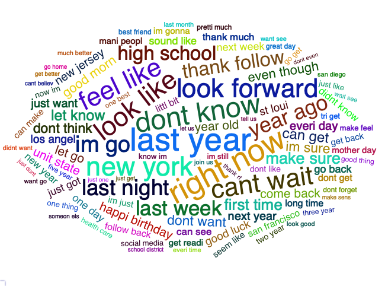
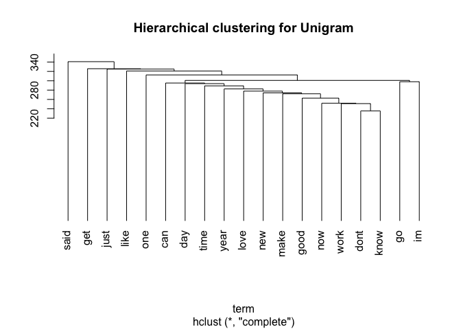

1. [Introduction](#introduction)
    a. [Background](#background)
    b. [Objective](#objective)
2. [Dataset](#dataset)
    a. [Source](#source)
    b. [Data information](#information)
3. [Data pre-processing](#preprocessing)
    a. [Data sampling](#sampling)
    b. [Data cleaning](#cleaning)
    c. [N-gram](#ngram)
4. [Exploratory analysis](#exploratory)
    a. [Word frequencies](#frequencies)
    b. [Word Clouds](#wordclouds)
    c. [Clustering](#clustering)
5. [Findings](#findings)
6. [Future plans](#plans)


## Introduction <a name="introduction"></a>
### 1a. Background <a name="background"></a>
This milestone report was a part of the course ([Data Science Capstone](https://www.coursera.org/learn/data-science-project?specialization=jhu-data-science)) offered by Johns Hopkins University on the Coursera platform. This course was under a specialization program, which consisted of 9 courses and a Capstone Project. 

The Capstone Project required students to develop an application to predict the following word after a user typed a phrase. This project started with analyzing a large corpus of text documents to discover the data structure and how words were structured. It covered cleaning and analyzing text data, then building and sampling from a predictive text model. Finally, we applied the knowledge we gained in data products to develop a predictive text product. There were eight tasks in total, and this report aimed to achieve the first four tasks.

- Task 1: **Understanding the Problem**
- Task 2: **Data acquisition and cleaning**
- Task 3: **Exploratory analysis**
- Task 4: **Statistical modeling**
- Task 5: Predictive modeling
- Task 6: Creative exploration
- Task 7: Creating a data product
- Task 8: Creating a short slide deck pitching your product

### 1b. Objective <a name="objective"></a>
The objective of this report was to display the data we were working with, and to understand any basic relationships we were able observe in the data. In this report, we applied several natural language processing and text mining techniques in analyzing any new data.

## 2. Data <a name="dataset"></a>
### 2a. Source <a name="source"></a>
The course ([Data Science Capstone](https://www.coursera.org/learn/data-science-project?specialization=jhu-data-science) provided the training data, and it served as the basis for most of the capstone. The data was in English, German, Russian and Finnish, but we only considered the English one.

**[Capstone Dataset](https://d396qusza40orc.cloudfront.net/dsscapstone/dataset/Coursera-SwiftKey.zip)**

1. en_US.blogs.txt
2. en_US.news.txt
3. en_US.twitter.txt

### 2b. Data basic information <a name="information"></a>
We summarized the basic summary of the dataset, trying to understand their contents. You may preview a few lines of each dataset.


```
##               Lines_counts Word_counts File_size
## en_US.twitter      2360148   162096031    319 Mb
## en_US.blogs         899288   206824505  255.4 Mb
## en_US.news         1010242   206824505  257.3 Mb
```
#### Examples of Twitter data:

```
## [1] "u not getting rid of that beard are ya?"                                                             
## [2] "Hope you are well lady. Keep me posted on all the goings on. :D I will text you when I find my phone"
## [3] "you guys doing Danny James' \"Pear\" on lp?!"
```

#### Examples of blog data:

```
## [1] "He looked back at me, his eyes were as dark as coal,"                                                                                     
## [2] "You've set up a problem without stakes. Why does she care who the voice on the phone is? Why would she even listen to him past \"hello?\""
## [3] "Yvonne Strahovski … Peg Mooring"
```
#### Examples of news data:

```
## [1] "It’s a nice thought, but don’t expect state Democrats Stephen Sweeney or Sheila Oliver to be raising their glasses to Christie anytime soon, even if he does throw his name in the presidential race. The terms \"rotten bastard\" and \"mentally deranged,\" words that those two critics recently uttered about him, aren’t exactly champagne toast material."
## [2] "In an \"A\" review, Drew McWeeny of HitFix.com writes Lawrence invests Katniss \"with a rich inner life that makes her feel real. It is a pure movie star performance, and Lawrence rises to the occasion.\""                                                                                                                                                   
## [3] "This is also according to advice I've given others: We're flawed, all of us, and hoping to find an ideal person is not only pointless, it's also dehumanizing to people to expect them to meet your ideals. All you can realistically hope for are people who are self-aware enough and responsible enough to try to keep their frailties in check."
```


## 3. Data pre-processing <a name="preprocessing"></a>
### 3a. Data sampling <a name="sampling"></a>
This dataset was fairly large. Our objective was to visualize and understand the outline of dataset, so it was unnecessary to load the entire dataset in to build our algorithms. We sampled a small part of it to do so. 


The new summary for samples will be:

```
##               Lines_counts Word_counts File_size
## en_US.twitter        23601     1619566    3.2 Mb
## en_US.blogs           8992     2105986    2.6 Mb
## en_US.news           10102     2105986    2.6 Mb
```

### 3b. Data cleaning <a name="cleaning"></a>
As we can obeserve from the samples, there were some unnecessary information such as stopswords, punctuation. In the next step, we performed the following data cleaning to remove these unnecessary information

- Convert to lowercase
- Remove URLs
- Remove punctuation
- remove numbers
- Removing English stopwords (common words)
- Remove special characters
- Stemming (reducing a word to its word stem that affixes to suffixes and prefixes or to the roots of words )


```
## [1] "Corpus size after cleaning: " "41.6 Mb"
```

#### Examples of our corpus after processing:

```
## [[1]] gilani departur leav signific void within zardari inner circl yearold prime minist view parti colleagu deft troubleshoot abl hammer compromis zardari difficult rival
## [[2]] citi commiss spoke citi manag norton bonapart said readi resign well move forward
## [[3]] fine yesterday girardi said whatev reason symptom came today
## [[4]] think anybodi troubl unc guard dexter strickland said s great player s work behind time
## [[5]] q goos island wellknown outfit get foot door
```

### 3c. N-gram <a name="ngram"></a>
After data cleaning, we performed a N-gram preprocessing step to identify appropriate words.

N-gram refered to segmenting an input stream into all combinations of adjacent words of length n in our corpus.

- Unitgram: a single letter, syllable, or word.
- Bigram: a pair of consecutive written units such as letters, syllables, or words.
- Trigram: a group of three consecutive written units such as letters, syllables, or words.

Then, we can create a term document matrix to get the frequency of our words.


```r
# 2. N-gram
tokenize_unigrams <- function(x) {unlist(tokenize_ngrams(as.character(unlist(x)), n = 1, n_min = 1))}
tokenize_bigrams <- function(x) {unlist(tokenize_ngrams(as.character(unlist(x)), n = 2, n_min = 2))}
tokenize_trigrams <- function(x) {unlist(tokenize_ngrams(as.character(unlist(x)), n = 3, n_min = 3))}

# N-gram
tdm1 <- TermDocumentMatrix(myCorpus)
tdm2 <- TermDocumentMatrix(myCorpus, control = list(tokenize = tokenize_bigrams))
tdm3 <- TermDocumentMatrix(myCorpus, control = list(tokenize = tokenize_trigrams))
rm(myCorpus)

# Unigram
freq1 <- rowSums(as.matrix(tdm1)) # Create frequency for each token
freq1 <- subset(freq1, freq1 >= 5)
freq1 <- data.frame(word = names(freq1), freq = as.integer(freq1)) %>%
        arrange(desc(freq))

# Bigram
freq2 <- rowSums(as.matrix(tdm2)) # Create frequency for each token
freq2 <- subset(freq2, freq2 >= 5)
freq2 <- data.frame(word = names(freq2), freq = as.integer(freq2)) %>%
    arrange(desc(freq)) 

# Trigram
freq3 <- rowSums(as.matrix(tdm3)) # Create frequency for each token
freq3 <- subset(freq3, freq3 >= 2)
freq3 <- data.frame(word = names(freq3), freq = as.integer(freq3)) %>%
    arrange(desc(freq))
```

#### Examples of Unigram after processing:

```
##  [1] "squar"     "earn"      "onion"     "dozen"     "christina" "conclud"  
##  [7] "digit"     "furnitur"  "counsel"   "explan"
```

#### Examples of Bigram after processing:

```
##  [1] "get lot"        "one way"        "food drug"      "weve got"      
##  [5] "away home"      "attorney offic" "charg two"      "grand prix"    
##  [9] "art project"    "long time"
```
#### Examples of Triigram after processing:

```
##  [1] "white hous said"               "republican congression candid"
##  [3] "sherlock holm game"            "reduc energi consumpt"        
##  [5] "hes look forward"              "past two season"              
##  [7] "hudson librari histor"         "pitch normal doesnt"          
##  [9] "come million use"              "pass wednesday around"
```

## 4. Exploratory analysis <a name="exploratory"></a>
We built figures and tables to understand variation in the frequencies of words and word pairs in our data.


### 4a. Word frequencies <a name="frequencies"></a>
To understand variation in the frequencies of words and word pairs in the data, we created plots and tables. 

In appendix A, you may find the top 100 frequent words in N-gram.

<!-- --><!-- --><!-- -->

### 4b. Word clouds <a name="wordclouds"></a>

<!-- --><!-- --><!-- -->

### 4c. Clustering <a name="clustering"></a>

<!-- --><!-- --><!-- -->


## 5. Findings <a name="findings"></a>

Interestingly, we found that Bigram and Trigram contain more information than Unigram. There were some common topics or phrases. N-gram could provide a glance at trending topics.

We also found that Twitter data included a lot of shorthand and improper English words. We had to reconsider if Twitter data was a trustworthy source for our ultimate goal: word prediction.

When reviewing our data, although we focused only on English, some special characters and non-English words might still exist. So, we decided to remove all non-English characters, and to perform stemming in our pre-precessing data.

Finally, processing data was quite time-consuming, especially when converted to a term-document matrix. Due to computational limitations, we were only able to process a sample of the original data that was needed. Therefore, we might have to look for a better dataset to save our resources in our next step.
    
## 6. Future plans <a name="plans"></a>

As explained in our background information, our ultimate goal was to develop a text prediction application based on our prediction algorithm. We will deploy this application on a Shiny server to make our Shiny application available over the web. 

To achieve this objective, we have to train an accurate prediction algorithm. The data analysis in the report provided us with an insight that words frequency and the combination might be a possible way for text prediction. However, this method required us to process an enormous amount of data.

Therefore, we may also consider Hidden Markov Models (HMM) for text prediction. A hidden Markov model is a statistical model that models sequential data. It is usual for speech recognition, part-of-speech tagging, gene prediction etc. However, this model requires a good dataset for training. 

For our application, we want to provide an interactive text prediction feature. Providing a list of texts as a prediction result would be a possible way. Users can inspect the probability of each text prediction, and pick the one they like.


## Appendix A. Top 100 frequent words in N-gram

```
##   [1] "said"     "will"     "year"     "one"      "new"      "state"   
##   [7] "time"     "two"      "say"      "get"      "like"     "can"     
##  [13] "also"     "first"    "work"     "last"     "peopl"    "make"    
##  [19] "game"     "school"   "citi"     "just"     "play"     "day"     
##  [25] "team"     "now"      "includ"   "take"     "three"    "use"     
##  [31] "want"     "back"     "call"     "come"     "counti"   "even"    
##  [37] "percent"  "good"     "home"     "season"   "million"  "way"     
##  [43] "start"    "offic"    "week"     "need"     "compani"  "run"     
##  [49] "may"      "mani"     "show"     "well"     "think"    "month"   
##  [55] "polic"    "help"     "look"     "point"    "dont"     "made"    
##  [61] "know"     "report"   "right"    "still"    "plan"     "job"     
##  [67] "see"      "open"     "much"     "thing"    "public"   "hous"    
##  [73] "second"   "nation"   "center"   "high"     "famili"   "live"    
##  [79] "end"      "sinc"     "tri"      "anoth"    "next"     "big"     
##  [85] "that"     "four"     "night"    "group"    "win"      "part"    
##  [91] "presid"   "realli"   "move"     "got"      "offici"   "busi"    
##  [97] "player"   "district" "place"    "give"
```

```
##   [1] "last year"         "new york"          "high school"      
##   [4] "st loui"           "new jersey"        "last week"        
##   [7] "year ago"          "los angel"         "first time"       
##  [10] "last month"        "two year"          "right now"        
##  [13] "san francisco"     "unit state"        "make sure"        
##  [16] "next year"         "ohio state"        "three year"       
##  [19] "dont know"         "polic said"        "school district"  
##  [22] "feel like"         "health care"       "look like"        
##  [25] "polic offic"       "vice presid"       "barack obama"     
##  [28] "last season"       "offici said"       "citi council"     
##  [31] "even though"       "attorney general"  "everi day"        
##  [34] "can get"           "four year"         "law enforc"       
##  [37] "mani peopl"        "next week"         "state univers"    
##  [40] "dont want"         "presid barack"     "real estat"       
##  [43] "suprem court"      "associ press"      "chief execut"     
##  [46] "execut director"   "kansa citi"        "said statement"   
##  [49] "san diego"         "five year"         "public school"    
##  [52] "wall street"       "white hous"        "year said"        
##  [55] "dont think"        "just one"          "last two"         
##  [58] "polic depart"      "two week"          "elementari school"
##  [61] "head coach"        "littl bit"         "news confer"      
##  [64] "one thing"         "past year"         "want see"         
##  [67] "will get"          "york citi"         "come back"        
##  [70] "medic center"      "said want"         "super bowl"       
##  [73] "tuesday night"     "will take"         "plain dealer"     
##  [76] "plead guilti"      "run back"          "will also"        
##  [79] "will go"           "will make"         "year old"         
##  [82] "bay area"          "council member"    "cuyahoga counti"  
##  [85] "obama administr"   "st charl"          "state law"        
##  [88] "three month"       "two decad"         "two game"         
##  [91] "will help"         "year later"        "can help"         
##  [94] "court judg"        "fourth quarter"    "im go"            
##  [97] "jersey citi"       "long time"         "mitt romney"      
## [100] "month ago"
```

```
##   [1] "presid barack obama"     "new york citi"          
##   [3] "two year ago"            "g carbohydr g"          
##   [5] "g protein g"             "protein g carbohydr"    
##   [7] "fat g satur"             "g fat g"                
##   [9] "world war ii"            "st loui counti"         
##  [11] "execut vice presid"      "gov chris christi"      
##  [13] "calori g protein"        "carbohydr g fat"        
##  [15] "cent per share"          "cholesterol mg sodium"  
##  [17] "first time sinc"         "four year ago"          
##  [19] "high school student"     "per serv calori"        
##  [21] "us district court"       "us district judg"       
##  [23] "albright kick fc"        "attorney general offic" 
##  [25] "five year ago"           "g satur mg"             
##  [27] "golden gate bridg"       "mg cholesterol mg"      
##  [29] "past three year"         "satur mg cholesterol"   
##  [31] "st charl counti"         "told associ press"      
##  [33] "two decad ago"           "us suprem court"        
##  [35] "wall street journal"     "chief financi offic"    
##  [37] "circuit court appeal"    "dow jone industri"      
##  [39] "fiber mg sodium"         "food drug administr"    
##  [41] "health human servic"     "last year state"        
##  [43] "mg sodium g"             "new york time"          
##  [45] "next four year"          "presid chief execut"    
##  [47] "rock roll hall"          "roll hall fame"         
##  [49] "senior vice presid"      "serv calori g"          
##  [51] "sodium g fiber"          "state attorney general" 
##  [53] "will take place"         "can get hurt"           
##  [55] "chief execut offic"      "citi council member"    
##  [57] "confer call analyst"     "counti medic examin"    
##  [59] "court record show"       "drink plenti water"     
##  [61] "fanni mae freddi"        "fat mg cholesterol"     
##  [63] "first three game"        "first three month"      
##  [65] "first time season"       "first two game"         
##  [67] "g fiber mg"              "game win streak"        
##  [69] "high school footbal"     "high school graduat"    
##  [71] "hous speaker john"       "issu statement say"     
##  [73] "jone industri averag"    "kick fc cambier"        
##  [75] "last two season"         "last year accord"       
##  [77] "law enforc offici"       "los angel counti"       
##  [79] "mae freddi mac"          "mari tyler moor"        
##  [81] "mg cholesterol g"        "mile per hour"          
##  [83] "new york ap"             "osama bin laden"        
##  [85] "point eight rebound"     "polit scienc professor" 
##  [87] "respond request comment" "run albright kick"      
##  [89] "said last week"          "said statement releas"  
##  [91] "short time later"        "speaker john boehner"   
##  [93] "sport util vehicl"       "st clair counti"        
##  [95] "standard poor index"     "superior court judg"    
##  [97] "th us circuit"           "three year ago"         
##  [99] "two week ago"            "us circuit court"
```

## Appendix B. Full Code in R

```r
# Load libraries
require(tm); require(SnowballC); require(stopwords); 
require(ggplot2); require(tokenizers);  require(dplyr);
require(wordcloud2); require(webshot); require(htmlwidgets)

url_tw <- "./data/en_US.twitter.txt"
url_blog <- "./data/en_US.blogs.txt"
url_news <- "./data/en_US.news.txt"
conn_tw <- file(url_tw,open="r")
conn_blog <- file(url_blog,open="r")
conn_news <- file(url_news,open="r")

# Load data
lines_tw <-readLines(conn_tw)
lines_blog <-readLines(conn_blog)
lines_news <-readLines(conn_news)

line_counts <- c(length(lines_tw), length(lines_blog), length(lines_news))
word_counts <- c(sum(nchar(lines_tw)), sum(nchar(lines_blog)),sum(nchar(lines_blog)))
size_counts <- c(format(object.size(lines_tw), units = "Mb"),
                format(object.size(lines_blog), units = "Mb"),
                format(object.size(lines_news), units = "Mb"))

# Process basic infomation
summ <- data.frame('Lines_counts' = line_counts, 
                         'Word_counts' = word_counts, 
                         'File_size' = size_counts,
                      row.names = c('en_US.twitter', 'en_US.blogs', 'en_US.news'))
summ

close(conn_tw)
close(conn_blog)
close(conn_news)
rm(url_tw, url_blog, url_news, conn_blog, conn_news, conn_tw)

# create a list of random variables
set.seed(1234)
# Sample a part of each dataset
percent <- 0.01
lines_tw <- sample(lines_tw, summ$Lines_counts[1]*percent, replace=FALSE)
lines_blog <- sample(lines_blog, summ$Lines_counts[2]*percent, replace=FALSE)
lines_news <- sample(lines_news, summ$Lines_counts[3]*percent, replace=FALSE)

# 1. Text cleaning:
myCorpus <- VCorpus(VectorSource(c(lines_tw, lines_blog, lines_news)))

removeURL <- function(x) {gsub("(f|ht)tp(s?)://\\S+", "", x, perl=T)}
removeSpecial <- function(x) {gsub("[^[:alnum:] ]", "", x,perl=T)}

myCorpus <- VCorpus(VectorSource(c(lines_news)))

myCorpus <- tm_map(myCorpus, content_transformer(tolower))
myCorpus <- tm_map(myCorpus, content_transformer(removeURL)) 
myCorpus <- tm_map(myCorpus, removePunctuation)
myCorpus <- tm_map(myCorpus, removeNumbers)
myCorpus <- tm_map(myCorpus, removeWords, stopwords("english"))
myCorpus <- tm_map(myCorpus, content_transformer(removeSpecial)) 

# Stemming
myCorpus <- tm_map(myCorpus, stemDocument)

rm(lines_tw, lines_blog, lines_news, removeURL, removeSpecial)

print(c('Corpus size after cleaning: ', format(object.size(myCorpus), units = "Mb")))

# 2. N-gram
tokenize_unigrams <- function(x) {unlist(tokenize_ngrams(as.character(unlist(x)), n = 1, n_min = 1))}
tokenize_bigrams <- function(x) {unlist(tokenize_ngrams(as.character(unlist(x)), n = 2, n_min = 2))}
tokenize_trigrams <- function(x) {unlist(tokenize_ngrams(as.character(unlist(x)), n = 3, n_min = 3))}

# N-gram
tdm1 <- TermDocumentMatrix(myCorpus)
tdm2 <- TermDocumentMatrix(myCorpus, control = list(tokenize = tokenize_bigrams))
tdm3 <- TermDocumentMatrix(myCorpus, control = list(tokenize = tokenize_trigrams))
rm(myCorpus)

# Unigram
freq1 <- rowSums(as.matrix(tdm1)) # Create frequency for each token
freq1 <- subset(freq1, freq1 >= 5)
freq1 <- data.frame(word = names(freq1), freq = as.integer(freq1)) %>%
        arrange(desc(freq))

# Bigram
freq2 <- rowSums(as.matrix(tdm2)) # Create frequency for each token
freq2 <- subset(freq2, freq2 >= 5)
freq2 <- data.frame(word = names(freq2), freq = as.integer(freq2)) %>%
    arrange(desc(freq)) 

# Trigram
freq3 <- rowSums(as.matrix(tdm3)) # Create frequency for each token
freq3 <- subset(freq3, freq3 >= 2)
freq3 <- data.frame(word = names(freq3), freq = as.integer(freq3)) %>%
    arrange(desc(freq))

# Plot Unigram
ggplot(head(freq1,20), aes(x=reorder(word, freq), y=freq)) +
  geom_bar(stat = "identity") +
  labs(x = "Terms",
           y = "Count") + 
      ggtitle("Top 20 frequent terms in Unigram") +
  coord_flip()

# Plot Bigram
ggplot(head(freq2,20), aes(x=reorder(word, freq), y=freq)) +
  geom_bar(stat = "identity") +
  labs(x = "Terms",
           y = "Count") + 
      ggtitle("Top 20 frequent terms in Bigram") +
  coord_flip()

# Plot Trigram
ggplot(head(freq3,20), aes(x=reorder(word, freq), y=freq)) +
  geom_bar(stat = "identity") +
  labs(x = "Terms",
           y = "Count") + 
      ggtitle("Top 20 frequent terms in Trigram") +
  coord_flip()

# Word clouds for Unigram
wc1 <- wordcloud2(data = head(freq1, 200), color =  "random-dark")
saveWidget(wc1, "./images/wc1.html", selfcontained = F)
webshot("./images/wc1.html", "wc1.png", delay = 2, vwidth = 650, vheight = 470)
# Word clouds for Bigram
wc2 <- wordcloud2(data = head(freq2, 150), color =  "random-dark", size=0.5)
saveWidget(wc2, "./images/wc2.html", selfcontained = F)
webshot("./images/wc2.html", "wc2.png", delay = 2, vwidth = 650, vheight = 470)
# Word clouds for Trigram
wc3 <- wordcloud2(data = head(freq3, 100), color =  "random-dark", size = 0.35)
saveWidget(wc3, "./images/wc3.html", selfcontained = F)
webshot("./images/wc3.html", "wc3.png", delay = 2, vwidth = 650, vheight = 470)

# Clustering for Unigram
tdm4 <- removeSparseTerms(tdm1, 0.96)
d <- dist(scale(tdm4), method="euclidian")   
fit <- hclust(d=d, method="complete") 
plot.new()
plot(fit, hang=-1, main ="Hierarchical clustering for Unigram",
     xlab = "term", ylab = "")

# Clustering for Bigram
tdm4 <- removeSparseTerms(tdm2, 0.997) 
d <- dist(scale(tdm4), method="euclidian")   
fit <- hclust(d=d, method="complete") 
plot.new()
plot(fit, hang=-1, main ="Hierarchical clustering for Bigram",
     xlab = "terms", ylab = "")

# Clustering for Trigram
tdm4 <- removeSparseTerms(tdm3, 0.9994) 
d <- dist(scale(tdm4), method="euclidian")   
fit <- hclust(d=d, method="complete") 
plot.new()
plot(fit, hang=-1, main ="Hierarchical clustering for Trigram",
     xlab = "terms", ylab = "")
rm(tdm4, d, fit)
```
