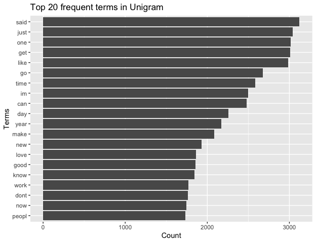
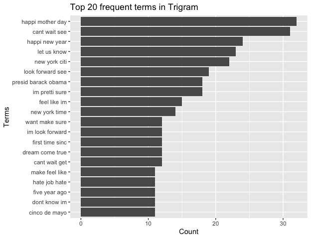
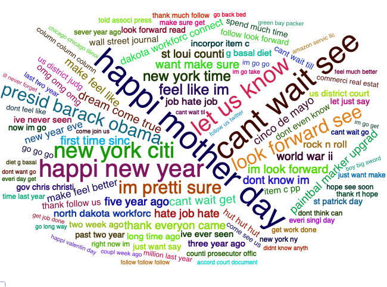

1. [Introduction](#introduction)
    a. [Background](#background)
    b. [Objective](#objective)
2. [Dataset](#dataset)
    a. [Source](#source)
    b. [Data information](#information)
3. [Data pre-processing](#preprocessing)
    a. [Data sampling](#sampling)
    b. [Data cleaning](#cleaning)
    c. [N-gram](#ngram)
4. [Exploratory analysis](#exploratory)
    a. [Word frequencies](#frequencies)
    b. [Word Clouds](#wordclouds)
    c. [Clustering](#clustering)
5. [Findings](#findings)
6. [Future plans](#plans)
7. [Appendix A. Top 100 frequent words in N-gram](#appendixA)
8. [Appendix B. Full Code in R](#appendixB)


## Introduction <a name="introduction"></a>
### 1a. Background <a name="background"></a>
This milestone report was a part of the course ([Data Science Capstone](https://www.coursera.org/learn/data-science-project?specialization=jhu-data-science)) offered by Johns Hopkins University on the Coursera platform. This course was under a specialization program, which consisted of 9 courses and a Capstone Project. 

The Capstone Project required students to develop an application to predict the following word after a user typed a phrase. This project started with analyzing a large corpus of text documents to discover the data structure and how words were structured. It covered cleaning and analyzing text data, then building and sampling from a predictive text model. Finally, we applied the knowledge we gained in data products to develop a predictive text product. There were eight tasks in total, and this report aimed to achieve the first four tasks.

- Task 1: **Understanding the Problem**
- Task 2: **Data acquisition and cleaning**
- Task 3: **Exploratory analysis**
- Task 4: **Statistical modeling**
- Task 5: Predictive modeling
- Task 6: Creative exploration
- Task 7: Creating a data product
- Task 8: Creating a short slide deck pitching your product

### 1b. Objective <a name="objective"></a>
The objective of this report was to display the data we were working with, and to understand any basic relationships we were able observe in the data. In this report, we applied several natural language processing and text mining techniques in analyzing any new data.

## 2. Data <a name="dataset"></a>
### 2a. Source <a name="source"></a>
The course ([Data Science Capstone](https://www.coursera.org/learn/data-science-project?specialization=jhu-data-science) provided the training data, and it served as the basis for most of the capstone. The data was in English, German, Russian and Finnish, but we only considered the English one.

**[Capstone Dataset](https://d396qusza40orc.cloudfront.net/dsscapstone/dataset/Coursera-SwiftKey.zip)**

1. en_US.blogs.txt
2. en_US.news.txt
3. en_US.twitter.txt

### 2b. Data basic information <a name="information"></a>
We summarized the basic summary of the dataset, trying to understand their contents. You may preview a few lines of each dataset.


```
##               Lines_counts Word_counts File_size
## en_US.twitter      2360148   162096031    319 Mb
## en_US.blogs         899288   206824505  255.4 Mb
## en_US.news         1010242   206824505  257.3 Mb
```
#### Examples of Twitter data:

```
## [1] "u not getting rid of that beard are ya?"                                                             
## [2] "Hope you are well lady. Keep me posted on all the goings on. :D I will text you when I find my phone"
## [3] "you guys doing Danny James' \"Pear\" on lp?!"
```

#### Examples of blog data:

```
## [1] "He looked back at me, his eyes were as dark as coal,"                                                                                     
## [2] "You've set up a problem without stakes. Why does she care who the voice on the phone is? Why would she even listen to him past \"hello?\""
## [3] "Yvonne Strahovski … Peg Mooring"
```
#### Examples of news data:

```
## [1] "It’s a nice thought, but don’t expect state Democrats Stephen Sweeney or Sheila Oliver to be raising their glasses to Christie anytime soon, even if he does throw his name in the presidential race. The terms \"rotten bastard\" and \"mentally deranged,\" words that those two critics recently uttered about him, aren’t exactly champagne toast material."
## [2] "In an \"A\" review, Drew McWeeny of HitFix.com writes Lawrence invests Katniss \"with a rich inner life that makes her feel real. It is a pure movie star performance, and Lawrence rises to the occasion.\""                                                                                                                                                   
## [3] "This is also according to advice I've given others: We're flawed, all of us, and hoping to find an ideal person is not only pointless, it's also dehumanizing to people to expect them to meet your ideals. All you can realistically hope for are people who are self-aware enough and responsible enough to try to keep their frailties in check."
```


## 3. Data pre-processing <a name="preprocessing"></a>
### 3a. Data sampling <a name="sampling"></a>
This dataset was fairly large. Our objective was to visualize and understand the outline of dataset, so it was unnecessary to load the entire dataset in to build our algorithms. We sampled a small part of it to do so. 


The new summary for samples was:

```
##               Lines_counts Word_counts File_size
## en_US.twitter        23601     1620306    3.2 Mb
## en_US.blogs           8992     2044519    2.5 Mb
## en_US.news           10102     2044519    2.6 Mb
```

### 3b. Data cleaning <a name="cleaning"></a>
As we can obeserve from the samples, there were some unnecessary information such as stopswords, punctuation. In the next step, we performed the following data cleaning to remove these unnecessary information

- Convert to lowercase
- Remove URLs
- Remove punctuation
- remove numbers
- Removing English stopwords (common words)
- Remove special characters
- Stemming (reducing a word to its word stem that affixes to suffixes and prefixes or to the roots of words )


```
## [1] "Corpus size after cleaning: " "174.2 Mb"
```

#### Examples of our corpus after processing:

```
## [[1]] u get rid beard ya
## [[2]] hope well ladi keep post go d text find phone
## [[3]] guy danni jame pear lp
## [[4]] excit wonder christma
## [[5]] money want usa visa areno question ask got prove
```

### 3c. N-gram <a name="ngram"></a>
After data cleaning, we performed a N-gram preprocessing step to identify appropriate words.

N-gram refered to segmenting an input stream into all combinations of adjacent words of length n in our corpus.

- Unigram: a single letter, syllable, or word.
- Bigram: a pair of consecutive written units such as letters, syllables, or words.
- Trigram: a group of three consecutive written units such as letters, syllables, or words.

Then, we created a term document matrix to get the frequency of our words.


```r
# 2. N-gram
tokenize_unigrams <- function(x) {unlist(tokenize_ngrams(as.character(unlist(x)), n = 1, n_min = 1))}
tokenize_bigrams <- function(x) {unlist(tokenize_ngrams(as.character(unlist(x)), n = 2, n_min = 2))}
tokenize_trigrams <- function(x) {unlist(tokenize_ngrams(as.character(unlist(x)), n = 3, n_min = 3))}


# N-gram
# removeSparseTerms: remove sparse words to contain around 1000 frequent words
tdm1 <- TermDocumentMatrix(myCorpus)
tdm1 <- removeSparseTerms(tdm1, 0.9975) 
tdm2 <- TermDocumentMatrix(myCorpus, control = list(tokenize = tokenize_bigrams))
tdm2 <- removeSparseTerms(tdm2, 0.9997) 
tdm3 <- TermDocumentMatrix(myCorpus, control = list(tokenize = tokenize_trigrams))
tdm3 <- removeSparseTerms(tdm3, 0.99994) 
rm(myCorpus)

# Unigram
freq1 <- rowSums(as.matrix(tdm1)) # Create frequency for each token
freq1 <- subset(freq1, freq1 >= 5)
freq1 <- data.frame(word = names(freq1), freq = as.integer(freq1)) %>%
        arrange(desc(freq))

# Bigram
freq2 <- rowSums(as.matrix(tdm2)) # Create frequency for each token
freq2 <- subset(freq2, freq2 >= 5)
freq2 <- data.frame(word = names(freq2), freq = as.integer(freq2)) %>%
    arrange(desc(freq)) 

# Trigram
freq3 <- rowSums(as.matrix(tdm3)) # Create frequency for each token
freq3 <- subset(freq3, freq3 >= 2)
freq3 <- data.frame(word = names(freq3), freq = as.integer(freq3)) %>%
    arrange(desc(freq))
```

#### Examples of Unigram after processing:

```
##  [1] "mother"    "cri"       "potenti"   "ask"       "bar"       "peac"     
##  [7] "cleveland" "card"      "simpl"     "read"
```

#### Examples of Bigram after processing:

```
##  [1] "take pictur"     "still go"        "just two"        "need get"       
##  [5] "cuyahoga counti" "gotta love"      "like just"       "new way"        
##  [9] "thank love"      "get peopl"
```
#### Examples of Triigram after processing:

```
##  [1] "said im go"             "want peopl know"        "thank follow back"     
##  [4] "llc andor amazon"       "make great day"         "content provid subject"
##  [7] "runner score posit"     "tri someth new"         "presid bill clinton"   
## [10] "last week great"
```

## 4. Exploratory analysis <a name="exploratory"></a>
We built figures and tables to understand variation in the frequencies of words and word pairs in our data.

### 4a. Word frequencies <a name="frequencies"></a>
This part shows the top 20 frequent terms of our N-gram pre-processing. 

In appendix A, you may find the top 100 frequent words in N-gram.

<!-- --><!-- --><!-- -->

### 4b. Word clouds <a name="wordclouds"></a>

<!-- --><!-- --><!-- -->

### 4c. Clustering <a name="clustering"></a>

<!-- --><!-- --><!-- -->


## 5. Findings <a name="findings"></a>

Interestingly, we found that Bigram and Trigram contain more information than Unigram. There were some common topics or phrases. N-gram could provide a glance at trending topics.

We also found that Twitter data included a lot of shorthand and improper English words. We had to reconsider if Twitter data was a trustworthy source for our ultimate goal: word prediction.

When reviewing our data, although we focused only on English, some special characters and non-English words might still exist. So, we decided to remove all non-English characters, and to perform stemming in our pre-precessing data.

Finally, processing data was quite time-consuming, especially when converted to a term-document matrix. Due to computational limitations, we were only able to process a sample of the original data that was needed. Therefore, we might have to look for a better dataset to save our resources in our next step.
    
## 6. Future plans <a name="plans"></a>

As explained in our background information, our ultimate goal is to develop a text prediction application based on our prediction algorithm. We will deploy this application on a Shiny server to make our Shiny application available over the web. 

To achieve this objective, we have to train an accurate prediction algorithm. The data analysis in the report provided us with an insight that words frequency and the combination might be a possible way for text prediction. However, this method required us to process an enormous amount of data.

Therefore, we may also consider Hidden Markov Models (HMM) for text prediction. A hidden Markov model is a statistical model that models sequential data. It is usual for speech recognition, part-of-speech tagging, gene prediction etc. However, this model requires a good dataset for training. 

For our application, we want to provide an interactive text prediction feature. Providing a list of texts as a prediction result would be a possible way. Users can inspect the probability of each text prediction, and pick the one they like.


## Appendix A. Top 100 frequent words in N-gram  <a name="appendixA"></a>

```
##   [1] "said"   "just"   "one"    "get"    "like"   "time"   "can"    "day"   
##   [9] "year"   "make"   "new"    "love"   "good"   "know"   "work"   "dont"  
##  [17] "now"    "peopl"  "say"    "think"  "see"    "want"   "thank"  "look"  
##  [25] "come"   "need"   "back"   "use"    "also"   "first"  "great"  "thing" 
##  [33] "well"   "way"    "last"   "take"   "even"   "much"   "today"  "two"   
##  [41] "right"  "start"  "follow" "realli" "week"   "got"    "still"  "game"  
##  [49] "play"   "feel"   "call"   "show"   "help"   "state"  "school" "tri"   
##  [57] "life"   "mani"   "cant"   "live"   "home"   "let"    "hope"   "littl" 
##  [65] "made"   "night"  "best"   "may"    "never"  "friend" "next"   "book"  
##  [73] "that"   "someth" "happi"  "give"   "find"   "didnt"  "lol"    "lot"   
##  [81] "keep"   "alway"  "man"    "run"    "long"   "citi"   "watch"  "place" 
##  [89] "better" "anoth"  "put"    "everi"  "end"    "team"   "around" "point" 
##  [97] "includ" "read"   "big"    "talk"
```

```
##   [1] "last year"       "right now"       "dont know"       "look like"      
##   [5] "new york"        "look forward"    "cant wait"       "feel like"      
##   [9] "last night"      "year ago"        "last week"       "thank follow"   
##  [13] "high school"     "im go"           "make sure"       "first time"     
##  [17] "let know"        "can get"         "dont want"       "dont think"     
##  [21] "even though"     "good morn"       "let go"          "come back"      
##  [25] "happi birthday"  "year old"        "unit state"      "everi day"      
##  [29] "just want"       "next year"       "new jersey"      "los angel"      
##  [33] "st loui"         "good luck"       "next week"       "just got"       
##  [37] "sound like"      "one day"         "go back"         "didnt know"     
##  [41] "new year"        "thank much"      "can see"         "im sure"        
##  [45] "littl bit"       "long time"       "follow back"     "san francisco"  
##  [49] "dont get"        "get back"        "mother day"      "get readi"      
##  [53] "mani peopl"      "can make"        "im just"         "seem like"      
##  [57] "dont like"       "two year"        "im gonna"        "one thing"      
##  [61] "go get"          "just like"       "make feel"       "tri get"        
##  [65] "social media"    "dont forget"     "health care"     "one best"       
##  [69] "five year"       "pretti much"     "three year"      "best friend"    
##  [73] "im still"        "good thing"      "great day"       "san diego"      
##  [77] "join us"         "know im"         "wait see"        "want go"        
##  [81] "last month"      "much better"     "now im"          "thank rt"       
##  [85] "want see"        "didnt want"      "everi time"      "look good"      
##  [89] "go home"         "just get"        "let us"          "make sens"      
##  [93] "school district" "someon els"      "tell us"         "cant believ"    
##  [97] "get better"      "just dont"       "just one"        "dont even"
```

```
##   [1] "happi mother day"        "cant wait see"          
##   [3] "happi new year"          "let us know"            
##   [5] "new york citi"           "look forward see"       
##   [7] "im pretti sure"          "presid barack obama"    
##   [9] "new york time"           "cant wait get"          
##  [11] "dream come true"         "feel like im"           
##  [13] "first time sinc"         "want make sure"         
##  [15] "cinco de mayo"           "five year ago"          
##  [17] "im look forward"         "make feel like"         
##  [19] "st loui counti"          "thank everyon came"     
##  [21] "world war ii"            "make feel better"       
##  [23] "new year eve"            "rock n roll"            
##  [25] "dont even know"          "dont know im"           
##  [27] "incorpor item c"         "item c pp"              
##  [29] "long time ago"           "thank follow us"        
##  [31] "three year ago"          "two week ago"           
##  [33] "us district court"       "wall street journal"    
##  [35] "cant wait till"          "follow look forward"    
##  [37] "go go go"                "gov chris christi"      
##  [39] "just want say"           "let just say"           
##  [41] "look forward read"       "past two year"          
##  [43] "spend much time"         "st patrick day"         
##  [45] "us district judg"        "cant wait go"           
##  [47] "come see us"             "commerci real estat"    
##  [49] "counti prosecutor offic" "dont feel like"         
##  [51] "dont think can"          "everi singl day"        
##  [53] "get work done"           "hope see soon"          
##  [55] "ive ever seen"           "just want make"         
##  [57] "last two year"           "make sure get"          
##  [59] "million last year"       "new york ny"            
##  [61] "now im go"               "sever year ago"         
##  [63] "thank much follow"       "thank rt hope"          
##  [65] "time last year"          "told associ press"      
##  [67] "accord court document"   "amazon servic llc"      
##  [69] "cant wait til"           "chicago chicago illinoi"
##  [71] "come join us"            "coupl week ago"         
##  [73] "didnt know anyth"        "dont want go"           
##  [75] "everi day get"           "feel much better"       
##  [77] "follow follow follow"    "follow us twitter"      
##  [79] "get job done"            "go back bed"            
##  [81] "go long way"             "green bay packer"       
##  [83] "happi valentin day"      "ill never forget"       
##  [85] "ive never seen"          "just around corner"     
##  [87] "look forward meet"       "look forward work"      
##  [89] "major leagu basebal"     "martin luther king"     
##  [91] "much better now"         "new england patriot"    
##  [93] "past five year"          "peopl dont know"        
##  [95] "point per game"          "right around corner"    
##  [97] "right now im"            "runner score posit"     
##  [99] "senior vice presid"      "spend lot time"
```

## Appendix B. Full Code in R <a name="appendixB"></a>

```r
# Load libraries
require(tm); require(SnowballC); require(stopwords); 
require(ggplot2); require(tokenizers);  require(dplyr);
require(wordcloud2); require(webshot); require(htmlwidgets)

url_tw <- "./data/en_US.twitter.txt"
url_blog <- "./data/en_US.blogs.txt"
url_news <- "./data/en_US.news.txt"
conn_tw <- file(url_tw,open="r")
conn_blog <- file(url_blog,open="r")
conn_news <- file(url_news,open="r")

# Load data
lines_tw <-readLines(conn_tw)
lines_blog <-readLines(conn_blog)
lines_news <-readLines(conn_news)

line_counts <- c(length(lines_tw), length(lines_blog), length(lines_news))
word_counts <- c(sum(nchar(lines_tw)), sum(nchar(lines_blog)),sum(nchar(lines_blog)))
size_counts <- c(format(object.size(lines_tw), units = "Mb"),
                format(object.size(lines_blog), units = "Mb"),
                format(object.size(lines_news), units = "Mb"))

# Process basic infomation
summ <- data.frame('Lines_counts' = line_counts, 
                         'Word_counts' = word_counts, 
                         'File_size' = size_counts,
                      row.names = c('en_US.twitter', 'en_US.blogs', 'en_US.news'))
summ

close(conn_tw)
close(conn_blog)
close(conn_news)
rm(url_tw, url_blog, url_news, conn_blog, conn_news, conn_tw)

# create a list of random variables
set.seed(1234)
# Sample a part of each dataset
percent <- 0.01
lines_tw <- sample(lines_tw, summ$Lines_counts[1]*percent, replace=FALSE)
lines_blog <- sample(lines_blog, summ$Lines_counts[2]*percent, replace=FALSE)
lines_news <- sample(lines_news, summ$Lines_counts[3]*percent, replace=FALSE)

# 1. Text cleaning:
myCorpus <- VCorpus(VectorSource(c(lines_tw, lines_blog, lines_news)))
rm(lines_tw, lines_blog, lines_news)
removeURL <- function(x) {gsub("(f|ht)tp(s?)://\\S+", "", x, perl=T)}
removeSpecial <- function(x) {gsub("[^[:alnum:] ]", "", x,perl=T)}

myCorpus <- tm_map(myCorpus, content_transformer(tolower))
myCorpus <- tm_map(myCorpus, content_transformer(removeURL)) 
myCorpus <- tm_map(myCorpus, removePunctuation)
myCorpus <- tm_map(myCorpus, removeNumbers)
myCorpus <- tm_map(myCorpus, removeWords, stopwords("english"))
myCorpus <- tm_map(myCorpus, content_transformer(removeSpecial)) 

# Stemming
myCorpus <- tm_map(myCorpus, stemDocument)

rm(removeURL, removeSpecial)

print(c('Corpus size after cleaning: ', format(object.size(myCorpus), units = "Mb")))

# 2. N-gram
tokenize_unigrams <- function(x) {unlist(tokenize_ngrams(as.character(unlist(x)), n = 1, n_min = 1))}
tokenize_bigrams <- function(x) {unlist(tokenize_ngrams(as.character(unlist(x)), n = 2, n_min = 2))}
tokenize_trigrams <- function(x) {unlist(tokenize_ngrams(as.character(unlist(x)), n = 3, n_min = 3))}

# N-gram
# removeSparseTerms: remove sparse words to contain around 1000 frequent words
tdm1 <- TermDocumentMatrix(myCorpus)
tdm1 <- removeSparseTerms(tdm1, 0.9975) 
tdm2 <- TermDocumentMatrix(myCorpus, control = list(tokenize = tokenize_bigrams))
tdm2 <- removeSparseTerms(tdm2, 0.9997) 
tdm3 <- TermDocumentMatrix(myCorpus, control = list(tokenize = tokenize_trigrams))
tdm3 <- removeSparseTerms(tdm3, 0.99994) 
rm(myCorpus)

# Unigram
freq1 <- rowSums(as.matrix(tdm1)) # Create frequency for each token
freq1 <- subset(freq1, freq1 >= 5)
freq1 <- data.frame(word = names(freq1), freq = as.integer(freq1)) %>%
        arrange(desc(freq))

# Bigram
freq2 <- rowSums(as.matrix(tdm2)) # Create frequency for each token
freq2 <- subset(freq2, freq2 >= 5)
freq2 <- data.frame(word = names(freq2), freq = as.integer(freq2)) %>%
    arrange(desc(freq)) 

# Trigram
freq3 <- rowSums(as.matrix(tdm3)) # Create frequency for each token
freq3 <- subset(freq3, freq3 >= 2)
freq3 <- data.frame(word = names(freq3), freq = as.integer(freq3)) %>%
    arrange(desc(freq))

# Plot Unigram
ggplot(head(freq1,20), aes(x=reorder(word, freq), y=freq)) +
  geom_bar(stat = "identity") +
  labs(x = "Terms",
           y = "Count") + 
      ggtitle("Top 20 frequent terms in Unigram") +
  coord_flip()

# Plot Bigram
ggplot(head(freq2,20), aes(x=reorder(word, freq), y=freq)) +
  geom_bar(stat = "identity") +
  labs(x = "Terms",
           y = "Count") + 
      ggtitle("Top 20 frequent terms in Bigram") +
  coord_flip()

# Plot Trigram
ggplot(head(freq3,20), aes(x=reorder(word, freq), y=freq)) +
  geom_bar(stat = "identity") +
  labs(x = "Terms",
           y = "Count") + 
      ggtitle("Top 20 frequent terms in Trigram") +
  coord_flip()

# Word clouds for Unigram
wc1 <- wordcloud2(data = head(freq1, 200), color =  "random-dark", size = 0.4)
saveWidget(wc1, "./images/wc1.html", selfcontained = F)
webshot("./images/wc1.html", "wc1.png", delay = 2, vwidth = 650, vheight = 470)
# Word clouds for Bigram
wc2 <- wordcloud2(data = head(freq2, 100), color =  "random-dark", size = 0.3)
saveWidget(wc2, "./images/wc2.html", selfcontained = F)
webshot("./images/wc2.html", "wc2.png", delay = 2, vwidth = 650, vheight = 470)
# Word clouds for Trigram
wc3 <- wordcloud2(data = head(freq3, 100), color =  "random-dark", size = 0.3)
saveWidget(wc3, "./images/wc3.html", selfcontained = F)
webshot("./images/wc3.html", "wc3.png", delay = 2, vwidth = 650, vheight = 470)

# Clustering for Unigram
# removeSparseTerms: to reduce the size of frequent words to around 20
tdm4 <- removeSparseTerms(tdm1, 0.965)
d <- dist(scale(tdm4), method="euclidian")   
fit <- hclust(d=d, method="complete") 
plot.new()
plot(fit, hang=-1, main ="Hierarchical clustering for Unigram",
     xlab = "term", ylab = "")

# Clustering for Bigram
tdm4 <- removeSparseTerms(tdm2, 0.9977) 
d <- dist(scale(tdm4), method="euclidian")   
fit <- hclust(d=d, method="complete") 
plot.new()
plot(fit, hang=-1, main ="Hierarchical clustering for Bigram",
     xlab = "terms", ylab = "")

# Clustering for Trigram
tdm4 <- removeSparseTerms(tdm3, 0.99976) 
d <- dist(scale(tdm4), method="euclidian")   
fit <- hclust(d=d, method="complete") 
plot.new()
plot(fit, hang=-1, main ="Hierarchical clustering for Trigram",
     xlab = "terms", ylab = "")
rm(tdm4, d, fit)
```
