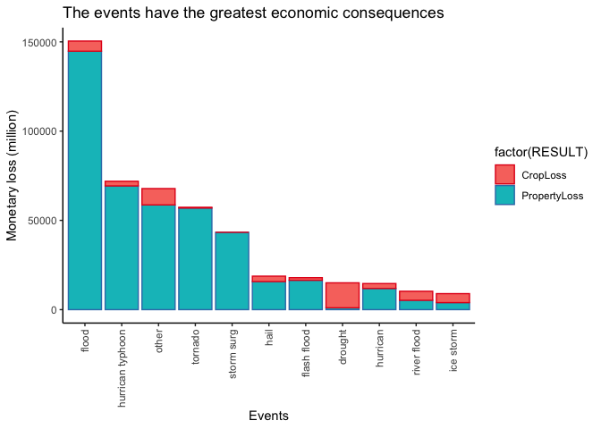

## Title: Across the United States, which types of events are most harmful with respect to population health, and which types of events have the greatest economic consequences?


### Synopsis: 
Storms and other severe weather events can cause both public health and economic problems for communities and municipalities. Many severe events can result in fatalities, injuries, and property damage, and preventing such outcomes to the extent possible is a key concern. 

So we are concerned about which types of events are most harmful with respect to population health, and which types of events have the greatest economic consequences? After exploring the U.S. National Oceanic and Atmospheric Administration's (NOAA) storm database, we conclude that tornados are the most harmful event to population health, while floods have the greatest economic consequences.

### Data Processing
We have few steps in data processing. 
1. load data
2. examine data
3. data selection
4. data conversion

### 1. Load data

```r
## Load libraries
setwd("/Users/l/Documents/Google_Drive/Workplace-JP/Workspace/R/datasciencecoursera/5Reproducible_Research/RepData_PeerAssessment2")

library("knitr")
library(kableExtra)
library(ggplot2)
library(tidyr)
library(dplyr)
# install.packages("stopwords")
library(stopwords)
# install.packages("tokenizers")
library(tokenizers)

# Load data
link <- "https://d396qusza40orc.cloudfront.net/repdata%2Fdata%2FStormData.csv.bz2"
df <- read.csv("repdata_data_StormData.csv.bz2", stringsAsFactors = FALSE, strip.white=TRUE, header=TRUE)
rm(link)
```

### 2. Examine data

```r
# Preview data
str(df)
```

```
## 'data.frame':	902297 obs. of  37 variables:
##  $ STATE__   : num  1 1 1 1 1 1 1 1 1 1 ...
##  $ BGN_DATE  : chr  "4/18/1950 0:00:00" "4/18/1950 0:00:00" "2/20/1951 0:00:00" "6/8/1951 0:00:00" ...
##  $ BGN_TIME  : chr  "0130" "0145" "1600" "0900" ...
##  $ TIME_ZONE : chr  "CST" "CST" "CST" "CST" ...
##  $ COUNTY    : num  97 3 57 89 43 77 9 123 125 57 ...
##  $ COUNTYNAME: chr  "MOBILE" "BALDWIN" "FAYETTE" "MADISON" ...
##  $ STATE     : chr  "AL" "AL" "AL" "AL" ...
##  $ EVTYPE    : chr  "TORNADO" "TORNADO" "TORNADO" "TORNADO" ...
##  $ BGN_RANGE : num  0 0 0 0 0 0 0 0 0 0 ...
##  $ BGN_AZI   : chr  "" "" "" "" ...
##  $ BGN_LOCATI: chr  "" "" "" "" ...
##  $ END_DATE  : chr  "" "" "" "" ...
##  $ END_TIME  : chr  "" "" "" "" ...
##  $ COUNTY_END: num  0 0 0 0 0 0 0 0 0 0 ...
##  $ COUNTYENDN: logi  NA NA NA NA NA NA ...
##  $ END_RANGE : num  0 0 0 0 0 0 0 0 0 0 ...
##  $ END_AZI   : chr  "" "" "" "" ...
##  $ END_LOCATI: chr  "" "" "" "" ...
##  $ LENGTH    : num  14 2 0.1 0 0 1.5 1.5 0 3.3 2.3 ...
##  $ WIDTH     : num  100 150 123 100 150 177 33 33 100 100 ...
##  $ F         : int  3 2 2 2 2 2 2 1 3 3 ...
##  $ MAG       : num  0 0 0 0 0 0 0 0 0 0 ...
##  $ FATALITIES: num  0 0 0 0 0 0 0 0 1 0 ...
##  $ INJURIES  : num  15 0 2 2 2 6 1 0 14 0 ...
##  $ PROPDMG   : num  25 2.5 25 2.5 2.5 2.5 2.5 2.5 25 25 ...
##  $ PROPDMGEXP: chr  "K" "K" "K" "K" ...
##  $ CROPDMG   : num  0 0 0 0 0 0 0 0 0 0 ...
##  $ CROPDMGEXP: chr  "" "" "" "" ...
##  $ WFO       : chr  "" "" "" "" ...
##  $ STATEOFFIC: chr  "" "" "" "" ...
##  $ ZONENAMES : chr  "" "" "" "" ...
##  $ LATITUDE  : num  3040 3042 3340 3458 3412 ...
##  $ LONGITUDE : num  8812 8755 8742 8626 8642 ...
##  $ LATITUDE_E: num  3051 0 0 0 0 ...
##  $ LONGITUDE_: num  8806 0 0 0 0 ...
##  $ REMARKS   : chr  "" "" "" "" ...
##  $ REFNUM    : num  1 2 3 4 5 6 7 8 9 10 ...
```

```r
dim(df)
```

```
## [1] 902297     37
```
### 3. Data selection
We find out only the following columns are needed, and therefore select them.
- BGN_DATE: the beginning date
- EVTYPE: types of events 
- FATALITIES: number of deaths
- INJURIES:  number of injuries
- PROPDMG: the cost of property damage
- PROPDMGEXP: the unit for the property damage 
- CROPDMG: the cost crop damages
- CROPDMGEXP: the unit for the crop damage


```r
# Select necessary columns
df <- select(df, "BGN_DATE", "EVTYPE", "FATALITIES", "INJURIES", "PROPDMG", "PROPDMGEXP", "CROPDMG", "CROPDMGEXP")
```
### 4. Data conversion
Update the units and types

```r
# Update data types
df$BGN_DATE <- as.Date(as.character(df$BGN_DATE),format="%m/%d/%Y %H:%M:%S")

# Update units 
df <- df %>% 
  mutate(PROPDMGEXP = dplyr::recode(
    PROPDMGEXP,"H" = 10^2L, "K" = 10^3L,"M" = 10^6L,"B" = 10^9L, "-" = 1,
                  "+" = 1, "?" = 1, .default = 1, .missing = 1))
df$PropertyLoss <- df$PROPDMG * df$PROPDMGEXP 

df <- df %>% 
  mutate(CROPDMGEXP = dplyr::recode(
    CROPDMGEXP,"H" = 10^2L, "K" = 10^3L,"M" = 10^6L,"B" = 10^9L, "-" = 1,
                  "+" = 1, "?" = 1, .default = 1, .missing = 1))

df$CropLoss <- df$CROPDMG * df$CROPDMGEXP 

#Examine unique types of events
unique(toupper(df$EVTYPE))
```

```
##   [1] "TORNADO"                        "TSTM WIND"                     
##   [3] "HAIL"                           "FREEZING RAIN"                 
##   [5] "SNOW"                           "ICE STORM/FLASH FLOOD"         
##   [7] "SNOW/ICE"                       "WINTER STORM"                  
##   [9] "HURRICANE OPAL/HIGH WINDS"      "THUNDERSTORM WINDS"            
##  [11] "RECORD COLD"                    "HURRICANE ERIN"                
##  [13] "HURRICANE OPAL"                 "HEAVY RAIN"                    
##  [15] "LIGHTNING"                      "THUNDERSTORM WIND"             
##  [17] "DENSE FOG"                      "RIP CURRENT"                   
##  [19] "THUNDERSTORM WINS"              "FLASH FLOOD"                   
##  [21] "FLASH FLOODING"                 "HIGH WINDS"                    
##  [23] "FUNNEL CLOUD"                   "TORNADO F0"                    
##  [25] "THUNDERSTORM WINDS LIGHTNING"   "THUNDERSTORM WINDS/HAIL"       
##  [27] "HEAT"                           "WIND"                          
##  [29] "LIGHTING"                       "HEAVY RAINS"                   
##  [31] "LIGHTNING AND HEAVY RAIN"       "FUNNEL"                        
##  [33] "WALL CLOUD"                     "FLOODING"                      
##  [35] "THUNDERSTORM WINDS HAIL"        "FLOOD"                         
##  [37] "COLD"                           "HEAVY RAIN/LIGHTNING"          
##  [39] "FLASH FLOODING/THUNDERSTORM WI" "WALL CLOUD/FUNNEL CLOUD"       
##  [41] "THUNDERSTORM"                   "WATERSPOUT"                    
##  [43] "EXTREME COLD"                   "HAIL 1.75)"                    
##  [45] "LIGHTNING/HEAVY RAIN"           "HIGH WIND"                     
##  [47] "BLIZZARD"                       "BLIZZARD WEATHER"              
##  [49] "WIND CHILL"                     "BREAKUP FLOODING"              
##  [51] "HIGH WIND/BLIZZARD"             "RIVER FLOOD"                   
##  [53] "HEAVY SNOW"                     "FREEZE"                        
##  [55] "COASTAL FLOOD"                  "HIGH WIND AND HIGH TIDES"      
##  [57] "HIGH WIND/BLIZZARD/FREEZING RA" "HIGH TIDES"                    
##  [59] "HIGH WIND AND HEAVY SNOW"       "RECORD COLD AND HIGH WIND"     
##  [61] "RECORD HIGH TEMPERATURE"        "RECORD HIGH"                   
##  [63] "HIGH WINDS HEAVY RAINS"         "HIGH WIND/ BLIZZARD"           
##  [65] "ICE STORM"                      "BLIZZARD/HIGH WIND"            
##  [67] "HIGH WIND/LOW WIND CHILL"       "HEAVY SNOW/HIGH"               
##  [69] "RECORD LOW"                     "HIGH WINDS AND WIND CHILL"     
##  [71] "HEAVY SNOW/HIGH WINDS/FREEZING" "LOW TEMPERATURE RECORD"        
##  [73] "AVALANCHE"                      "MARINE MISHAP"                 
##  [75] "WIND CHILL/HIGH WIND"           "HIGH WIND/WIND CHILL/BLIZZARD" 
##  [77] "HIGH WIND/WIND CHILL"           "HIGH WIND/HEAVY SNOW"          
##  [79] "HIGH TEMPERATURE RECORD"        "FLOOD WATCH/"                  
##  [81] "RECORD HIGH TEMPERATURES"       "HIGH WIND/SEAS"                
##  [83] "HIGH WINDS/HEAVY RAIN"          "HIGH SEAS"                     
##  [85] "SEVERE TURBULENCE"              "RECORD RAINFALL"               
##  [87] "RECORD SNOWFALL"                "RECORD WARMTH"                 
##  [89] "HEAVY SNOW/WIND"                "EXTREME HEAT"                  
##  [91] "WIND DAMAGE"                    "DUST STORM"                    
##  [93] "APACHE COUNTY"                  "SLEET"                         
##  [95] "HAIL STORM"                     "FUNNEL CLOUDS"                 
##  [97] "FLASH FLOODS"                   "DUST DEVIL"                    
##  [99] "EXCESSIVE HEAT"                 "THUNDERSTORM WINDS/FUNNEL CLOU"
## [101] "WINTER STORM/HIGH WIND"         "WINTER STORM/HIGH WINDS"       
## [103] "GUSTY WINDS"                    "STRONG WINDS"                  
## [105] "FLOODING/HEAVY RAIN"            "SNOW AND WIND"                 
## [107] "HEAVY SURF COASTAL FLOODING"    "HEAVY SURF"                    
## [109] "HEAVY PRECIPATATION"            "URBAN FLOODING"                
## [111] "HIGH SURF"                      "BLOWING DUST"                  
## [113] "URBAN/SMALL"                    "WILD FIRES"                    
## [115] "HIGH"                           "URBAN/SMALL FLOODING"          
## [117] "WATER SPOUT"                    "HIGH WINDS DUST STORM"         
## [119] "WINTER STORM HIGH WINDS"        "LOCAL FLOOD"                   
## [121] "WINTER STORMS"                  "MUDSLIDES"                     
## [123] "RAINSTORM"                      "SEVERE THUNDERSTORM"           
## [125] "SEVERE THUNDERSTORMS"           "SEVERE THUNDERSTORM WINDS"     
## [127] "THUNDERSTORMS WINDS"            "DRY MICROBURST"                
## [129] "FLOOD/FLASH FLOOD"              "FLOOD/RAIN/WINDS"              
## [131] "WINDS"                          "DRY MICROBURST 61"             
## [133] "THUNDERSTORMS"                  "FLASH FLOOD WINDS"             
## [135] "URBAN/SMALL STREAM FLOODING"    "MICROBURST"                    
## [137] "STRONG WIND"                    "HIGH WIND DAMAGE"              
## [139] "STREAM FLOODING"                "URBAN AND SMALL"               
## [141] "HEAVY SNOWPACK"                 "ICE"                           
## [143] "FLASH FLOOD/"                   "DOWNBURST"                     
## [145] "GUSTNADO AND"                   "FLOOD/RAIN/WIND"               
## [147] "WET MICROBURST"                 "DOWNBURST WINDS"               
## [149] "DRY MICROBURST WINDS"           "DRY MIRCOBURST WINDS"          
## [151] "DRY MICROBURST 53"              "SMALL STREAM URBAN FLOOD"      
## [153] "MICROBURST WINDS"               "HIGH WINDS 57"                 
## [155] "DRY MICROBURST 50"              "HIGH WINDS 66"                 
## [157] "HIGH WINDS 76"                  "HIGH WINDS 63"                 
## [159] "HIGH WINDS 67"                  "BLIZZARD/HEAVY SNOW"           
## [161] "HEAVY SNOW/HIGH WINDS"          "BLOWING SNOW"                  
## [163] "HIGH WINDS 82"                  "HIGH WINDS 80"                 
## [165] "HIGH WINDS 58"                  "FREEZING DRIZZLE"              
## [167] "LIGHTNING THUNDERSTORM WINDSS"  "DRY MICROBURST 58"             
## [169] "HAIL 75"                        "HIGH WINDS 73"                 
## [171] "HIGH WINDS 55"                  "LIGHT SNOW AND SLEET"          
## [173] "URBAN FLOOD"                    "DRY MICROBURST 84"             
## [175] "THUNDERSTORM WINDS 60"          "HEAVY RAIN/FLOODING"           
## [177] "THUNDERSTORM WINDSS"            "TORNADOS"                      
## [179] "GLAZE"                          "RECORD HEAT"                   
## [181] "COASTAL FLOODING"               "HEAT WAVE"                     
## [183] "FIRST SNOW"                     "FREEZING RAIN AND SLEET"       
## [185] "UNSEASONABLY DRY"               "UNSEASONABLY WET"              
## [187] "WINTRY MIX"                     "WINTER WEATHER"                
## [189] "UNSEASONABLY COLD"              "EXTREME/RECORD COLD"           
## [191] "RIP CURRENTS HEAVY SURF"        "SLEET/RAIN/SNOW"               
## [193] "UNSEASONABLY WARM"              "DROUGHT"                       
## [195] "NORMAL PRECIPITATION"           "HIGH WINDS/FLOODING"           
## [197] "DRY"                            "RAIN/SNOW"                     
## [199] "SNOW/RAIN/SLEET"                "WATERSPOUT/TORNADO"            
## [201] "WATERSPOUTS"                    "WATERSPOUT TORNADO"            
## [203] "URBAN/SMALL STREAM FLOOD"       "STORM SURGE"                   
## [205] "WATERSPOUT-TORNADO"             "WATERSPOUT-"                   
## [207] "TORNADOES, TSTM WIND, HAIL"     "TROPICAL STORM ALBERTO"        
## [209] "TROPICAL STORM"                 "TROPICAL STORM GORDON"         
## [211] "TROPICAL STORM JERRY"           "LIGHTNING THUNDERSTORM WINDS"  
## [213] "WAYTERSPOUT"                    "MINOR FLOODING"                
## [215] "LIGHTNING INJURY"               "URBAN/SMALL STREAM  FLOOD"     
## [217] "LIGHTNING AND THUNDERSTORM WIN" "THUNDERSTORM WINDS53"          
## [219] "URBAN AND SMALL STREAM FLOOD"   "URBAN AND SMALL STREAM"        
## [221] "WILDFIRE"                       "DAMAGING FREEZE"               
## [223] "THUNDERSTORM WINDS 13"          "SMALL HAIL"                    
## [225] "HEAVY SNOW/HIGH WIND"           "HURRICANE"                     
## [227] "WILD/FOREST FIRE"               "SMALL STREAM FLOODING"         
## [229] "MUD SLIDE"                      "LIGNTNING"                     
## [231] "FROST"                          "FREEZING RAIN/SNOW"            
## [233] "HIGH WINDS/"                    "THUNDERSNOW"                   
## [235] "FLOODS"                         "EXTREME WIND CHILLS"           
## [237] "COOL AND WET"                   "HEAVY RAIN/SNOW"               
## [239] "SMALL STREAM AND URBAN FLOODIN" "SMALL STREAM/URBAN FLOOD"      
## [241] "SNOW/SLEET/FREEZING RAIN"       "SEVERE COLD"                   
## [243] "GLAZE ICE"                      "COLD WAVE"                     
## [245] "EARLY SNOW"                     "SMALL STREAM AND URBAN FLOOD"  
## [247] "HIGH  WINDS"                    "RURAL FLOOD"                   
## [249] "SMALL STREAM AND"               "MUD SLIDES"                    
## [251] "HAIL 80"                        "EXTREME WIND CHILL"            
## [253] "COLD AND WET CONDITIONS"        "EXCESSIVE WETNESS"             
## [255] "GRADIENT WINDS"                 "HEAVY SNOW/BLOWING SNOW"       
## [257] "SLEET/ICE STORM"                "THUNDERSTORM WINDS URBAN FLOOD"
## [259] "THUNDERSTORM WINDS SMALL STREA" "ROTATING WALL CLOUD"           
## [261] "LARGE WALL CLOUD"               "COLD AIR FUNNEL"               
## [263] "GUSTNADO"                       "COLD AIR FUNNELS"              
## [265] "BLOWING SNOW- EXTREME WIND CHI" "SNOW AND HEAVY SNOW"           
## [267] "GROUND BLIZZARD"                "MAJOR FLOOD"                   
## [269] "SNOW/HEAVY SNOW"                "FREEZING RAIN/SLEET"           
## [271] "ICE JAM FLOODING"               "SNOW- HIGH WIND- WIND CHILL"   
## [273] "STREET FLOOD"                   "COLD AIR TORNADO"              
## [275] "SMALL STREAM FLOOD"             "FOG"                           
## [277] "THUNDERSTORM WINDS 2"           "FUNNEL CLOUD/HAIL"             
## [279] "ICE/SNOW"                       "TSTM WIND 51"                  
## [281] "TSTM WIND 50"                   "TSTM WIND 52"                  
## [283] "TSTM WIND 55"                   "HEAVY SNOW/BLIZZARD"           
## [285] "THUNDERSTORM WINDS 61"          "HAIL 0.75"                     
## [287] "THUNDERSTORM DAMAGE"            "THUNDERTORM WINDS"             
## [289] "HAIL 1.00"                      "HAIL/WINDS"                    
## [291] "SNOW AND ICE"                   "WIND STORM"                    
## [293] "SNOWSTORM"                      "GRASS FIRES"                   
## [295] "LAKE FLOOD"                     "PROLONG COLD"                  
## [297] "HAIL/WIND"                      "HAIL 1.75"                     
## [299] "THUNDERSTORMW 50"               "WIND/HAIL"                     
## [301] "SNOW AND ICE STORM"             "URBAN AND SMALL STREAM FLOODIN"
## [303] "THUNDERSTORMS WIND"             "THUNDERSTORM  WINDS"           
## [305] "HEAVY SNOW/SLEET"               "AGRICULTURAL FREEZE"           
## [307] "DROUGHT/EXCESSIVE HEAT"         "TUNDERSTORM WIND"              
## [309] "TROPICAL STORM DEAN"            "THUNDERTSORM WIND"             
## [311] "THUNDERSTORM WINDS/ HAIL"       "THUNDERSTORM WIND/LIGHTNING"   
## [313] "HEAVY RAIN/SEVERE WEATHER"      "THUNDESTORM WINDS"             
## [315] "WATERSPOUT/ TORNADO"            "LIGHTNING."                    
## [317] "WARM DRY CONDITIONS"            "HURRICANE-GENERATED SWELLS"    
## [319] "HEAVY SNOW/ICE STORM"           "RIVER AND STREAM FLOOD"        
## [321] "HIGH WIND 63"                   "COASTAL SURGE"                 
## [323] "HEAVY SNOW AND ICE STORM"       "MINOR FLOOD"                   
## [325] "HIGH WINDS/COASTAL FLOOD"       "RAIN"                          
## [327] "RIVER FLOODING"                 "SNOW/RAIN"                     
## [329] "ICE FLOES"                      "HIGH WAVES"                    
## [331] "SNOW SQUALLS"                   "SNOW SQUALL"                   
## [333] "THUNDERSTORM WIND G50"          "LIGHTNING FIRE"                
## [335] "BLIZZARD/FREEZING RAIN"         "HEAVY LAKE SNOW"               
## [337] "HEAVY SNOW/FREEZING RAIN"       "LAKE EFFECT SNOW"              
## [339] "HEAVY WET SNOW"                 "DUST DEVIL WATERSPOUT"         
## [341] "THUNDERSTORM WINDS/HEAVY RAIN"  "THUNDERSTROM WINDS"            
## [343] "THUNDERSTORM WINDS      LE CEN" "HAIL 225"                      
## [345] "BLIZZARD AND HEAVY SNOW"        "HEAVY SNOW AND ICE"            
## [347] "ICE STORM AND SNOW"             "HEAVY SNOW ANDBLOWING SNOW"    
## [349] "HEAVY SNOW/ICE"                 "BLIZZARD AND EXTREME WIND CHIL"
## [351] "LOW WIND CHILL"                 "BLOWING SNOW & EXTREME WIND CH"
## [353] "WATERSPOUT/"                    "URBAN/SMALL STREAM"            
## [355] "TORNADO F3"                     "FUNNEL CLOUD."                 
## [357] "TORNDAO"                        "HAIL 0.88"                     
## [359] "FLOOD/RIVER FLOOD"              "MUD SLIDES URBAN FLOODING"     
## [361] "TORNADO F1"                     "THUNDERSTORM WINDS G"          
## [363] "DEEP HAIL"                      "GLAZE/ICE STORM"               
## [365] "HEAVY SNOW/WINTER STORM"        "AVALANCE"                      
## [367] "BLIZZARD/WINTER STORM"          "DUST STORM/HIGH WINDS"         
## [369] "ICE JAM"                        "FOREST FIRES"                  
## [371] "THUNDERSTORM WIND G60"          "FROST\\FREEZE"                 
## [373] "THUNDERSTORM WINDS."            "HAIL 88"                       
## [375] "HAIL 175"                       "HVY RAIN"                      
## [377] "HAIL 100"                       "HAIL 150"                      
## [379] "HAIL 075"                       "THUNDERSTORM WIND G55"         
## [381] "HAIL 125"                       "THUNDERSTORM WINDS G60"        
## [383] "HARD FREEZE"                    "HAIL 200"                      
## [385] "THUNDERSTORM WINDS FUNNEL CLOU" "THUNDERSTORM WINDS 62"         
## [387] "WILDFIRES"                      "RECORD HEAT WAVE"              
## [389] "HEAVY SNOW AND HIGH WINDS"      "HEAVY SNOW/HIGH WINDS & FLOOD" 
## [391] "HAIL FLOODING"                  "THUNDERSTORM WINDS/FLASH FLOOD"
## [393] "HIGH WIND 70"                   "WET SNOW"                      
## [395] "HEAVY RAIN AND FLOOD"           "LOCAL FLASH FLOOD"             
## [397] "THUNDERSTORM WINDS 53"          "FLOOD/FLASH FLOODING"          
## [399] "TORNADO/WATERSPOUT"             "RAIN AND WIND"                 
## [401] "THUNDERSTORM WIND 59"           "THUNDERSTORM WIND 52"          
## [403] "COASTAL/TIDAL FLOOD"            "SNOW/ICE STORM"                
## [405] "BELOW NORMAL PRECIPITATION"     "RIP CURRENTS/HEAVY SURF"       
## [407] "FLASH FLOOD/FLOOD"              "EXCESSIVE RAIN"                
## [409] "RECORD/EXCESSIVE HEAT"          "HEAT WAVES"                    
## [411] "LIGHT SNOW"                     "THUNDERSTORM WIND 69"          
## [413] "HAIL DAMAGE"                    "LIGHTNING DAMAGE"              
## [415] "RECORD TEMPERATURES"            "LIGHTNING AND WINDS"           
## [417] "FOG AND COLD TEMPERATURES"      "OTHER"                         
## [419] "RECORD SNOW"                    "SNOW/COLD"                     
## [421] "FLASH FLOOD FROM ICE JAMS"      "TSTM WIND G58"                 
## [423] "MUDSLIDE"                       "HEAVY SNOW SQUALLS"            
## [425] "HEAVY SNOW/SQUALLS"             "HEAVY SNOW-SQUALLS"            
## [427] "ICY ROADS"                      "HEAVY MIX"                     
## [429] "SNOW FREEZING RAIN"             "LACK OF SNOW"                  
## [431] "SNOW/SLEET"                     "SNOW/FREEZING RAIN"            
## [433] "SNOW DROUGHT"                   "THUNDERSTORMW WINDS"           
## [435] "THUNDERSTORM WIND 60 MPH"       "THUNDERSTORM WIND 65MPH"       
## [437] "THUNDERSTORM WIND/ TREES"       "THUNDERSTORM WIND/AWNING"      
## [439] "THUNDERSTORM WIND 98 MPH"       "THUNDERSTORM WIND TREES"       
## [441] "TORRENTIAL RAIN"                "TORNADO F2"                    
## [443] "RIP CURRENTS"                   "HURRICANE EMILY"               
## [445] "HURRICANE GORDON"               "HURRICANE FELIX"               
## [447] "THUNDERSTORM WIND 59 MPH"       "THUNDERSTORM WINDS 63 MPH"     
## [449] "THUNDERSTORM WIND/ TREE"        "THUNDERSTORM DAMAGE TO"        
## [451] "THUNDERSTORM WIND 65 MPH"       "FLASH FLOOD - HEAVY RAIN"      
## [453] "THUNDERSTORM WIND."             "FLASH FLOOD/ STREET"           
## [455] "THUNDERSTORM WIND 59 MPH."      "HEAVY SNOW   FREEZING RAIN"    
## [457] "DAM FAILURE"                    "THUNDERSTORM HAIL"             
## [459] "HAIL 088"                       "THUNDERSTORM WINDSHAIL"        
## [461] "LIGHTNING  WAUSEON"             "THUDERSTORM WINDS"             
## [463] "ICE AND SNOW"                   "RECORD COLD/FROST"             
## [465] "STORM FORCE WINDS"              "FREEZING RAIN AND SNOW"        
## [467] "FREEZING RAIN SLEET AND"        "SOUTHEAST"                     
## [469] "HEAVY SNOW & ICE"               "FREEZING DRIZZLE AND FREEZING" 
## [471] "THUNDERSTORM WINDS AND"         "HAIL/ICY ROADS"                
## [473] "FLASH FLOOD/HEAVY RAIN"         "HEAVY RAIN; URBAN FLOOD WINDS;"
## [475] "HEAVY PRECIPITATION"            "TSTM WIND DAMAGE"              
## [477] "HIGH WATER"                     "FLOOD FLASH"                   
## [479] "RAIN/WIND"                      "THUNDERSTORM WINDS 50"         
## [481] "THUNDERSTORM WIND G52"          "FLOOD FLOOD/FLASH"             
## [483] "THUNDERSTORM WINDS 52"          "SNOW SHOWERS"                  
## [485] "THUNDERSTORM WIND G51"          "HEAT WAVE DROUGHT"             
## [487] "HEAVY SNOW/BLIZZARD/AVALANCHE"  "RECORD SNOW/COLD"              
## [489] "WET WEATHER"                    "UNSEASONABLY WARM AND DRY"     
## [491] "FREEZING RAIN SLEET AND LIGHT"  "RECORD/EXCESSIVE RAINFALL"     
## [493] "TIDAL FLOOD"                    "BEACH EROSIN"                  
## [495] "THUNDERSTORM WIND G61"          "FLOOD/FLASH"                   
## [497] "LOW TEMPERATURE"                "SLEET & FREEZING RAIN"         
## [499] "HEAVY RAINS/FLOODING"           "THUNDERESTORM WINDS"           
## [501] "THUNDERSTORM WINDS/FLOODING"    "THUNDEERSTORM WINDS"           
## [503] "HIGHWAY FLOODING"               "THUNDERSTORM W INDS"           
## [505] "HYPOTHERMIA"                    "FLASH FLOOD/ FLOOD"            
## [507] "THUNDERSTORM WIND 50"           "THUNERSTORM WINDS"             
## [509] "HEAVY RAIN/MUDSLIDES/FLOOD"     "MUD/ROCK SLIDE"                
## [511] "HIGH WINDS/COLD"                "BEACH EROSION/COASTAL FLOOD"   
## [513] "COLD/WINDS"                     "SNOW/ BITTER COLD"             
## [515] "THUNDERSTORM WIND 56"           "SNOW SLEET"                    
## [517] "DRY HOT WEATHER"                "COLD WEATHER"                  
## [519] "RAPIDLY RISING WATER"           "HAIL ALOFT"                    
## [521] "EARLY FREEZE"                   "ICE/STRONG WINDS"              
## [523] "EXTREME WIND CHILL/BLOWING SNO" "SNOW/HIGH WINDS"               
## [525] "HIGH WINDS/SNOW"                "EARLY FROST"                   
## [527] "SNOWMELT FLOODING"              "HEAVY SNOW AND STRONG WINDS"   
## [529] "SNOW ACCUMULATION"              "BLOWING SNOW/EXTREME WIND CHIL"
## [531] "SNOW/ ICE"                      "SNOW/BLOWING SNOW"             
## [533] "TORNADOES"                      "THUNDERSTORM WIND/HAIL"        
## [535] "FLASH FLOODING/FLOOD"           "HAIL 275"                      
## [537] "HAIL 450"                       "FLASH FLOOODING"               
## [539] "EXCESSIVE RAINFALL"             "THUNDERSTORMW"                 
## [541] "HAILSTORM"                      "TSTM WINDS"                    
## [543] "BEACH FLOOD"                    "HAILSTORMS"                    
## [545] "TSTMW"                          "FUNNELS"                       
## [547] "TSTM WIND 65)"                  "THUNDERSTORM WINDS/ FLOOD"     
## [549] "HEAVY RAINFALL"                 "HEAT/DROUGHT"                  
## [551] "HEAT DROUGHT"                   "NEAR RECORD SNOW"              
## [553] "LANDSLIDE"                      "HIGH WIND AND SEAS"            
## [555] "THUNDERSTORMWINDS"              "THUNDERSTORM WINDS HEAVY RAIN" 
## [557] "SLEET/SNOW"                     "EXCESSIVE"                     
## [559] "SNOW/SLEET/RAIN"                "WILD/FOREST FIRES"             
## [561] "HEAVY SEAS"                     "DUSTSTORM"                     
## [563] "FLOOD & HEAVY RAIN"             "?"                             
## [565] "THUNDERSTROM WIND"              "FLOOD/FLASHFLOOD"              
## [567] "SNOW AND COLD"                  "HOT PATTERN"                   
## [569] "PROLONG COLD/SNOW"              "BRUSH FIRES"                   
## [571] "SNOW\\COLD"                     "WINTER MIX"                    
## [573] "EXCESSIVE PRECIPITATION"        "SNOWFALL RECORD"               
## [575] "HOT/DRY PATTERN"                "DRY PATTERN"                   
## [577] "MILD/DRY PATTERN"               "MILD PATTERN"                  
## [579] "LANDSLIDES"                     "HEAVY SHOWERS"                 
## [581] "HEAVY SNOW AND"                 "HIGH WIND 48"                  
## [583] "LAKE-EFFECT SNOW"               "BRUSH FIRE"                    
## [585] "WATERSPOUT FUNNEL CLOUD"        "URBAN SMALL STREAM FLOOD"      
## [587] "SAHARAN DUST"                   "HEAVY SHOWER"                  
## [589] "URBAN FLOOD LANDSLIDE"          "HEAVY SWELLS"                  
## [591] "URBAN SMALL"                    "URBAN FLOODS"                  
## [593] "SMALL STREAM"                   "HEAVY RAIN/URBAN FLOOD"        
## [595] "FLASH FLOOD/LANDSLIDE"          "LANDSLIDE/URBAN FLOOD"         
## [597] "HEAVY RAIN/SMALL STREAM URBAN"  "FLASH FLOOD LANDSLIDES"        
## [599] "EXTREME WINDCHILL"              "URBAN/SML STREAM FLD"          
## [601] "TSTM WIND/HAIL"                 "RECORD DRY MONTH"              
## [603] "TEMPERATURE RECORD"             "ICE JAM FLOOD (MINOR"          
## [605] "ROUGH SURF"                     "MARINE ACCIDENT"               
## [607] "COASTAL STORM"                  "COASTALFLOOD"                  
## [609] "EROSION/CSTL FLOOD"             "HEAVY RAIN AND WIND"           
## [611] "LIGHT SNOW/FLURRIES"            "WET MONTH"                     
## [613] "WET YEAR"                       "TIDAL FLOODING"                
## [615] "BEACH EROSION"                  "HOT AND DRY"                   
## [617] "HEAVY RAIN/HIGH SURF"           "RAIN DAMAGE"                   
## [619] "UNSEASONABLE COLD"              "STREET FLOODING"               
## [621] "ICE FOG"                        "EXCESSIVE COLD"                
## [623] "TORRENTIAL RAINFALL"            "LANDSLUMP"                     
## [625] "LATE-SEASON SNOWFALL"           "HURRICANE EDOUARD"             
## [627] "HEAVY RAIN/WIND"                "RECORD WARM TEMPS."            
## [629] "EXTENDED COLD"                  "FREEZING FOG"                  
## [631] "DRIFTING SNOW"                  "WHIRLWIND"                     
## [633] "HEAVY SNOW SHOWER"              "LATE SNOW"                     
## [635] "RECORD MAY SNOW"                "RECORD WINTER SNOW"            
## [637] " COASTAL FLOOD"                 "RECORD TEMPERATURE"            
## [639] "LATE SEASON SNOWFALL"           "GUSTY WIND"                    
## [641] "MIXED PRECIP"                   "BLACK ICE"                     
## [643] "GRADIENT WIND"                  "FREEZING SPRAY"                
## [645] "SUMMARY JAN 17"                 "SUMMARY OF MARCH 14"           
## [647] "SUMMARY OF MARCH 23"            "SUMMARY OF MARCH 24"           
## [649] "SUMMARY OF APRIL 3RD"           "SUMMARY OF APRIL 12"           
## [651] "SUMMARY OF APRIL 13"            "SUMMARY OF APRIL 21"           
## [653] "SUMMARY AUGUST 11"              "SUMMARY OF APRIL 27"           
## [655] "SUMMARY OF MAY 9-10"            "SUMMARY OF MAY 10"             
## [657] "SUMMARY OF MAY 13"              "SUMMARY OF MAY 14"             
## [659] "SUMMARY OF MAY 22 AM"           "SUMMARY OF MAY 22 PM"          
## [661] "HEATBURST"                      "SUMMARY OF MAY 26 AM"          
## [663] "SUMMARY OF MAY 26 PM"           "METRO STORM, MAY 26"           
## [665] "SUMMARY OF MAY 31 AM"           "SUMMARY OF MAY 31 PM"          
## [667] "SUMMARY OF JUNE 3"              "SUMMARY OF JUNE 4"             
## [669] "SUMMARY JUNE 5-6"               "SUMMARY JUNE 6"                
## [671] "SUMMARY OF JUNE 11"             "SUMMARY OF JUNE 12"            
## [673] "SUMMARY OF JUNE 13"             "SUMMARY OF JUNE 15"            
## [675] "SUMMARY OF JUNE 16"             "SUMMARY JUNE 18-19"            
## [677] "SUMMARY OF JUNE 23"             "SUMMARY OF JUNE 24"            
## [679] "SUMMARY OF JUNE 30"             "SUMMARY OF JULY 2"             
## [681] "SUMMARY OF JULY 3"              "SUMMARY OF JULY 11"            
## [683] "SUMMARY OF JULY 22"             "SUMMARY JULY 23-24"            
## [685] "SUMMARY OF JULY 26"             "SUMMARY OF JULY 29"            
## [687] "SUMMARY OF AUGUST 1"            "SUMMARY AUGUST 2-3"            
## [689] "SUMMARY AUGUST 7"               "SUMMARY AUGUST 9"              
## [691] "SUMMARY AUGUST 10"              "SUMMARY AUGUST 17"             
## [693] "SUMMARY AUGUST 21"              "SUMMARY AUGUST 28"             
## [695] "SUMMARY SEPTEMBER 4"            "SUMMARY SEPTEMBER 20"          
## [697] "SUMMARY SEPTEMBER 23"           "SUMMARY SEPT. 25-26"           
## [699] "SUMMARY: OCT. 20-21"            "SUMMARY: OCTOBER 31"           
## [701] "SUMMARY: NOV. 6-7"              "SUMMARY: NOV. 16"              
## [703] "WET MICOBURST"                  "HAIL(0.75)"                    
## [705] "NO SEVERE WEATHER"              "SUMMARY OF MAY 22"             
## [707] "SUMMARY OF JUNE 6"              "SUMMARY AUGUST 4"              
## [709] "SUMMARY OF JUNE 10"             "SUMMARY OF JUNE 18"            
## [711] "SUMMARY SEPTEMBER 3"            "SUMMARY: SEPT. 18"             
## [713] "LIGHT SNOWFALL"                 "GUSTY WIND/RAIN"               
## [715] "GUSTY WIND/HVY RAIN"            "EARLY SNOWFALL"                
## [717] "MONTHLY SNOWFALL"               "SEASONAL SNOWFALL"             
## [719] "MONTHLY RAINFALL"               "COLD TEMPERATURE"              
## [721] "SML STREAM FLD"                 "MUDSLIDE/LANDSLIDE"            
## [723] "VOLCANIC ASH"                   "VOLCANIC ASH PLUME"            
## [725] "THUNDERSNOW SHOWER"             "NONE"                          
## [727] "COLD AND SNOW"                  "DAM BREAK"                     
## [729] "TSTM WIND (G45)"                "SLEET/FREEZING RAIN"           
## [731] "BLOW-OUT TIDES"                 "UNSEASONABLY COOL"             
## [733] "TSTM HEAVY RAIN"                "TSTM WIND 40"                  
## [735] "TSTM WIND 45"                   "TSTM WIND (41)"                
## [737] "TSTM WIND (G40)"                "TSTM WND"                      
## [739] " TSTM WIND"                     "FROST/FREEZE"                  
## [741] "RAIN (HEAVY)"                   "COLD AND FROST"                
## [743] "URBAN/SML STREAM FLDG"          "STRONG WIND GUST"              
## [745] "LATE FREEZE"                    "BLOW-OUT TIDE"                 
## [747] "HYPOTHERMIA/EXPOSURE"           "MIXED PRECIPITATION"           
## [749] "COASTALSTORM"                   "SNOW AND SLEET"                
## [751] "BLIZZARD SUMMARY"               "SUMMARY OF MARCH 24-25"        
## [753] "SUMMARY OF MARCH 27"            "SUMMARY OF MARCH 29"           
## [755] "ICESTORM/BLIZZARD"              "FLOOD/STRONG WIND"             
## [757] "TSTM WIND AND LIGHTNING"        "MOUNTAIN SNOWS"                
## [759] "URBAN/SMALL STRM FLDG"          "HEAVY SURF AND WIND"           
## [761] "MILD AND DRY PATTERN"           "TYPHOON"                       
## [763] "HIGH SWELLS"                    "HIGH  SWELLS"                  
## [765] "DRY SPELL"                      " LIGHTNING"                    
## [767] "UNSEASONAL RAIN"                "EARLY RAIN"                    
## [769] "PROLONGED RAIN"                 "WINTERY MIX"                   
## [771] "COASTAL FLOODING/EROSION"       "HOT SPELL"                     
## [773] "UNSEASONABLY HOT"               " TSTM WIND (G45)"              
## [775] "TSTM WIND  (G45)"               "HIGH WIND (G40)"               
## [777] "TSTM WIND (G35)"                "DRY WEATHER"                   
## [779] "ABNORMAL WARMTH"                "UNUSUAL WARMTH"                
## [781] "WAKE LOW WIND"                  "COLD TEMPERATURES"             
## [783] "COLD WIND CHILL TEMPERATURES"   "MODERATE SNOW"                 
## [785] "MODERATE SNOWFALL"              "URBAN/STREET FLOODING"         
## [787] "COASTAL EROSION"                "UNUSUAL/RECORD WARMTH"         
## [789] "BITTER WIND CHILL"              "BITTER WIND CHILL TEMPERATURES"
## [791] "SEICHE"                         "TSTM"                          
## [793] "COASTAL  FLOODING/EROSION"      "UNSEASONABLY WARM YEAR"        
## [795] "HYPERTHERMIA/EXPOSURE"          "ROCK SLIDE"                    
## [797] "ICE PELLETS"                    "PATCHY DENSE FOG"              
## [799] "RECORD COOL"                    "RECORD WARM"                   
## [801] "HOT WEATHER"                    "TROPICAL DEPRESSION"           
## [803] "VOLCANIC ERUPTION"              "COOL SPELL"                    
## [805] "WIND ADVISORY"                  "GUSTY WIND/HAIL"               
## [807] "RED FLAG FIRE WX"               "FIRST FROST"                   
## [809] "EXCESSIVELY DRY"                "LIGHT SNOW/FREEZING PRECIP"    
## [811] "VOG"                            "MONTHLY PRECIPITATION"         
## [813] "MONTHLY TEMPERATURE"            "RECORD DRYNESS"                
## [815] "EXTREME WINDCHILL TEMPERATURES" "DRY CONDITIONS"                
## [817] "REMNANTS OF FLOYD"              "LANDSPOUT"                     
## [819] "DRIEST MONTH"                   "RECORD  COLD"                  
## [821] "LATE SEASON HAIL"               "EXCESSIVE SNOW"                
## [823] "DRYNESS"                        "FLOOD/FLASH/FLOOD"             
## [825] "WIND AND WAVE"                  "LIGHT FREEZING RAIN"           
## [827] " WIND"                          "RECORD PRECIPITATION"          
## [829] "ICE ROADS"                      "ROUGH SEAS"                    
## [831] "UNSEASONABLY WARM/WET"          "UNSEASONABLY COOL & WET"       
## [833] "UNUSUALLY WARM"                 "TSTM WIND G45"                 
## [835] "NON SEVERE HAIL"                "NON-SEVERE WIND DAMAGE"        
## [837] "UNUSUALLY COLD"                 "WARM WEATHER"                  
## [839] "THUNDERSTORM WIND (G40)"        "UNSEASONABLY WARM & WET"       
## [841] " FLASH FLOOD"                   "LOCALLY HEAVY RAIN"            
## [843] "WIND GUSTS"                     "UNSEASONAL LOW TEMP"           
## [845] "HIGH SURF ADVISORY"             "LATE SEASON SNOW"              
## [847] "GUSTY LAKE WIND"                "ABNORMALLY DRY"                
## [849] "WINTER WEATHER MIX"             "RED FLAG CRITERIA"             
## [851] "WND"                            "CSTL FLOODING/EROSION"         
## [853] "SMOKE"                          " WATERSPOUT"                   
## [855] "SNOW ADVISORY"                  "EXTREMELY WET"                 
## [857] "UNUSUALLY LATE SNOW"            "VERY DRY"                      
## [859] "RECORD LOW RAINFALL"            "ROGUE WAVE"                    
## [861] "PROLONG WARMTH"                 "ACCUMULATED SNOWFALL"          
## [863] "FALLING SNOW/ICE"               "DUST DEVEL"                    
## [865] "NON-TSTM WIND"                  "NON TSTM WIND"                 
## [867] "GUSTY THUNDERSTORM WINDS"       "PATCHY ICE"                    
## [869] "HEAVY RAIN EFFECTS"             "EXCESSIVE HEAT/DROUGHT"        
## [871] "NORTHERN LIGHTS"                "MARINE TSTM WIND"              
## [873] "   HIGH SURF ADVISORY"          "HAZARDOUS SURF"                
## [875] "WINTER WEATHER/MIX"             "ASTRONOMICAL HIGH TIDE"        
## [877] "VERY WARM"                      "ABNORMALLY WET"                
## [879] "TORNADO DEBRIS"                 "EXTREME COLD/WIND CHILL"       
## [881] "ICE ON ROAD"                    "DROWNING"                      
## [883] "GUSTY THUNDERSTORM WIND"        "MARINE HAIL"                   
## [885] "HIGH SURF ADVISORIES"           "HURRICANE/TYPHOON"             
## [887] "HEAVY SURF/HIGH SURF"           "SLEET STORM"                   
## [889] "STORM SURGE/TIDE"               "COLD/WIND CHILL"               
## [891] "MARINE HIGH WIND"               "TSUNAMI"                       
## [893] "DENSE SMOKE"                    "LAKESHORE FLOOD"               
## [895] "MARINE THUNDERSTORM WIND"       "MARINE STRONG WIND"            
## [897] "ASTRONOMICAL LOW TIDE"          "VOLCANIC ASHFALL"
```
We can see that some events should be considered as the same event. e.g.<[124] "SEVERE THUNDERSTORM" , [125] "SEVERE THUNDERSTORMS" > So we remove all special characters, and find the word stems.


```r
# Remove all special characters in EVTYPE column
df$EVTYPE <- gsub("[[:punct:]]", " ", df$EVTYPE)

# Find word stems
stems <- lapply(df$EVTYPE, function(x) paste(tokenize_word_stems(x, stopwords = stopwords::stopwords("en"), simplify = TRUE), collapse = " "))

# Update event names
df$EVENT <- as.character(stems)
rm(stems)

# Examine top 100 events
head(df, 100) %>%
  kable(format = "html", col.names = colnames(df)) %>%
  kable_styling() %>%
  kableExtra::scroll_box(width = "100%", height = "200px")
```

<div style="border: 1px solid #ddd; padding: 0px; overflow-y: scroll; height:200px; overflow-x: scroll; width:100%; "><table class="table" style="margin-left: auto; margin-right: auto;">
 <thead>
  <tr>
   <th style="text-align:left;position: sticky; top:0; background-color: #FFFFFF;"> BGN_DATE </th>
   <th style="text-align:left;position: sticky; top:0; background-color: #FFFFFF;"> EVTYPE </th>
   <th style="text-align:right;position: sticky; top:0; background-color: #FFFFFF;"> FATALITIES </th>
   <th style="text-align:right;position: sticky; top:0; background-color: #FFFFFF;"> INJURIES </th>
   <th style="text-align:right;position: sticky; top:0; background-color: #FFFFFF;"> PROPDMG </th>
   <th style="text-align:right;position: sticky; top:0; background-color: #FFFFFF;"> PROPDMGEXP </th>
   <th style="text-align:right;position: sticky; top:0; background-color: #FFFFFF;"> CROPDMG </th>
   <th style="text-align:right;position: sticky; top:0; background-color: #FFFFFF;"> CROPDMGEXP </th>
   <th style="text-align:right;position: sticky; top:0; background-color: #FFFFFF;"> PropertyLoss </th>
   <th style="text-align:right;position: sticky; top:0; background-color: #FFFFFF;"> CropLoss </th>
   <th style="text-align:left;position: sticky; top:0; background-color: #FFFFFF;"> EVENT </th>
  </tr>
 </thead>
<tbody>
  <tr>
   <td style="text-align:left;"> 1950-04-18 </td>
   <td style="text-align:left;"> TORNADO </td>
   <td style="text-align:right;"> 0 </td>
   <td style="text-align:right;"> 15 </td>
   <td style="text-align:right;"> 25.00 </td>
   <td style="text-align:right;"> 1e+03 </td>
   <td style="text-align:right;"> 0 </td>
   <td style="text-align:right;"> 1 </td>
   <td style="text-align:right;"> 25000 </td>
   <td style="text-align:right;"> 0 </td>
   <td style="text-align:left;"> tornado </td>
  </tr>
  <tr>
   <td style="text-align:left;"> 1950-04-18 </td>
   <td style="text-align:left;"> TORNADO </td>
   <td style="text-align:right;"> 0 </td>
   <td style="text-align:right;"> 0 </td>
   <td style="text-align:right;"> 2.50 </td>
   <td style="text-align:right;"> 1e+03 </td>
   <td style="text-align:right;"> 0 </td>
   <td style="text-align:right;"> 1 </td>
   <td style="text-align:right;"> 2500 </td>
   <td style="text-align:right;"> 0 </td>
   <td style="text-align:left;"> tornado </td>
  </tr>
  <tr>
   <td style="text-align:left;"> 1951-02-20 </td>
   <td style="text-align:left;"> TORNADO </td>
   <td style="text-align:right;"> 0 </td>
   <td style="text-align:right;"> 2 </td>
   <td style="text-align:right;"> 25.00 </td>
   <td style="text-align:right;"> 1e+03 </td>
   <td style="text-align:right;"> 0 </td>
   <td style="text-align:right;"> 1 </td>
   <td style="text-align:right;"> 25000 </td>
   <td style="text-align:right;"> 0 </td>
   <td style="text-align:left;"> tornado </td>
  </tr>
  <tr>
   <td style="text-align:left;"> 1951-06-08 </td>
   <td style="text-align:left;"> TORNADO </td>
   <td style="text-align:right;"> 0 </td>
   <td style="text-align:right;"> 2 </td>
   <td style="text-align:right;"> 2.50 </td>
   <td style="text-align:right;"> 1e+03 </td>
   <td style="text-align:right;"> 0 </td>
   <td style="text-align:right;"> 1 </td>
   <td style="text-align:right;"> 2500 </td>
   <td style="text-align:right;"> 0 </td>
   <td style="text-align:left;"> tornado </td>
  </tr>
  <tr>
   <td style="text-align:left;"> 1951-11-15 </td>
   <td style="text-align:left;"> TORNADO </td>
   <td style="text-align:right;"> 0 </td>
   <td style="text-align:right;"> 2 </td>
   <td style="text-align:right;"> 2.50 </td>
   <td style="text-align:right;"> 1e+03 </td>
   <td style="text-align:right;"> 0 </td>
   <td style="text-align:right;"> 1 </td>
   <td style="text-align:right;"> 2500 </td>
   <td style="text-align:right;"> 0 </td>
   <td style="text-align:left;"> tornado </td>
  </tr>
  <tr>
   <td style="text-align:left;"> 1951-11-15 </td>
   <td style="text-align:left;"> TORNADO </td>
   <td style="text-align:right;"> 0 </td>
   <td style="text-align:right;"> 6 </td>
   <td style="text-align:right;"> 2.50 </td>
   <td style="text-align:right;"> 1e+03 </td>
   <td style="text-align:right;"> 0 </td>
   <td style="text-align:right;"> 1 </td>
   <td style="text-align:right;"> 2500 </td>
   <td style="text-align:right;"> 0 </td>
   <td style="text-align:left;"> tornado </td>
  </tr>
  <tr>
   <td style="text-align:left;"> 1951-11-16 </td>
   <td style="text-align:left;"> TORNADO </td>
   <td style="text-align:right;"> 0 </td>
   <td style="text-align:right;"> 1 </td>
   <td style="text-align:right;"> 2.50 </td>
   <td style="text-align:right;"> 1e+03 </td>
   <td style="text-align:right;"> 0 </td>
   <td style="text-align:right;"> 1 </td>
   <td style="text-align:right;"> 2500 </td>
   <td style="text-align:right;"> 0 </td>
   <td style="text-align:left;"> tornado </td>
  </tr>
  <tr>
   <td style="text-align:left;"> 1952-01-22 </td>
   <td style="text-align:left;"> TORNADO </td>
   <td style="text-align:right;"> 0 </td>
   <td style="text-align:right;"> 0 </td>
   <td style="text-align:right;"> 2.50 </td>
   <td style="text-align:right;"> 1e+03 </td>
   <td style="text-align:right;"> 0 </td>
   <td style="text-align:right;"> 1 </td>
   <td style="text-align:right;"> 2500 </td>
   <td style="text-align:right;"> 0 </td>
   <td style="text-align:left;"> tornado </td>
  </tr>
  <tr>
   <td style="text-align:left;"> 1952-02-13 </td>
   <td style="text-align:left;"> TORNADO </td>
   <td style="text-align:right;"> 1 </td>
   <td style="text-align:right;"> 14 </td>
   <td style="text-align:right;"> 25.00 </td>
   <td style="text-align:right;"> 1e+03 </td>
   <td style="text-align:right;"> 0 </td>
   <td style="text-align:right;"> 1 </td>
   <td style="text-align:right;"> 25000 </td>
   <td style="text-align:right;"> 0 </td>
   <td style="text-align:left;"> tornado </td>
  </tr>
  <tr>
   <td style="text-align:left;"> 1952-02-13 </td>
   <td style="text-align:left;"> TORNADO </td>
   <td style="text-align:right;"> 0 </td>
   <td style="text-align:right;"> 0 </td>
   <td style="text-align:right;"> 25.00 </td>
   <td style="text-align:right;"> 1e+03 </td>
   <td style="text-align:right;"> 0 </td>
   <td style="text-align:right;"> 1 </td>
   <td style="text-align:right;"> 25000 </td>
   <td style="text-align:right;"> 0 </td>
   <td style="text-align:left;"> tornado </td>
  </tr>
  <tr>
   <td style="text-align:left;"> 1952-02-13 </td>
   <td style="text-align:left;"> TORNADO </td>
   <td style="text-align:right;"> 0 </td>
   <td style="text-align:right;"> 3 </td>
   <td style="text-align:right;"> 2.50 </td>
   <td style="text-align:right;"> 1e+06 </td>
   <td style="text-align:right;"> 0 </td>
   <td style="text-align:right;"> 1 </td>
   <td style="text-align:right;"> 2500000 </td>
   <td style="text-align:right;"> 0 </td>
   <td style="text-align:left;"> tornado </td>
  </tr>
  <tr>
   <td style="text-align:left;"> 1952-02-13 </td>
   <td style="text-align:left;"> TORNADO </td>
   <td style="text-align:right;"> 0 </td>
   <td style="text-align:right;"> 3 </td>
   <td style="text-align:right;"> 2.50 </td>
   <td style="text-align:right;"> 1e+06 </td>
   <td style="text-align:right;"> 0 </td>
   <td style="text-align:right;"> 1 </td>
   <td style="text-align:right;"> 2500000 </td>
   <td style="text-align:right;"> 0 </td>
   <td style="text-align:left;"> tornado </td>
  </tr>
  <tr>
   <td style="text-align:left;"> 1952-02-13 </td>
   <td style="text-align:left;"> TORNADO </td>
   <td style="text-align:right;"> 1 </td>
   <td style="text-align:right;"> 26 </td>
   <td style="text-align:right;"> 250.00 </td>
   <td style="text-align:right;"> 1e+03 </td>
   <td style="text-align:right;"> 0 </td>
   <td style="text-align:right;"> 1 </td>
   <td style="text-align:right;"> 250000 </td>
   <td style="text-align:right;"> 0 </td>
   <td style="text-align:left;"> tornado </td>
  </tr>
  <tr>
   <td style="text-align:left;"> 1952-02-29 </td>
   <td style="text-align:left;"> TORNADO </td>
   <td style="text-align:right;"> 0 </td>
   <td style="text-align:right;"> 12 </td>
   <td style="text-align:right;"> 0.00 </td>
   <td style="text-align:right;"> 1e+03 </td>
   <td style="text-align:right;"> 0 </td>
   <td style="text-align:right;"> 1 </td>
   <td style="text-align:right;"> 0 </td>
   <td style="text-align:right;"> 0 </td>
   <td style="text-align:left;"> tornado </td>
  </tr>
  <tr>
   <td style="text-align:left;"> 1952-03-03 </td>
   <td style="text-align:left;"> TORNADO </td>
   <td style="text-align:right;"> 0 </td>
   <td style="text-align:right;"> 6 </td>
   <td style="text-align:right;"> 25.00 </td>
   <td style="text-align:right;"> 1e+03 </td>
   <td style="text-align:right;"> 0 </td>
   <td style="text-align:right;"> 1 </td>
   <td style="text-align:right;"> 25000 </td>
   <td style="text-align:right;"> 0 </td>
   <td style="text-align:left;"> tornado </td>
  </tr>
  <tr>
   <td style="text-align:left;"> 1952-03-22 </td>
   <td style="text-align:left;"> TORNADO </td>
   <td style="text-align:right;"> 4 </td>
   <td style="text-align:right;"> 50 </td>
   <td style="text-align:right;"> 25.00 </td>
   <td style="text-align:right;"> 1e+03 </td>
   <td style="text-align:right;"> 0 </td>
   <td style="text-align:right;"> 1 </td>
   <td style="text-align:right;"> 25000 </td>
   <td style="text-align:right;"> 0 </td>
   <td style="text-align:left;"> tornado </td>
  </tr>
  <tr>
   <td style="text-align:left;"> 1952-04-04 </td>
   <td style="text-align:left;"> TORNADO </td>
   <td style="text-align:right;"> 0 </td>
   <td style="text-align:right;"> 2 </td>
   <td style="text-align:right;"> 25.00 </td>
   <td style="text-align:right;"> 1e+03 </td>
   <td style="text-align:right;"> 0 </td>
   <td style="text-align:right;"> 1 </td>
   <td style="text-align:right;"> 25000 </td>
   <td style="text-align:right;"> 0 </td>
   <td style="text-align:left;"> tornado </td>
  </tr>
  <tr>
   <td style="text-align:left;"> 1952-05-10 </td>
   <td style="text-align:left;"> TORNADO </td>
   <td style="text-align:right;"> 0 </td>
   <td style="text-align:right;"> 0 </td>
   <td style="text-align:right;"> 25.00 </td>
   <td style="text-align:right;"> 1e+03 </td>
   <td style="text-align:right;"> 0 </td>
   <td style="text-align:right;"> 1 </td>
   <td style="text-align:right;"> 25000 </td>
   <td style="text-align:right;"> 0 </td>
   <td style="text-align:left;"> tornado </td>
  </tr>
  <tr>
   <td style="text-align:left;"> 1952-05-10 </td>
   <td style="text-align:left;"> TORNADO </td>
   <td style="text-align:right;"> 0 </td>
   <td style="text-align:right;"> 0 </td>
   <td style="text-align:right;"> 25.00 </td>
   <td style="text-align:right;"> 1e+03 </td>
   <td style="text-align:right;"> 0 </td>
   <td style="text-align:right;"> 1 </td>
   <td style="text-align:right;"> 25000 </td>
   <td style="text-align:right;"> 0 </td>
   <td style="text-align:left;"> tornado </td>
  </tr>
  <tr>
   <td style="text-align:left;"> 1952-05-10 </td>
   <td style="text-align:left;"> TORNADO </td>
   <td style="text-align:right;"> 0 </td>
   <td style="text-align:right;"> 0 </td>
   <td style="text-align:right;"> 25.00 </td>
   <td style="text-align:right;"> 1e+03 </td>
   <td style="text-align:right;"> 0 </td>
   <td style="text-align:right;"> 1 </td>
   <td style="text-align:right;"> 25000 </td>
   <td style="text-align:right;"> 0 </td>
   <td style="text-align:left;"> tornado </td>
  </tr>
  <tr>
   <td style="text-align:left;"> 1953-01-08 </td>
   <td style="text-align:left;"> TORNADO </td>
   <td style="text-align:right;"> 0 </td>
   <td style="text-align:right;"> 0 </td>
   <td style="text-align:right;"> 25.00 </td>
   <td style="text-align:right;"> 1e+03 </td>
   <td style="text-align:right;"> 0 </td>
   <td style="text-align:right;"> 1 </td>
   <td style="text-align:right;"> 25000 </td>
   <td style="text-align:right;"> 0 </td>
   <td style="text-align:left;"> tornado </td>
  </tr>
  <tr>
   <td style="text-align:left;"> 1953-01-08 </td>
   <td style="text-align:left;"> TORNADO </td>
   <td style="text-align:right;"> 0 </td>
   <td style="text-align:right;"> 0 </td>
   <td style="text-align:right;"> 2.50 </td>
   <td style="text-align:right;"> 1e+03 </td>
   <td style="text-align:right;"> 0 </td>
   <td style="text-align:right;"> 1 </td>
   <td style="text-align:right;"> 2500 </td>
   <td style="text-align:right;"> 0 </td>
   <td style="text-align:left;"> tornado </td>
  </tr>
  <tr>
   <td style="text-align:left;"> 1953-01-20 </td>
   <td style="text-align:left;"> TORNADO </td>
   <td style="text-align:right;"> 0 </td>
   <td style="text-align:right;"> 0 </td>
   <td style="text-align:right;"> 2.50 </td>
   <td style="text-align:right;"> 1e+03 </td>
   <td style="text-align:right;"> 0 </td>
   <td style="text-align:right;"> 1 </td>
   <td style="text-align:right;"> 2500 </td>
   <td style="text-align:right;"> 0 </td>
   <td style="text-align:left;"> tornado </td>
  </tr>
  <tr>
   <td style="text-align:left;"> 1953-01-20 </td>
   <td style="text-align:left;"> TORNADO </td>
   <td style="text-align:right;"> 0 </td>
   <td style="text-align:right;"> 1 </td>
   <td style="text-align:right;"> 25.00 </td>
   <td style="text-align:right;"> 1e+03 </td>
   <td style="text-align:right;"> 0 </td>
   <td style="text-align:right;"> 1 </td>
   <td style="text-align:right;"> 25000 </td>
   <td style="text-align:right;"> 0 </td>
   <td style="text-align:left;"> tornado </td>
  </tr>
  <tr>
   <td style="text-align:left;"> 1953-01-23 </td>
   <td style="text-align:left;"> TORNADO </td>
   <td style="text-align:right;"> 0 </td>
   <td style="text-align:right;"> 1 </td>
   <td style="text-align:right;"> 25.00 </td>
   <td style="text-align:right;"> 1e+03 </td>
   <td style="text-align:right;"> 0 </td>
   <td style="text-align:right;"> 1 </td>
   <td style="text-align:right;"> 25000 </td>
   <td style="text-align:right;"> 0 </td>
   <td style="text-align:left;"> tornado </td>
  </tr>
  <tr>
   <td style="text-align:left;"> 1953-02-20 </td>
   <td style="text-align:left;"> TORNADO </td>
   <td style="text-align:right;"> 1 </td>
   <td style="text-align:right;"> 8 </td>
   <td style="text-align:right;"> 25.00 </td>
   <td style="text-align:right;"> 1e+03 </td>
   <td style="text-align:right;"> 0 </td>
   <td style="text-align:right;"> 1 </td>
   <td style="text-align:right;"> 25000 </td>
   <td style="text-align:right;"> 0 </td>
   <td style="text-align:left;"> tornado </td>
  </tr>
  <tr>
   <td style="text-align:left;"> 1953-02-20 </td>
   <td style="text-align:left;"> TORNADO </td>
   <td style="text-align:right;"> 0 </td>
   <td style="text-align:right;"> 2 </td>
   <td style="text-align:right;"> 25.00 </td>
   <td style="text-align:right;"> 1e+03 </td>
   <td style="text-align:right;"> 0 </td>
   <td style="text-align:right;"> 1 </td>
   <td style="text-align:right;"> 25000 </td>
   <td style="text-align:right;"> 0 </td>
   <td style="text-align:left;"> tornado </td>
  </tr>
  <tr>
   <td style="text-align:left;"> 1953-02-20 </td>
   <td style="text-align:left;"> TORNADO </td>
   <td style="text-align:right;"> 0 </td>
   <td style="text-align:right;"> 1 </td>
   <td style="text-align:right;"> 25.00 </td>
   <td style="text-align:right;"> 1e+03 </td>
   <td style="text-align:right;"> 0 </td>
   <td style="text-align:right;"> 1 </td>
   <td style="text-align:right;"> 25000 </td>
   <td style="text-align:right;"> 0 </td>
   <td style="text-align:left;"> tornado </td>
  </tr>
  <tr>
   <td style="text-align:left;"> 1953-02-20 </td>
   <td style="text-align:left;"> TORNADO </td>
   <td style="text-align:right;"> 0 </td>
   <td style="text-align:right;"> 6 </td>
   <td style="text-align:right;"> 25.00 </td>
   <td style="text-align:right;"> 1e+03 </td>
   <td style="text-align:right;"> 0 </td>
   <td style="text-align:right;"> 1 </td>
   <td style="text-align:right;"> 25000 </td>
   <td style="text-align:right;"> 0 </td>
   <td style="text-align:left;"> tornado </td>
  </tr>
  <tr>
   <td style="text-align:left;"> 1953-03-18 </td>
   <td style="text-align:left;"> TORNADO </td>
   <td style="text-align:right;"> 0 </td>
   <td style="text-align:right;"> 2 </td>
   <td style="text-align:right;"> 2.50 </td>
   <td style="text-align:right;"> 1e+03 </td>
   <td style="text-align:right;"> 0 </td>
   <td style="text-align:right;"> 1 </td>
   <td style="text-align:right;"> 2500 </td>
   <td style="text-align:right;"> 0 </td>
   <td style="text-align:left;"> tornado </td>
  </tr>
  <tr>
   <td style="text-align:left;"> 1953-03-22 </td>
   <td style="text-align:left;"> TORNADO </td>
   <td style="text-align:right;"> 0 </td>
   <td style="text-align:right;"> 0 </td>
   <td style="text-align:right;"> 2.50 </td>
   <td style="text-align:right;"> 1e+03 </td>
   <td style="text-align:right;"> 0 </td>
   <td style="text-align:right;"> 1 </td>
   <td style="text-align:right;"> 2500 </td>
   <td style="text-align:right;"> 0 </td>
   <td style="text-align:left;"> tornado </td>
  </tr>
  <tr>
   <td style="text-align:left;"> 1953-04-06 </td>
   <td style="text-align:left;"> TORNADO </td>
   <td style="text-align:right;"> 0 </td>
   <td style="text-align:right;"> 12 </td>
   <td style="text-align:right;"> 2.50 </td>
   <td style="text-align:right;"> 1e+03 </td>
   <td style="text-align:right;"> 0 </td>
   <td style="text-align:right;"> 1 </td>
   <td style="text-align:right;"> 2500 </td>
   <td style="text-align:right;"> 0 </td>
   <td style="text-align:left;"> tornado </td>
  </tr>
  <tr>
   <td style="text-align:left;"> 1953-04-12 </td>
   <td style="text-align:left;"> TORNADO </td>
   <td style="text-align:right;"> 0 </td>
   <td style="text-align:right;"> 0 </td>
   <td style="text-align:right;"> 25.00 </td>
   <td style="text-align:right;"> 1e+03 </td>
   <td style="text-align:right;"> 0 </td>
   <td style="text-align:right;"> 1 </td>
   <td style="text-align:right;"> 25000 </td>
   <td style="text-align:right;"> 0 </td>
   <td style="text-align:left;"> tornado </td>
  </tr>
  <tr>
   <td style="text-align:left;"> 1953-04-18 </td>
   <td style="text-align:left;"> TORNADO </td>
   <td style="text-align:right;"> 6 </td>
   <td style="text-align:right;"> 195 </td>
   <td style="text-align:right;"> 2.50 </td>
   <td style="text-align:right;"> 1e+06 </td>
   <td style="text-align:right;"> 0 </td>
   <td style="text-align:right;"> 1 </td>
   <td style="text-align:right;"> 2500000 </td>
   <td style="text-align:right;"> 0 </td>
   <td style="text-align:left;"> tornado </td>
  </tr>
  <tr>
   <td style="text-align:left;"> 1953-05-01 </td>
   <td style="text-align:left;"> TORNADO </td>
   <td style="text-align:right;"> 0 </td>
   <td style="text-align:right;"> 2 </td>
   <td style="text-align:right;"> 25.00 </td>
   <td style="text-align:right;"> 1e+03 </td>
   <td style="text-align:right;"> 0 </td>
   <td style="text-align:right;"> 1 </td>
   <td style="text-align:right;"> 25000 </td>
   <td style="text-align:right;"> 0 </td>
   <td style="text-align:left;"> tornado </td>
  </tr>
  <tr>
   <td style="text-align:left;"> 1953-05-01 </td>
   <td style="text-align:left;"> TORNADO </td>
   <td style="text-align:right;"> 7 </td>
   <td style="text-align:right;"> 12 </td>
   <td style="text-align:right;"> 250.00 </td>
   <td style="text-align:right;"> 1e+03 </td>
   <td style="text-align:right;"> 0 </td>
   <td style="text-align:right;"> 1 </td>
   <td style="text-align:right;"> 250000 </td>
   <td style="text-align:right;"> 0 </td>
   <td style="text-align:left;"> tornado </td>
  </tr>
  <tr>
   <td style="text-align:left;"> 1953-05-01 </td>
   <td style="text-align:left;"> TORNADO </td>
   <td style="text-align:right;"> 0 </td>
   <td style="text-align:right;"> 0 </td>
   <td style="text-align:right;"> 2.50 </td>
   <td style="text-align:right;"> 1e+03 </td>
   <td style="text-align:right;"> 0 </td>
   <td style="text-align:right;"> 1 </td>
   <td style="text-align:right;"> 2500 </td>
   <td style="text-align:right;"> 0 </td>
   <td style="text-align:left;"> tornado </td>
  </tr>
  <tr>
   <td style="text-align:left;"> 1953-05-01 </td>
   <td style="text-align:left;"> TORNADO </td>
   <td style="text-align:right;"> 2 </td>
   <td style="text-align:right;"> 3 </td>
   <td style="text-align:right;"> 25.00 </td>
   <td style="text-align:right;"> 1e+03 </td>
   <td style="text-align:right;"> 0 </td>
   <td style="text-align:right;"> 1 </td>
   <td style="text-align:right;"> 25000 </td>
   <td style="text-align:right;"> 0 </td>
   <td style="text-align:left;"> tornado </td>
  </tr>
  <tr>
   <td style="text-align:left;"> 1953-05-04 </td>
   <td style="text-align:left;"> TORNADO </td>
   <td style="text-align:right;"> 0 </td>
   <td style="text-align:right;"> 2 </td>
   <td style="text-align:right;"> 2.50 </td>
   <td style="text-align:right;"> 1e+03 </td>
   <td style="text-align:right;"> 0 </td>
   <td style="text-align:right;"> 1 </td>
   <td style="text-align:right;"> 2500 </td>
   <td style="text-align:right;"> 0 </td>
   <td style="text-align:left;"> tornado </td>
  </tr>
  <tr>
   <td style="text-align:left;"> 1953-05-04 </td>
   <td style="text-align:left;"> TORNADO </td>
   <td style="text-align:right;"> 0 </td>
   <td style="text-align:right;"> 0 </td>
   <td style="text-align:right;"> 25.00 </td>
   <td style="text-align:right;"> 1e+03 </td>
   <td style="text-align:right;"> 0 </td>
   <td style="text-align:right;"> 1 </td>
   <td style="text-align:right;"> 25000 </td>
   <td style="text-align:right;"> 0 </td>
   <td style="text-align:left;"> tornado </td>
  </tr>
  <tr>
   <td style="text-align:left;"> 1953-12-06 </td>
   <td style="text-align:left;"> TORNADO </td>
   <td style="text-align:right;"> 0 </td>
   <td style="text-align:right;"> 0 </td>
   <td style="text-align:right;"> 2.50 </td>
   <td style="text-align:right;"> 1e+03 </td>
   <td style="text-align:right;"> 0 </td>
   <td style="text-align:right;"> 1 </td>
   <td style="text-align:right;"> 2500 </td>
   <td style="text-align:right;"> 0 </td>
   <td style="text-align:left;"> tornado </td>
  </tr>
  <tr>
   <td style="text-align:left;"> 1953-12-06 </td>
   <td style="text-align:left;"> TORNADO </td>
   <td style="text-align:right;"> 0 </td>
   <td style="text-align:right;"> 1 </td>
   <td style="text-align:right;"> 25.00 </td>
   <td style="text-align:right;"> 1e+03 </td>
   <td style="text-align:right;"> 0 </td>
   <td style="text-align:right;"> 1 </td>
   <td style="text-align:right;"> 25000 </td>
   <td style="text-align:right;"> 0 </td>
   <td style="text-align:left;"> tornado </td>
  </tr>
  <tr>
   <td style="text-align:left;"> 1954-02-28 </td>
   <td style="text-align:left;"> TORNADO </td>
   <td style="text-align:right;"> 0 </td>
   <td style="text-align:right;"> 0 </td>
   <td style="text-align:right;"> 2.50 </td>
   <td style="text-align:right;"> 1e+03 </td>
   <td style="text-align:right;"> 0 </td>
   <td style="text-align:right;"> 1 </td>
   <td style="text-align:right;"> 2500 </td>
   <td style="text-align:right;"> 0 </td>
   <td style="text-align:left;"> tornado </td>
  </tr>
  <tr>
   <td style="text-align:left;"> 1954-03-13 </td>
   <td style="text-align:left;"> TORNADO </td>
   <td style="text-align:right;"> 0 </td>
   <td style="text-align:right;"> 0 </td>
   <td style="text-align:right;"> 25.00 </td>
   <td style="text-align:right;"> 1e+03 </td>
   <td style="text-align:right;"> 0 </td>
   <td style="text-align:right;"> 1 </td>
   <td style="text-align:right;"> 25000 </td>
   <td style="text-align:right;"> 0 </td>
   <td style="text-align:left;"> tornado </td>
  </tr>
  <tr>
   <td style="text-align:left;"> 1954-03-29 </td>
   <td style="text-align:left;"> TORNADO </td>
   <td style="text-align:right;"> 0 </td>
   <td style="text-align:right;"> 0 </td>
   <td style="text-align:right;"> 25.00 </td>
   <td style="text-align:right;"> 1e+03 </td>
   <td style="text-align:right;"> 0 </td>
   <td style="text-align:right;"> 1 </td>
   <td style="text-align:right;"> 25000 </td>
   <td style="text-align:right;"> 0 </td>
   <td style="text-align:left;"> tornado </td>
  </tr>
  <tr>
   <td style="text-align:left;"> 1954-04-16 </td>
   <td style="text-align:left;"> TORNADO </td>
   <td style="text-align:right;"> 0 </td>
   <td style="text-align:right;"> 0 </td>
   <td style="text-align:right;"> 0.03 </td>
   <td style="text-align:right;"> 1e+03 </td>
   <td style="text-align:right;"> 0 </td>
   <td style="text-align:right;"> 1 </td>
   <td style="text-align:right;"> 30 </td>
   <td style="text-align:right;"> 0 </td>
   <td style="text-align:left;"> tornado </td>
  </tr>
  <tr>
   <td style="text-align:left;"> 1954-04-16 </td>
   <td style="text-align:left;"> TORNADO </td>
   <td style="text-align:right;"> 0 </td>
   <td style="text-align:right;"> 1 </td>
   <td style="text-align:right;"> 25.00 </td>
   <td style="text-align:right;"> 1e+03 </td>
   <td style="text-align:right;"> 0 </td>
   <td style="text-align:right;"> 1 </td>
   <td style="text-align:right;"> 25000 </td>
   <td style="text-align:right;"> 0 </td>
   <td style="text-align:left;"> tornado </td>
  </tr>
  <tr>
   <td style="text-align:left;"> 1954-12-05 </td>
   <td style="text-align:left;"> TORNADO </td>
   <td style="text-align:right;"> 0 </td>
   <td style="text-align:right;"> 4 </td>
   <td style="text-align:right;"> 250.00 </td>
   <td style="text-align:right;"> 1e+03 </td>
   <td style="text-align:right;"> 0 </td>
   <td style="text-align:right;"> 1 </td>
   <td style="text-align:right;"> 250000 </td>
   <td style="text-align:right;"> 0 </td>
   <td style="text-align:left;"> tornado </td>
  </tr>
  <tr>
   <td style="text-align:left;"> 1954-12-05 </td>
   <td style="text-align:left;"> TORNADO </td>
   <td style="text-align:right;"> 0 </td>
   <td style="text-align:right;"> 26 </td>
   <td style="text-align:right;"> 250.00 </td>
   <td style="text-align:right;"> 1e+03 </td>
   <td style="text-align:right;"> 0 </td>
   <td style="text-align:right;"> 1 </td>
   <td style="text-align:right;"> 250000 </td>
   <td style="text-align:right;"> 0 </td>
   <td style="text-align:left;"> tornado </td>
  </tr>
  <tr>
   <td style="text-align:left;"> 1954-12-05 </td>
   <td style="text-align:left;"> TORNADO </td>
   <td style="text-align:right;"> 0 </td>
   <td style="text-align:right;"> 3 </td>
   <td style="text-align:right;"> 2.50 </td>
   <td style="text-align:right;"> 1e+03 </td>
   <td style="text-align:right;"> 0 </td>
   <td style="text-align:right;"> 1 </td>
   <td style="text-align:right;"> 2500 </td>
   <td style="text-align:right;"> 0 </td>
   <td style="text-align:left;"> tornado </td>
  </tr>
  <tr>
   <td style="text-align:left;"> 1954-12-05 </td>
   <td style="text-align:left;"> TORNADO </td>
   <td style="text-align:right;"> 0 </td>
   <td style="text-align:right;"> 2 </td>
   <td style="text-align:right;"> 2.50 </td>
   <td style="text-align:right;"> 1e+03 </td>
   <td style="text-align:right;"> 0 </td>
   <td style="text-align:right;"> 1 </td>
   <td style="text-align:right;"> 2500 </td>
   <td style="text-align:right;"> 0 </td>
   <td style="text-align:left;"> tornado </td>
  </tr>
  <tr>
   <td style="text-align:left;"> 1954-12-05 </td>
   <td style="text-align:left;"> TORNADO </td>
   <td style="text-align:right;"> 0 </td>
   <td style="text-align:right;"> 0 </td>
   <td style="text-align:right;"> 25.00 </td>
   <td style="text-align:right;"> 1e+03 </td>
   <td style="text-align:right;"> 0 </td>
   <td style="text-align:right;"> 1 </td>
   <td style="text-align:right;"> 25000 </td>
   <td style="text-align:right;"> 0 </td>
   <td style="text-align:left;"> tornado </td>
  </tr>
  <tr>
   <td style="text-align:left;"> 1955-03-21 </td>
   <td style="text-align:left;"> TORNADO </td>
   <td style="text-align:right;"> 0 </td>
   <td style="text-align:right;"> 1 </td>
   <td style="text-align:right;"> 25.00 </td>
   <td style="text-align:right;"> 1e+03 </td>
   <td style="text-align:right;"> 0 </td>
   <td style="text-align:right;"> 1 </td>
   <td style="text-align:right;"> 25000 </td>
   <td style="text-align:right;"> 0 </td>
   <td style="text-align:left;"> tornado </td>
  </tr>
  <tr>
   <td style="text-align:left;"> 1955-03-21 </td>
   <td style="text-align:left;"> TSTM WIND </td>
   <td style="text-align:right;"> 0 </td>
   <td style="text-align:right;"> 0 </td>
   <td style="text-align:right;"> 0.00 </td>
   <td style="text-align:right;"> 1e+00 </td>
   <td style="text-align:right;"> 0 </td>
   <td style="text-align:right;"> 1 </td>
   <td style="text-align:right;"> 0 </td>
   <td style="text-align:right;"> 0 </td>
   <td style="text-align:left;"> tstm wind </td>
  </tr>
  <tr>
   <td style="text-align:left;"> 1955-03-25 </td>
   <td style="text-align:left;"> HAIL </td>
   <td style="text-align:right;"> 0 </td>
   <td style="text-align:right;"> 0 </td>
   <td style="text-align:right;"> 0.00 </td>
   <td style="text-align:right;"> 1e+00 </td>
   <td style="text-align:right;"> 0 </td>
   <td style="text-align:right;"> 1 </td>
   <td style="text-align:right;"> 0 </td>
   <td style="text-align:right;"> 0 </td>
   <td style="text-align:left;"> hail </td>
  </tr>
  <tr>
   <td style="text-align:left;"> 1955-03-25 </td>
   <td style="text-align:left;"> HAIL </td>
   <td style="text-align:right;"> 0 </td>
   <td style="text-align:right;"> 0 </td>
   <td style="text-align:right;"> 0.00 </td>
   <td style="text-align:right;"> 1e+00 </td>
   <td style="text-align:right;"> 0 </td>
   <td style="text-align:right;"> 1 </td>
   <td style="text-align:right;"> 0 </td>
   <td style="text-align:right;"> 0 </td>
   <td style="text-align:left;"> hail </td>
  </tr>
  <tr>
   <td style="text-align:left;"> 1955-04-06 </td>
   <td style="text-align:left;"> TSTM WIND </td>
   <td style="text-align:right;"> 0 </td>
   <td style="text-align:right;"> 0 </td>
   <td style="text-align:right;"> 0.00 </td>
   <td style="text-align:right;"> 1e+00 </td>
   <td style="text-align:right;"> 0 </td>
   <td style="text-align:right;"> 1 </td>
   <td style="text-align:right;"> 0 </td>
   <td style="text-align:right;"> 0 </td>
   <td style="text-align:left;"> tstm wind </td>
  </tr>
  <tr>
   <td style="text-align:left;"> 1955-04-06 </td>
   <td style="text-align:left;"> HAIL </td>
   <td style="text-align:right;"> 0 </td>
   <td style="text-align:right;"> 0 </td>
   <td style="text-align:right;"> 0.00 </td>
   <td style="text-align:right;"> 1e+00 </td>
   <td style="text-align:right;"> 0 </td>
   <td style="text-align:right;"> 1 </td>
   <td style="text-align:right;"> 0 </td>
   <td style="text-align:right;"> 0 </td>
   <td style="text-align:left;"> hail </td>
  </tr>
  <tr>
   <td style="text-align:left;"> 1955-04-06 </td>
   <td style="text-align:left;"> TSTM WIND </td>
   <td style="text-align:right;"> 0 </td>
   <td style="text-align:right;"> 0 </td>
   <td style="text-align:right;"> 0.00 </td>
   <td style="text-align:right;"> 1e+00 </td>
   <td style="text-align:right;"> 0 </td>
   <td style="text-align:right;"> 1 </td>
   <td style="text-align:right;"> 0 </td>
   <td style="text-align:right;"> 0 </td>
   <td style="text-align:left;"> tstm wind </td>
  </tr>
  <tr>
   <td style="text-align:left;"> 1955-04-06 </td>
   <td style="text-align:left;"> TSTM WIND </td>
   <td style="text-align:right;"> 0 </td>
   <td style="text-align:right;"> 0 </td>
   <td style="text-align:right;"> 0.00 </td>
   <td style="text-align:right;"> 1e+00 </td>
   <td style="text-align:right;"> 0 </td>
   <td style="text-align:right;"> 1 </td>
   <td style="text-align:right;"> 0 </td>
   <td style="text-align:right;"> 0 </td>
   <td style="text-align:left;"> tstm wind </td>
  </tr>
  <tr>
   <td style="text-align:left;"> 1955-04-06 </td>
   <td style="text-align:left;"> HAIL </td>
   <td style="text-align:right;"> 0 </td>
   <td style="text-align:right;"> 0 </td>
   <td style="text-align:right;"> 0.00 </td>
   <td style="text-align:right;"> 1e+00 </td>
   <td style="text-align:right;"> 0 </td>
   <td style="text-align:right;"> 1 </td>
   <td style="text-align:right;"> 0 </td>
   <td style="text-align:right;"> 0 </td>
   <td style="text-align:left;"> hail </td>
  </tr>
  <tr>
   <td style="text-align:left;"> 1955-04-06 </td>
   <td style="text-align:left;"> HAIL </td>
   <td style="text-align:right;"> 0 </td>
   <td style="text-align:right;"> 0 </td>
   <td style="text-align:right;"> 0.00 </td>
   <td style="text-align:right;"> 1e+00 </td>
   <td style="text-align:right;"> 0 </td>
   <td style="text-align:right;"> 1 </td>
   <td style="text-align:right;"> 0 </td>
   <td style="text-align:right;"> 0 </td>
   <td style="text-align:left;"> hail </td>
  </tr>
  <tr>
   <td style="text-align:left;"> 1955-04-06 </td>
   <td style="text-align:left;"> HAIL </td>
   <td style="text-align:right;"> 0 </td>
   <td style="text-align:right;"> 0 </td>
   <td style="text-align:right;"> 0.00 </td>
   <td style="text-align:right;"> 1e+00 </td>
   <td style="text-align:right;"> 0 </td>
   <td style="text-align:right;"> 1 </td>
   <td style="text-align:right;"> 0 </td>
   <td style="text-align:right;"> 0 </td>
   <td style="text-align:left;"> hail </td>
  </tr>
  <tr>
   <td style="text-align:left;"> 1955-04-13 </td>
   <td style="text-align:left;"> TSTM WIND </td>
   <td style="text-align:right;"> 0 </td>
   <td style="text-align:right;"> 0 </td>
   <td style="text-align:right;"> 0.00 </td>
   <td style="text-align:right;"> 1e+00 </td>
   <td style="text-align:right;"> 0 </td>
   <td style="text-align:right;"> 1 </td>
   <td style="text-align:right;"> 0 </td>
   <td style="text-align:right;"> 0 </td>
   <td style="text-align:left;"> tstm wind </td>
  </tr>
  <tr>
   <td style="text-align:left;"> 1955-04-13 </td>
   <td style="text-align:left;"> TSTM WIND </td>
   <td style="text-align:right;"> 0 </td>
   <td style="text-align:right;"> 0 </td>
   <td style="text-align:right;"> 0.00 </td>
   <td style="text-align:right;"> 1e+00 </td>
   <td style="text-align:right;"> 0 </td>
   <td style="text-align:right;"> 1 </td>
   <td style="text-align:right;"> 0 </td>
   <td style="text-align:right;"> 0 </td>
   <td style="text-align:left;"> tstm wind </td>
  </tr>
  <tr>
   <td style="text-align:left;"> 1955-04-13 </td>
   <td style="text-align:left;"> TSTM WIND </td>
   <td style="text-align:right;"> 0 </td>
   <td style="text-align:right;"> 0 </td>
   <td style="text-align:right;"> 0.00 </td>
   <td style="text-align:right;"> 1e+00 </td>
   <td style="text-align:right;"> 0 </td>
   <td style="text-align:right;"> 1 </td>
   <td style="text-align:right;"> 0 </td>
   <td style="text-align:right;"> 0 </td>
   <td style="text-align:left;"> tstm wind </td>
  </tr>
  <tr>
   <td style="text-align:left;"> 1955-04-13 </td>
   <td style="text-align:left;"> HAIL </td>
   <td style="text-align:right;"> 0 </td>
   <td style="text-align:right;"> 0 </td>
   <td style="text-align:right;"> 0.00 </td>
   <td style="text-align:right;"> 1e+00 </td>
   <td style="text-align:right;"> 0 </td>
   <td style="text-align:right;"> 1 </td>
   <td style="text-align:right;"> 0 </td>
   <td style="text-align:right;"> 0 </td>
   <td style="text-align:left;"> hail </td>
  </tr>
  <tr>
   <td style="text-align:left;"> 1955-04-21 </td>
   <td style="text-align:left;"> TORNADO </td>
   <td style="text-align:right;"> 0 </td>
   <td style="text-align:right;"> 1 </td>
   <td style="text-align:right;"> 25.00 </td>
   <td style="text-align:right;"> 1e+03 </td>
   <td style="text-align:right;"> 0 </td>
   <td style="text-align:right;"> 1 </td>
   <td style="text-align:right;"> 25000 </td>
   <td style="text-align:right;"> 0 </td>
   <td style="text-align:left;"> tornado </td>
  </tr>
  <tr>
   <td style="text-align:left;"> 1955-04-21 </td>
   <td style="text-align:left;"> TSTM WIND </td>
   <td style="text-align:right;"> 0 </td>
   <td style="text-align:right;"> 0 </td>
   <td style="text-align:right;"> 0.00 </td>
   <td style="text-align:right;"> 1e+00 </td>
   <td style="text-align:right;"> 0 </td>
   <td style="text-align:right;"> 1 </td>
   <td style="text-align:right;"> 0 </td>
   <td style="text-align:right;"> 0 </td>
   <td style="text-align:left;"> tstm wind </td>
  </tr>
  <tr>
   <td style="text-align:left;"> 1955-04-24 </td>
   <td style="text-align:left;"> TORNADO </td>
   <td style="text-align:right;"> 5 </td>
   <td style="text-align:right;"> 20 </td>
   <td style="text-align:right;"> 2.50 </td>
   <td style="text-align:right;"> 1e+06 </td>
   <td style="text-align:right;"> 0 </td>
   <td style="text-align:right;"> 1 </td>
   <td style="text-align:right;"> 2500000 </td>
   <td style="text-align:right;"> 0 </td>
   <td style="text-align:left;"> tornado </td>
  </tr>
  <tr>
   <td style="text-align:left;"> 1955-05-24 </td>
   <td style="text-align:left;"> TSTM WIND </td>
   <td style="text-align:right;"> 0 </td>
   <td style="text-align:right;"> 0 </td>
   <td style="text-align:right;"> 0.00 </td>
   <td style="text-align:right;"> 1e+00 </td>
   <td style="text-align:right;"> 0 </td>
   <td style="text-align:right;"> 1 </td>
   <td style="text-align:right;"> 0 </td>
   <td style="text-align:right;"> 0 </td>
   <td style="text-align:left;"> tstm wind </td>
  </tr>
  <tr>
   <td style="text-align:left;"> 1955-05-29 </td>
   <td style="text-align:left;"> TSTM WIND </td>
   <td style="text-align:right;"> 0 </td>
   <td style="text-align:right;"> 0 </td>
   <td style="text-align:right;"> 0.00 </td>
   <td style="text-align:right;"> 1e+00 </td>
   <td style="text-align:right;"> 0 </td>
   <td style="text-align:right;"> 1 </td>
   <td style="text-align:right;"> 0 </td>
   <td style="text-align:right;"> 0 </td>
   <td style="text-align:left;"> tstm wind </td>
  </tr>
  <tr>
   <td style="text-align:left;"> 1955-06-10 </td>
   <td style="text-align:left;"> TSTM WIND </td>
   <td style="text-align:right;"> 0 </td>
   <td style="text-align:right;"> 0 </td>
   <td style="text-align:right;"> 0.00 </td>
   <td style="text-align:right;"> 1e+00 </td>
   <td style="text-align:right;"> 0 </td>
   <td style="text-align:right;"> 1 </td>
   <td style="text-align:right;"> 0 </td>
   <td style="text-align:right;"> 0 </td>
   <td style="text-align:left;"> tstm wind </td>
  </tr>
  <tr>
   <td style="text-align:left;"> 1955-07-19 </td>
   <td style="text-align:left;"> HAIL </td>
   <td style="text-align:right;"> 0 </td>
   <td style="text-align:right;"> 0 </td>
   <td style="text-align:right;"> 0.00 </td>
   <td style="text-align:right;"> 1e+00 </td>
   <td style="text-align:right;"> 0 </td>
   <td style="text-align:right;"> 1 </td>
   <td style="text-align:right;"> 0 </td>
   <td style="text-align:right;"> 0 </td>
   <td style="text-align:left;"> hail </td>
  </tr>
  <tr>
   <td style="text-align:left;"> 1955-07-28 </td>
   <td style="text-align:left;"> TSTM WIND </td>
   <td style="text-align:right;"> 0 </td>
   <td style="text-align:right;"> 0 </td>
   <td style="text-align:right;"> 0.00 </td>
   <td style="text-align:right;"> 1e+00 </td>
   <td style="text-align:right;"> 0 </td>
   <td style="text-align:right;"> 1 </td>
   <td style="text-align:right;"> 0 </td>
   <td style="text-align:right;"> 0 </td>
   <td style="text-align:left;"> tstm wind </td>
  </tr>
  <tr>
   <td style="text-align:left;"> 1955-10-16 </td>
   <td style="text-align:left;"> TORNADO </td>
   <td style="text-align:right;"> 0 </td>
   <td style="text-align:right;"> 0 </td>
   <td style="text-align:right;"> 2.50 </td>
   <td style="text-align:right;"> 1e+03 </td>
   <td style="text-align:right;"> 0 </td>
   <td style="text-align:right;"> 1 </td>
   <td style="text-align:right;"> 2500 </td>
   <td style="text-align:right;"> 0 </td>
   <td style="text-align:left;"> tornado </td>
  </tr>
  <tr>
   <td style="text-align:left;"> 1955-10-16 </td>
   <td style="text-align:left;"> TORNADO </td>
   <td style="text-align:right;"> 0 </td>
   <td style="text-align:right;"> 0 </td>
   <td style="text-align:right;"> 2.50 </td>
   <td style="text-align:right;"> 1e+03 </td>
   <td style="text-align:right;"> 0 </td>
   <td style="text-align:right;"> 1 </td>
   <td style="text-align:right;"> 2500 </td>
   <td style="text-align:right;"> 0 </td>
   <td style="text-align:left;"> tornado </td>
  </tr>
  <tr>
   <td style="text-align:left;"> 1955-10-16 </td>
   <td style="text-align:left;"> TORNADO </td>
   <td style="text-align:right;"> 0 </td>
   <td style="text-align:right;"> 0 </td>
   <td style="text-align:right;"> 25.00 </td>
   <td style="text-align:right;"> 1e+03 </td>
   <td style="text-align:right;"> 0 </td>
   <td style="text-align:right;"> 1 </td>
   <td style="text-align:right;"> 25000 </td>
   <td style="text-align:right;"> 0 </td>
   <td style="text-align:left;"> tornado </td>
  </tr>
  <tr>
   <td style="text-align:left;"> 1955-10-16 </td>
   <td style="text-align:left;"> TORNADO </td>
   <td style="text-align:right;"> 0 </td>
   <td style="text-align:right;"> 0 </td>
   <td style="text-align:right;"> 2.50 </td>
   <td style="text-align:right;"> 1e+06 </td>
   <td style="text-align:right;"> 0 </td>
   <td style="text-align:right;"> 1 </td>
   <td style="text-align:right;"> 2500000 </td>
   <td style="text-align:right;"> 0 </td>
   <td style="text-align:left;"> tornado </td>
  </tr>
  <tr>
   <td style="text-align:left;"> 1955-10-16 </td>
   <td style="text-align:left;"> TORNADO </td>
   <td style="text-align:right;"> 0 </td>
   <td style="text-align:right;"> 5 </td>
   <td style="text-align:right;"> 2.50 </td>
   <td style="text-align:right;"> 1e+06 </td>
   <td style="text-align:right;"> 0 </td>
   <td style="text-align:right;"> 1 </td>
   <td style="text-align:right;"> 2500000 </td>
   <td style="text-align:right;"> 0 </td>
   <td style="text-align:left;"> tornado </td>
  </tr>
  <tr>
   <td style="text-align:left;"> 1955-10-28 </td>
   <td style="text-align:left;"> TSTM WIND </td>
   <td style="text-align:right;"> 0 </td>
   <td style="text-align:right;"> 0 </td>
   <td style="text-align:right;"> 0.00 </td>
   <td style="text-align:right;"> 1e+00 </td>
   <td style="text-align:right;"> 0 </td>
   <td style="text-align:right;"> 1 </td>
   <td style="text-align:right;"> 0 </td>
   <td style="text-align:right;"> 0 </td>
   <td style="text-align:left;"> tstm wind </td>
  </tr>
  <tr>
   <td style="text-align:left;"> 1955-10-28 </td>
   <td style="text-align:left;"> HAIL </td>
   <td style="text-align:right;"> 0 </td>
   <td style="text-align:right;"> 0 </td>
   <td style="text-align:right;"> 0.00 </td>
   <td style="text-align:right;"> 1e+00 </td>
   <td style="text-align:right;"> 0 </td>
   <td style="text-align:right;"> 1 </td>
   <td style="text-align:right;"> 0 </td>
   <td style="text-align:right;"> 0 </td>
   <td style="text-align:left;"> hail </td>
  </tr>
  <tr>
   <td style="text-align:left;"> 1956-02-17 </td>
   <td style="text-align:left;"> TSTM WIND </td>
   <td style="text-align:right;"> 0 </td>
   <td style="text-align:right;"> 0 </td>
   <td style="text-align:right;"> 0.00 </td>
   <td style="text-align:right;"> 1e+00 </td>
   <td style="text-align:right;"> 0 </td>
   <td style="text-align:right;"> 1 </td>
   <td style="text-align:right;"> 0 </td>
   <td style="text-align:right;"> 0 </td>
   <td style="text-align:left;"> tstm wind </td>
  </tr>
  <tr>
   <td style="text-align:left;"> 1956-02-17 </td>
   <td style="text-align:left;"> TSTM WIND </td>
   <td style="text-align:right;"> 0 </td>
   <td style="text-align:right;"> 0 </td>
   <td style="text-align:right;"> 0.00 </td>
   <td style="text-align:right;"> 1e+00 </td>
   <td style="text-align:right;"> 0 </td>
   <td style="text-align:right;"> 1 </td>
   <td style="text-align:right;"> 0 </td>
   <td style="text-align:right;"> 0 </td>
   <td style="text-align:left;"> tstm wind </td>
  </tr>
  <tr>
   <td style="text-align:left;"> 1956-02-17 </td>
   <td style="text-align:left;"> TSTM WIND </td>
   <td style="text-align:right;"> 0 </td>
   <td style="text-align:right;"> 0 </td>
   <td style="text-align:right;"> 0.00 </td>
   <td style="text-align:right;"> 1e+00 </td>
   <td style="text-align:right;"> 0 </td>
   <td style="text-align:right;"> 1 </td>
   <td style="text-align:right;"> 0 </td>
   <td style="text-align:right;"> 0 </td>
   <td style="text-align:left;"> tstm wind </td>
  </tr>
  <tr>
   <td style="text-align:left;"> 1956-02-17 </td>
   <td style="text-align:left;"> TSTM WIND </td>
   <td style="text-align:right;"> 0 </td>
   <td style="text-align:right;"> 0 </td>
   <td style="text-align:right;"> 0.00 </td>
   <td style="text-align:right;"> 1e+00 </td>
   <td style="text-align:right;"> 0 </td>
   <td style="text-align:right;"> 1 </td>
   <td style="text-align:right;"> 0 </td>
   <td style="text-align:right;"> 0 </td>
   <td style="text-align:left;"> tstm wind </td>
  </tr>
  <tr>
   <td style="text-align:left;"> 1956-02-18 </td>
   <td style="text-align:left;"> TSTM WIND </td>
   <td style="text-align:right;"> 0 </td>
   <td style="text-align:right;"> 0 </td>
   <td style="text-align:right;"> 0.00 </td>
   <td style="text-align:right;"> 1e+00 </td>
   <td style="text-align:right;"> 0 </td>
   <td style="text-align:right;"> 1 </td>
   <td style="text-align:right;"> 0 </td>
   <td style="text-align:right;"> 0 </td>
   <td style="text-align:left;"> tstm wind </td>
  </tr>
  <tr>
   <td style="text-align:left;"> 1956-03-07 </td>
   <td style="text-align:left;"> HAIL </td>
   <td style="text-align:right;"> 0 </td>
   <td style="text-align:right;"> 0 </td>
   <td style="text-align:right;"> 0.00 </td>
   <td style="text-align:right;"> 1e+00 </td>
   <td style="text-align:right;"> 0 </td>
   <td style="text-align:right;"> 1 </td>
   <td style="text-align:right;"> 0 </td>
   <td style="text-align:right;"> 0 </td>
   <td style="text-align:left;"> hail </td>
  </tr>
  <tr>
   <td style="text-align:left;"> 1956-03-07 </td>
   <td style="text-align:left;"> HAIL </td>
   <td style="text-align:right;"> 0 </td>
   <td style="text-align:right;"> 0 </td>
   <td style="text-align:right;"> 0.00 </td>
   <td style="text-align:right;"> 1e+00 </td>
   <td style="text-align:right;"> 0 </td>
   <td style="text-align:right;"> 1 </td>
   <td style="text-align:right;"> 0 </td>
   <td style="text-align:right;"> 0 </td>
   <td style="text-align:left;"> hail </td>
  </tr>
  <tr>
   <td style="text-align:left;"> 1956-03-16 </td>
   <td style="text-align:left;"> TORNADO </td>
   <td style="text-align:right;"> 0 </td>
   <td style="text-align:right;"> 0 </td>
   <td style="text-align:right;"> 25.00 </td>
   <td style="text-align:right;"> 1e+03 </td>
   <td style="text-align:right;"> 0 </td>
   <td style="text-align:right;"> 1 </td>
   <td style="text-align:right;"> 25000 </td>
   <td style="text-align:right;"> 0 </td>
   <td style="text-align:left;"> tornado </td>
  </tr>
  <tr>
   <td style="text-align:left;"> 1956-04-03 </td>
   <td style="text-align:left;"> TSTM WIND </td>
   <td style="text-align:right;"> 0 </td>
   <td style="text-align:right;"> 0 </td>
   <td style="text-align:right;"> 0.00 </td>
   <td style="text-align:right;"> 1e+00 </td>
   <td style="text-align:right;"> 0 </td>
   <td style="text-align:right;"> 1 </td>
   <td style="text-align:right;"> 0 </td>
   <td style="text-align:right;"> 0 </td>
   <td style="text-align:left;"> tstm wind </td>
  </tr>
  <tr>
   <td style="text-align:left;"> 1956-04-15 </td>
   <td style="text-align:left;"> HAIL </td>
   <td style="text-align:right;"> 0 </td>
   <td style="text-align:right;"> 0 </td>
   <td style="text-align:right;"> 0.00 </td>
   <td style="text-align:right;"> 1e+00 </td>
   <td style="text-align:right;"> 0 </td>
   <td style="text-align:right;"> 1 </td>
   <td style="text-align:right;"> 0 </td>
   <td style="text-align:right;"> 0 </td>
   <td style="text-align:left;"> hail </td>
  </tr>
  <tr>
   <td style="text-align:left;"> 1956-04-15 </td>
   <td style="text-align:left;"> TSTM WIND </td>
   <td style="text-align:right;"> 0 </td>
   <td style="text-align:right;"> 0 </td>
   <td style="text-align:right;"> 0.00 </td>
   <td style="text-align:right;"> 1e+00 </td>
   <td style="text-align:right;"> 0 </td>
   <td style="text-align:right;"> 1 </td>
   <td style="text-align:right;"> 0 </td>
   <td style="text-align:right;"> 0 </td>
   <td style="text-align:left;"> tstm wind </td>
  </tr>
  <tr>
   <td style="text-align:left;"> 1956-04-15 </td>
   <td style="text-align:left;"> TORNADO </td>
   <td style="text-align:right;"> 25 </td>
   <td style="text-align:right;"> 200 </td>
   <td style="text-align:right;"> 2.50 </td>
   <td style="text-align:right;"> 1e+06 </td>
   <td style="text-align:right;"> 0 </td>
   <td style="text-align:right;"> 1 </td>
   <td style="text-align:right;"> 2500000 </td>
   <td style="text-align:right;"> 0 </td>
   <td style="text-align:left;"> tornado </td>
  </tr>
  <tr>
   <td style="text-align:left;"> 1956-04-15 </td>
   <td style="text-align:left;"> TSTM WIND </td>
   <td style="text-align:right;"> 0 </td>
   <td style="text-align:right;"> 0 </td>
   <td style="text-align:right;"> 0.00 </td>
   <td style="text-align:right;"> 1e+00 </td>
   <td style="text-align:right;"> 0 </td>
   <td style="text-align:right;"> 1 </td>
   <td style="text-align:right;"> 0 </td>
   <td style="text-align:right;"> 0 </td>
   <td style="text-align:left;"> tstm wind </td>
  </tr>
  <tr>
   <td style="text-align:left;"> 1956-04-15 </td>
   <td style="text-align:left;"> TSTM WIND </td>
   <td style="text-align:right;"> 0 </td>
   <td style="text-align:right;"> 0 </td>
   <td style="text-align:right;"> 0.00 </td>
   <td style="text-align:right;"> 1e+00 </td>
   <td style="text-align:right;"> 0 </td>
   <td style="text-align:right;"> 1 </td>
   <td style="text-align:right;"> 0 </td>
   <td style="text-align:right;"> 0 </td>
   <td style="text-align:left;"> tstm wind </td>
  </tr>
  <tr>
   <td style="text-align:left;"> 1956-04-15 </td>
   <td style="text-align:left;"> TSTM WIND </td>
   <td style="text-align:right;"> 0 </td>
   <td style="text-align:right;"> 0 </td>
   <td style="text-align:right;"> 0.00 </td>
   <td style="text-align:right;"> 1e+00 </td>
   <td style="text-align:right;"> 0 </td>
   <td style="text-align:right;"> 1 </td>
   <td style="text-align:right;"> 0 </td>
   <td style="text-align:right;"> 0 </td>
   <td style="text-align:left;"> tstm wind </td>
  </tr>
  <tr>
   <td style="text-align:left;"> 1956-05-02 </td>
   <td style="text-align:left;"> TSTM WIND </td>
   <td style="text-align:right;"> 0 </td>
   <td style="text-align:right;"> 0 </td>
   <td style="text-align:right;"> 0.00 </td>
   <td style="text-align:right;"> 1e+00 </td>
   <td style="text-align:right;"> 0 </td>
   <td style="text-align:right;"> 1 </td>
   <td style="text-align:right;"> 0 </td>
   <td style="text-align:right;"> 0 </td>
   <td style="text-align:left;"> tstm wind </td>
  </tr>
  <tr>
   <td style="text-align:left;"> 1956-05-03 </td>
   <td style="text-align:left;"> TORNADO </td>
   <td style="text-align:right;"> 0 </td>
   <td style="text-align:right;"> 2 </td>
   <td style="text-align:right;"> 25.00 </td>
   <td style="text-align:right;"> 1e+03 </td>
   <td style="text-align:right;"> 0 </td>
   <td style="text-align:right;"> 1 </td>
   <td style="text-align:right;"> 25000 </td>
   <td style="text-align:right;"> 0 </td>
   <td style="text-align:left;"> tornado </td>
  </tr>
  <tr>
   <td style="text-align:left;"> 1956-05-25 </td>
   <td style="text-align:left;"> HAIL </td>
   <td style="text-align:right;"> 0 </td>
   <td style="text-align:right;"> 0 </td>
   <td style="text-align:right;"> 0.00 </td>
   <td style="text-align:right;"> 1e+00 </td>
   <td style="text-align:right;"> 0 </td>
   <td style="text-align:right;"> 1 </td>
   <td style="text-align:right;"> 0 </td>
   <td style="text-align:right;"> 0 </td>
   <td style="text-align:left;"> hail </td>
  </tr>
</tbody>
</table></div>

### Results
#### The most harmful event types to population health
We consider the most harmful event brought the highest number of fatalities and injuries. So we sort out the top 10 harmful events by calculating the sum of them. As a result, we can see that tornado is the most harmful event.


```r
health_df <- df %>% 
  group_by(EVENT) %>% 
  summarise(FATALITIES = sum(FATALITIES), INJURIES = sum(INJURIES)) %>%  
  arrange(desc(FATALITIES+INJURIES))

# Reduce data to only top 10 harmful events,and summarize the rest into "Other"
other_df <- tail(health_df, nrow(health_df) - 10) 

health_df <- head(health_df, 10) %>%
  rbind(data.frame(EVENT = "other", FATALITIES = sum(other_df$FATALITIES), INJURIES = sum(other_df$INJURIES)))

rm(other_df)

# Gather dataframe for the plot
health_df <- health_df %>% 
  gather(RESULT, NUMBERS, FATALITIES, INJURIES)

## order by frequency, the most frequent bar coming first.
ggplot(health_df, aes(x = reorder(EVENT, -NUMBERS),
               y  = NUMBERS,
               fill = factor(RESULT),
               color = factor(RESULT))) +
  geom_bar(stat = "identity")+
    labs(x = "Events",
         y = "Number of casualties") + 
    ggtitle("The most harmful event types to population health") +
    theme(
      axis.text.x = element_text(angle = 90, vjust = 0.5, hjust=1),
        panel.grid.major = element_blank(),
        panel.grid.minor = element_blank(),
        panel.background = element_blank(),
        axis.line = element_line(colour = "black")) +
    scale_color_brewer(palette="Set1")
```

<!-- -->

#### Types of events have the greatest economic consequences

We consider the events have the greatest economic consequences by bringing the highest number of property and crop losses.So we find out the number of losses. We can see that flood have the greatest economic consequences.


```r
econ_df <- df %>% 
  group_by(EVENT) %>% 
  summarise(PropertyLoss = sum(PropertyLoss), CropLoss = sum(CropLoss)) %>%  
  arrange(desc(PropertyLoss+CropLoss))

# Reduce data to only top 10 harmful events,and summarize the rest into "Other"
other_df <- tail(econ_df, nrow(econ_df) - 10) 

econ_df <- head(econ_df, 10) %>%
  rbind(data.frame(EVENT = "other", CropLoss = sum(other_df$CropLoss), PropertyLoss = sum(other_df$PropertyLoss)))

rm(other_df)

# Gather dataframe for the plot
econ_df <- econ_df %>% 
  gather(RESULT, NUMBERS, PropertyLoss, CropLoss)

## order by frequency, the most frequent bar coming first.
ggplot(econ_df, aes(x = reorder(EVENT, -NUMBERS),
               y  = NUMBERS / 10^6,
               fill = factor(RESULT),
               color = factor(RESULT))) +
  geom_bar(stat = "identity")+
    labs(x = "Events",
         y = "Monetary loss (million)") + 
    ggtitle("The events have the greatest economic consequences ") +
    theme(
      axis.text.x = element_text(angle = 90, vjust = 0.5, hjust=1),
        panel.grid.major = element_blank(),
        panel.grid.minor = element_blank(),
        panel.background = element_blank(),
        axis.line = element_line(colour = "black")) +
    scale_color_brewer(palette="Set1")
```

<!-- -->

### Conclusion
We conclude that:  

- Across the United States, tornados are the most harmful event to population health;
- Across the United States, floods have the greatest economic consequences.
