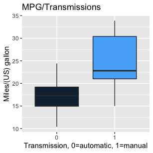
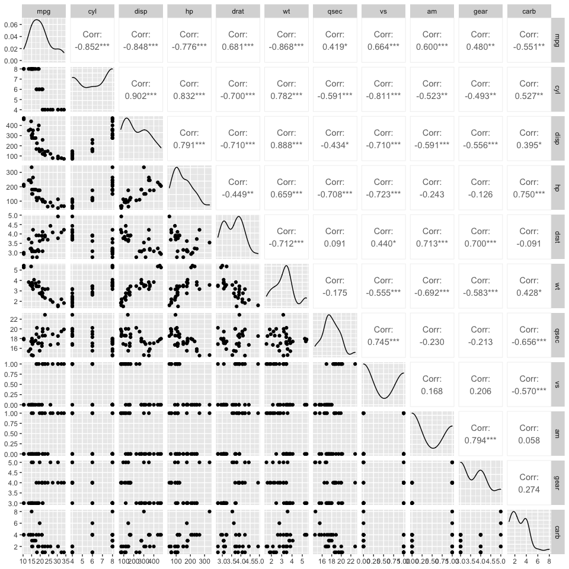
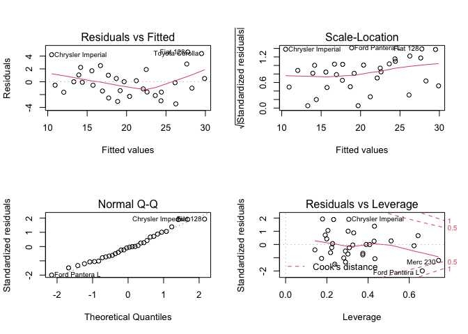

## Peer-graded Assignment: Regression Models Course Project
**Introduction**: You work for Motor Trend, a magazine about the automobile industry. Looking at a data set of a collection of cars, they are interested in exploring the relationship between a set of variables and miles per gallon (MPG) (outcome). They are particularly interested in the following two questions:

1. Is an automatic or manual transmission better for MPG

2. Quantify the MPG difference between automatic and manual transmissions

### 1 Load the mtcars data and perform some basic exploratory data analyses. 
<br/>
According to the description, the data contains 32 observations on 11 (numeric) variables.

1.	MPG	Miles/(US) gallon
2.	cyl	Number of cylinders
3.	disp	Displacement (cu.in.)
4.	hp	Gross horsepower
5.	drat	Rear axle ratio
6.	wt	Weight (1000 lbs)
7.	qsec	1/4 mile time
8.	vs	Engine (0 = V-shaped, 1 = straight)
9.	am	Transmission (0 = automatic, 1 = manual)
10.	gear	Number of forward gears
11.	carb	Number of carburetors

The data structure is:

```
## 'data.frame':	32 obs. of  11 variables:
##  $ mpg : num  21 21 22.8 21.4 18.7 18.1 14.3 24.4 22.8 19.2 ...
##  $ cyl : num  6 6 4 6 8 6 8 4 4 6 ...
##  $ disp: num  160 160 108 258 360 ...
##  $ hp  : num  110 110 93 110 175 105 245 62 95 123 ...
##  $ drat: num  3.9 3.9 3.85 3.08 3.15 2.76 3.21 3.69 3.92 3.92 ...
##  $ wt  : num  2.62 2.88 2.32 3.21 3.44 ...
##  $ qsec: num  16.5 17 18.6 19.4 17 ...
##  $ vs  : num  0 0 1 1 0 1 0 1 1 1 ...
##  $ am  : num  1 1 1 0 0 0 0 0 0 0 ...
##  $ gear: num  4 4 4 3 3 3 3 4 4 4 ...
##  $ carb: num  4 4 1 1 2 1 4 2 2 4 ...
```


### 2. Provide a basic summary of the MPG verus transmissions (automatic and manual)

<!-- -->

From this plot, it appeared that a manual transmission was better than an automatic transmission for MPG. More basic summaries in Appendix A also suggested that the manual transmission was better.

However, in the above plot, transmission was not adjusted for other terms. From the multivariable comparison chart in Appendix A, MPG was obviously correlated with many terms. 

So, we wanted fit the data with a model with only necessary terms.


### 3. Models Selection
From the multivariable comparison chart in the Appendix A, we saw that variables were correlated. So, MPG might not be affected only by transmission(am), but also by some other factors. 

To avoid unnecessary terms and include only necessary terms in our model, we applied a backward selection approach to fit our model. This method slowly removed one factor at a time, starting with the term with the highest p-value. 

We took out the term with the highest p-value if its p-value were higher than above a specified p-value threshold (5%). We updated the model and checked the next term with the highest P-value. This continued until all the remaining terms in the model were below a specified p-value threshold.


```r
# Initial our model with all terms
fit <- lm(mpg ~ . , data = mtcars)
# Show initial P-values 
summary(fit)$coef
```

```
##                Estimate  Std. Error    t value   Pr(>|t|)
## (Intercept) 12.30337416 18.71788443  0.6573058 0.51812440
## cyl         -0.11144048  1.04502336 -0.1066392 0.91608738
## disp         0.01333524  0.01785750  0.7467585 0.46348865
## hp          -0.02148212  0.02176858 -0.9868407 0.33495531
## drat         0.78711097  1.63537307  0.4813036 0.63527790
## wt          -3.71530393  1.89441430 -1.9611887 0.06325215
## qsec         0.82104075  0.73084480  1.1234133 0.27394127
## vs           0.31776281  2.10450861  0.1509915 0.88142347
## am           2.52022689  2.05665055  1.2254035 0.23398971
## gear         0.65541302  1.49325996  0.4389142 0.66520643
## carb        -0.19941925  0.82875250 -0.2406258 0.81217871
```

```r
# Start the backward selection approach
require(MASS)
step <- stepAIC(fit, direction="backward")
```
Steps can be found in the Appendix B.

```r
step$anova # display results 
```

```
## Stepwise Model Path 
## Analysis of Deviance Table
## 
## Initial Model:
## mpg ~ cyl + disp + hp + drat + wt + qsec + vs + am + gear + carb
## 
## Final Model:
## mpg ~ wt + qsec + am
## 
## 
##     Step Df   Deviance Resid. Df Resid. Dev      AIC
## 1                             21   147.4944 70.89774
## 2  - cyl  1 0.07987121        22   147.5743 68.91507
## 3   - vs  1 0.26852280        23   147.8428 66.97324
## 4 - carb  1 0.68546077        24   148.5283 65.12126
## 5 - gear  1 1.56497053        25   150.0933 63.45667
## 6 - drat  1 3.34455117        26   153.4378 62.16190
## 7 - disp  1 6.62865369        27   160.0665 61.51530
## 8   - hp  1 9.21946935        28   169.2859 61.30730
```

```r
# Update our model
fit_combined <- update(fit, mpg ~  wt + qsec + factor(am), data = mtcars)
# Show final P-values 
summary(fit_combined)
```

```
## 
## Call:
## lm(formula = mpg ~ wt + qsec + factor(am), data = mtcars)
## 
## Residuals:
##     Min      1Q  Median      3Q     Max 
## -3.4811 -1.5555 -0.7257  1.4110  4.6610 
## 
## Coefficients:
##             Estimate Std. Error t value Pr(>|t|)    
## (Intercept)   9.6178     6.9596   1.382 0.177915    
## wt           -3.9165     0.7112  -5.507 6.95e-06 ***
## qsec          1.2259     0.2887   4.247 0.000216 ***
## factor(am)1   2.9358     1.4109   2.081 0.046716 *  
## ---
## Signif. codes:  0 '***' 0.001 '**' 0.01 '*' 0.05 '.' 0.1 ' ' 1
## 
## Residual standard error: 2.459 on 28 degrees of freedom
## Multiple R-squared:  0.8497,	Adjusted R-squared:  0.8336 
## F-statistic: 52.75 on 3 and 28 DF,  p-value: 1.21e-11
```
As a result, all P-values were smaller than 5%. So, according to our criterion, we could reject there were no difference between our terms and MPG, which suggested that these three interaction terms were necessary.

Since factor(am)1 was maller than 5%, it implied there was difference for MPG between automatic and manual transmission.
 
Besides, the adjusted R-squared was 0.8336, meaning that 83.36% of the variance of the 
MPG could be explained by this model.


### Model Adjustment
#### a. Model with factor variables
Since we wanted to know if there was any difference between automatic and manual transmission to MPG, and the model already included them with all necessary terms.

We saw that in addition to the intercept(referred to MPG), and slopes for "wt" and "qsec", there was a third variable ‘factor(am)1’. When lm() encountered a factor variable with two levels, it created a new variable based on the second level.

In our case, the term "am" was a binary variable that took the value 1 if the transmission was manual, and 0 if it was automatic, and therefore ‘factor(am)1’ is created.  The fitted equation for two groups can be written as 

``` Automatic transmission: mpg = 9.6178 -3.9165(wt)  + 1.2259(qsec)```
``` Manual transmission: mpg = 9.6178 + 2.9358 * 1 -3.9165(wt)  + 1.2259(qsec) ```

As a result, if the transmission is manual, we will consider the term "2.9358(manual)", otherwise, we will ignore the term "2.9358(manual)".

We can see that the slopes for "wt and "qsec" are the same. The intercept for automatic transmission is 9.6178. The intercept for a manual transmission is 9.6178 + (2.9358 * 1) = 12.5536. 


<!--html_preserve--><div id="htmlwidget-51c8336da4dc0ee26ee2" style="width:672px;height:480px;" class="plotly html-widget"></div>
<script type="application/json" data-for="htmlwidget-51c8336da4dc0ee26ee2">{"x":{"visdat":{"2df16b069dec":["function () ","plotlyVisDat"]},"cur_data":"2df16b069dec","attrs":{"2df16b069dec":{"alpha_stroke":1,"sizes":[10,100],"spans":[1,20],"df":{},"x":[2.62,2.875,2.32,3.215,3.44,3.46,3.57,3.19,3.15,3.44,3.44,4.07,3.73,3.78,5.25,5.424,5.345,2.2,1.615,1.835,2.465,3.52,3.435,3.84,3.845,1.935,2.14,1.513,3.17,2.77,3.57,2.78],"y":[16.46,17.02,18.61,19.44,17.02,20.22,15.84,20,22.9,18.3,18.9,17.4,17.6,18,17.98,17.82,17.42,19.47,18.52,19.9,20.01,16.87,17.3,15.41,17.05,18.9,16.7,16.9,14.5,15.5,14.6,18.6],"z":[21,21,22.8,21.4,18.7,18.1,14.3,24.4,22.8,19.2,17.8,16.4,17.3,15.2,10.4,10.4,14.7,32.4,30.4,33.9,21.5,15.5,15.2,13.3,19.2,27.3,26,30.4,15.8,19.7,15,21.4],"type":"scatter3d","mode":"text+markers","color":["1","1","1","0","0","0","0","0","0","0","0","0","0","0","0","0","0","1","1","1","0","0","0","0","0","1","1","1","1","1","1","1"],"colors":["#FF0000","#0000FF"],"marker":{"size":6},"inherit":true},"2df16b069dec.1":{"alpha_stroke":1,"sizes":[10,100],"spans":[1,20],"x":{},"y":{},"z":{},"colorscale":[["0","rgb(63, 63, 63"],[1,"rgb(63, 63, 63)"]],"showscale":false,"type":"surface","inherit":true},"2df16b069dec.2":{"alpha_stroke":1,"sizes":[10,100],"spans":[1,20],"x":{},"y":{},"z":{},"colorscale":[["0","rgb(133, 133, 133"],[1,"rgb(133, 133, 133)"]],"showscale":false,"type":"surface","inherit":true}},"layout":{"margin":{"b":40,"l":60,"t":25,"r":10},"scene":{"xaxis":{"title":"Weight"},"yaxis":{"title":"1/4 mile time"},"zaxis":{"title":"mpg"}},"hovermode":"closest","showlegend":true},"source":"A","config":{"showSendToCloud":false},"data":[{"df":{"mpg":[21,21,22.8,21.4,18.7,18.1,14.3,24.4,22.8,19.2,17.8,16.4,17.3,15.2,10.4,10.4,14.7,32.4,30.4],"cyl":[6,6,4,6,8,6,8,4,4,6,6,8,8,8,8,8,8,4,4],"disp":[160,160,108,258,360,225,360,146.7,140.8,167.6,167.6,275.8,275.8,275.8,472,460,440,78.7,75.7],"hp":[110,110,93,110,175,105,245,62,95,123,123,180,180,180,205,215,230,66,52],"drat":[3.9,3.9,3.85,3.08,3.15,2.76,3.21,3.69,3.92,3.92,3.92,3.07,3.07,3.07,2.93,3,3.23,4.08,4.93],"wt":[2.62,2.875,2.32,3.215,3.44,3.46,3.57,3.19,3.15,3.44,3.44,4.07,3.73,3.78,5.25,5.424,5.345,2.2,1.615],"qsec":[16.46,17.02,18.61,19.44,17.02,20.22,15.84,20,22.9,18.3,18.9,17.4,17.6,18,17.98,17.82,17.42,19.47,18.52],"vs":[0,0,1,1,0,1,0,1,1,1,1,0,0,0,0,0,0,1,1],"am":[1,1,1,0,0,0,0,0,0,0,0,0,0,0,0,0,0,1,1],"gear":[4,4,4,3,3,3,3,4,4,4,4,3,3,3,3,3,3,4,4],"carb":[4,4,1,1,2,1,4,2,2,4,4,3,3,3,4,4,4,1,2]},"x":[3.215,3.44,3.46,3.57,3.19,3.15,3.44,3.44,4.07,3.73,3.78,5.25,5.424,5.345,2.465,3.52,3.435,3.84,3.845],"y":[19.44,17.02,20.22,15.84,20,22.9,18.3,18.9,17.4,17.6,18,17.98,17.82,17.42,20.01,16.87,17.3,15.41,17.05],"z":[21.4,18.7,18.1,14.3,24.4,22.8,19.2,17.8,16.4,17.3,15.2,10.4,10.4,14.7,21.5,15.5,15.2,13.3,19.2],"type":"scatter3d","mode":"text+markers","marker":{"color":"rgba(255,0,0,1)","size":6,"line":{"color":"rgba(255,0,0,1)"}},"name":"0","textfont":{"color":"rgba(255,0,0,1)"},"error_y":{"color":"rgba(255,0,0,1)"},"error_x":{"color":"rgba(255,0,0,1)"},"line":{"color":"rgba(255,0,0,1)"},"frame":null},{"df":{"mpg":[33.9,21.5,15.5,15.2,13.3,19.2,27.3,26,30.4,15.8,19.7,15,21.4],"cyl":[4,4,8,8,8,8,4,4,4,8,6,8,4],"disp":[71.1,120.1,318,304,350,400,79,120.3,95.1,351,145,301,121],"hp":[65,97,150,150,245,175,66,91,113,264,175,335,109],"drat":[4.22,3.7,2.76,3.15,3.73,3.08,4.08,4.43,3.77,4.22,3.62,3.54,4.11],"wt":[1.835,2.465,3.52,3.435,3.84,3.845,1.935,2.14,1.513,3.17,2.77,3.57,2.78],"qsec":[19.9,20.01,16.87,17.3,15.41,17.05,18.9,16.7,16.9,14.5,15.5,14.6,18.6],"vs":[1,1,0,0,0,0,1,0,1,0,0,0,1],"am":[1,0,0,0,0,0,1,1,1,1,1,1,1],"gear":[4,3,3,3,3,3,4,5,5,5,5,5,4],"carb":[1,1,2,2,4,2,1,2,2,4,6,8,2]},"x":[2.62,2.875,2.32,2.2,1.615,1.835,1.935,2.14,1.513,3.17,2.77,3.57,2.78],"y":[16.46,17.02,18.61,19.47,18.52,19.9,18.9,16.7,16.9,14.5,15.5,14.6,18.6],"z":[21,21,22.8,32.4,30.4,33.9,27.3,26,30.4,15.8,19.7,15,21.4],"type":"scatter3d","mode":"text+markers","marker":{"color":"rgba(0,0,255,1)","size":6,"line":{"color":"rgba(0,0,255,1)"}},"name":"1","textfont":{"color":"rgba(0,0,255,1)"},"error_y":{"color":"rgba(0,0,255,1)"},"error_x":{"color":"rgba(0,0,255,1)"},"line":{"color":"rgba(0,0,255,1)"},"frame":null},{"colorbar":{"title":"zz_auto<br />zz_manual","ticklen":2},"colorscale":[["0","rgb(63, 63, 63"],[1,"rgb(63, 63, 63)"]],"showscale":false,"x":[1.513,1.67595833333333,1.83891666666667,2.001875,2.16483333333333,2.32779166666667,2.49075,2.65370833333333,2.81666666666667,2.979625,3.14258333333333,3.30554166666667,3.4685,3.63145833333333,3.79441666666667,3.957375,4.12033333333333,4.28329166666667,4.44625,4.60920833333333,4.77216666666667,4.935125,5.09808333333333,5.26104166666667,5.424],"y":[14.5,14.85,15.2,15.55,15.9,16.25,16.6,16.95,17.3,17.65,18,18.35,18.7,19.05,19.4,19.75,20.1,20.45,20.8,21.15,21.5,21.85,22.2,22.55,22.9],"z":[[21.4674569666872,20.8292300471768,20.1910031276664,19.552776208156,18.9145492886456,18.2763223691351,17.6380954496247,16.9998685301143,16.3616416106039,15.7234146910935,15.085187771583,14.4469608520726,13.8087339325622,13.1705070130518,12.5322800935414,11.8940531740309,11.2558262545205,10.6175993350101,9.97937241549969,9.34114549598927,8.70291857647885,8.06469165696843,7.42646473745801,6.78823781794759,6.15001089843717],[21.8965170567415,21.2582901372311,20.6200632177207,19.9818362982103,19.3436093786999,18.7053824591894,18.067155539679,17.4289286201686,16.7907017006582,16.1524747811478,15.5142478616373,14.8760209421269,14.2377940226165,13.5995671031061,12.9613401835957,12.3231132640852,11.6848863445748,11.0466594250644,10.408432505554,9.77020558604356,9.13197866653314,8.49375174702272,7.85552482751231,7.21729790800188,6.57907098849146],[22.3255771467958,21.6873502272854,21.049123307775,20.4108963882646,19.7726694687541,19.1344425492437,18.4962156297333,17.8579887102229,17.2197617907125,16.5815348712021,15.9433079516916,15.3050810321812,14.6668541126708,14.0286271931604,13.39040027365,12.7521733541395,12.1139464346291,11.4757195151187,10.8374925956083,10.1992656760979,9.56103875658744,8.92281183707702,8.2845849175666,7.64635799805618,7.00813107854576],[22.7546372368501,22.1164103173397,21.4781833978293,20.8399564783189,20.2017295588084,19.563502639298,18.9252757197876,18.2870488002772,17.6488218807668,17.0105949612563,16.3723680417459,15.7341411222355,15.0959142027251,14.4576872832147,13.8194603637043,13.1812334441938,12.5430065246834,11.904779605173,11.2665526856626,10.6283257661522,9.99009884664173,9.35187192713131,8.7136450076209,8.07541808811048,7.43719116860006],[23.1836973269044,22.545470407394,21.9072434878836,21.2690165683732,20.6307896488627,19.9925627293523,19.3543358098419,18.7161088903315,18.0778819708211,17.4396550513106,16.8014281318002,16.1632012122898,15.5249742927794,14.886747373269,14.2485204537585,13.6102935342481,12.9720666147377,12.3338396952273,11.6956127757169,11.0573858562064,10.419158936696,9.78093201718561,9.14270509767519,8.50447817816477,7.86625125865435],[23.6127574169587,22.9745304974483,22.3363035779379,21.6980766584274,21.059849738917,20.4216228194066,19.7833958998962,19.1451689803858,18.5069420608754,17.8687151413649,17.2304882218545,16.5922613023441,15.9540343828337,15.3158074633233,14.6775805438128,14.0393536243024,13.401126704792,12.7628997852816,12.1246728657712,11.4864459462607,10.8482190267503,10.2099921072399,9.57176518772948,8.93353826821906,8.29531134870864],[24.041817507013,23.4035905875026,22.7653636679922,22.1271367484817,21.4889098289713,20.8506829094609,20.2124559899505,19.5742290704401,18.9360021509296,18.2977752314192,17.6595483119088,17.0213213923984,16.383094472888,15.7448675533776,15.1066406338671,14.4684137143567,13.8301867948463,13.1919598753359,12.5537329558255,11.915506036315,11.2772791168046,10.6390521972942,10.0008252777838,9.36259835827336,8.72437143876294],[24.4708775970673,23.8326506775569,23.1944237580465,22.556196838536,21.9179699190256,21.2797429995152,20.6415160800048,20.0032891604944,19.3650622409839,18.7268353214735,18.0886084019631,17.4503814824527,16.8121545629423,16.1739276434318,15.5357007239214,14.897473804411,14.2592468849006,13.6210199653902,12.9827930458797,12.3445661263693,11.7063392068589,11.0681122873485,10.4298853678381,9.79165844832765,9.15343152881723],[24.8999376871216,24.2617107676112,23.6234838481008,22.9852569285903,22.3470300090799,21.7088030895695,21.0705761700591,20.4323492505487,19.7941223310382,19.1558954115278,18.5176684920174,17.879441572507,17.2412146529966,16.6029877334861,15.9647608139757,15.3265338944653,14.6883069749549,14.0500800554445,13.411853135934,12.7736262164236,12.1353992969132,11.4971723774028,10.8589454578924,10.2207185383819,9.58249161887153],[25.3289977771759,24.6907708576655,24.052543938155,23.4143170186446,22.7760900991342,22.1378631796238,21.4996362601134,20.861409340603,20.2231824210925,19.5849555015821,18.9467285820717,18.3085016625613,17.6702747430509,17.0320478235404,16.39382090403,15.7555939845196,15.1173670650092,14.4791401454988,13.8409132259883,13.2026863064779,12.5644593869675,11.9262324674571,11.2880055479467,10.6497786284362,10.0115517089258],[25.7580578672302,25.1198309477198,24.4816040282093,23.8433771086989,23.2051501891885,22.5669232696781,21.9286963501677,21.2904694306572,20.6522425111468,20.0140155916364,19.375788672126,18.7375617526156,18.0993348331052,17.4611079135947,16.8228809940843,16.1846540745739,15.5464271550635,14.9082002355531,14.2699733160426,13.6317463965322,12.9935194770218,12.3552925575114,11.717065638001,11.0788387184905,10.4406117989801],[26.1871179572845,25.5488910377741,24.9106641182636,24.2724371987532,23.6342102792428,22.9959833597324,22.357756440222,21.7195295207115,21.0813026012011,20.4430756816907,19.8048487621803,19.1666218426699,18.5283949231594,17.890168003649,17.2519410841386,16.6137141646282,15.9754872451178,15.3372603256073,14.6990334060969,14.0608064865865,13.4225795670761,12.7843526475657,12.1461257280553,11.5078988085448,10.8696718890344],[26.6161780473388,25.9779511278284,25.3397242083179,24.7014972888075,24.0632703692971,23.4250434497867,22.7868165302763,22.1485896107658,21.5103626912554,20.872135771745,20.2339088522346,19.5956819327242,18.9574550132137,18.3192280937033,17.6810011741929,17.0427742546825,16.4045473351721,15.7663204156616,15.1280934961512,14.4898665766408,13.8516396571304,13.21341273762,12.5751858181095,11.9369588985991,11.2987319790887],[27.0452381373931,26.4070112178826,25.7687842983722,25.1305573788618,24.4923304593514,23.854103539841,23.2158766203305,22.5776497008201,21.9394227813097,21.3011958617993,20.6629689422889,20.0247420227785,19.386515103268,18.7482881837576,18.1100612642472,17.4718343447368,16.8336074252264,16.1953805057159,15.5571535862055,14.9189266666951,14.2806997471847,13.6424728276743,13.0042459081638,12.3660189886534,11.727792069143],[27.4742982274474,26.8360713079369,26.1978443884265,25.5596174689161,24.9213905494057,24.2831636298953,23.6449367103848,23.0067097908744,22.368482871364,21.7302559518536,21.0920290323432,20.4538021128327,19.8155751933223,19.1773482738119,18.5391213543015,17.9008944347911,17.2626675152807,16.6244405957702,15.9862136762598,15.3479867567494,14.709759837239,14.0715329177286,13.4333059982181,12.7950790787077,12.1568521591973],[27.9033583175017,27.2651313979912,26.6269044784808,25.9886775589704,25.35045063946,24.7122237199496,24.0739968004391,23.4357698809287,22.7975429614183,22.1593160419079,21.5210891223975,20.882862202887,20.2446352833766,19.6064083638662,18.9681814443558,18.3299545248454,17.6917276053349,17.0535006858245,16.4152737663141,15.7770468468037,15.1388199272933,14.5005930077828,13.8623660882724,13.224139168762,12.5859122492516],[28.3324184075559,27.6941914880455,27.0559645685351,26.4177376490247,25.7795107295143,25.1412838100038,24.5030568904934,23.864829970983,23.2266030514726,22.5883761319622,21.9501492124518,21.3119222929413,20.6736953734309,20.0354684539205,19.3972415344101,18.7590146148997,18.1207876953892,17.4825607758788,16.8443338563684,16.206106936858,15.5678800173476,14.9296530978371,14.2914261783267,13.6531992588163,13.0149723393059],[28.7614784976102,28.1232515780998,27.4850246585894,26.846797739079,26.2085708195686,25.5703439000581,24.9321169805477,24.2938900610373,23.6556631415269,23.0174362220165,22.379209302506,21.7409823829956,21.1027554634852,20.4645285439748,19.8263016244644,19.188074704954,18.5498477854435,17.9116208659331,17.2733939464227,16.6351670269123,15.9969401074019,15.3587131878914,14.720486268381,14.0822593488706,13.4440324293602],[29.1905385876645,28.5523116681541,27.9140847486437,27.2758578291333,26.6376309096229,25.9994039901124,25.361177070602,24.7229501510916,24.0847232315812,23.4464963120708,22.8082693925603,22.1700424730499,21.5318155535395,20.8935886340291,20.2553617145187,19.6171347950082,18.9789078754978,18.3406809559874,17.702454036477,17.0642271169666,16.4260001974561,15.7877732779457,15.1495463584353,14.5113194389249,13.8730925194145],[29.6195986777188,28.9813717582084,28.343144838698,27.7049179191876,27.0666909996772,26.4284640801667,25.7902371606563,25.1520102411459,24.5137833216355,23.8755564021251,23.2373294826146,22.5991025631042,21.9608756435938,21.3226487240834,20.684421804573,20.0461948850625,19.4079679655521,18.7697410460417,18.1315141265313,17.4932872070209,16.8550602875104,16.216833368,15.5786064484896,14.9403795289792,14.3021526094688],[30.0486587677731,29.4104318482627,28.7722049287523,28.1339780092419,27.4957510897314,26.857524170221,26.2192972507106,25.5810703312002,24.9428434116898,24.3046164921794,23.6663895726689,23.0281626531585,22.3899357336481,21.7517088141377,21.1134818946273,20.4752549751168,19.8370280556064,19.198801136096,18.5605742165856,17.9223472970752,17.2841203775647,16.6458934580543,16.0076665385439,15.3694396190335,14.7312126995231],[30.4777188578274,29.839491938317,29.2012650188066,28.5630380992962,27.9248111797857,27.2865842602753,26.6483573407649,26.0101304212545,25.3719035017441,24.7336765822336,24.0954496627232,23.4572227432128,22.8189958237024,22.180768904192,21.5425419846815,20.9043150651711,20.2660881456607,19.6278612261503,18.9896343066399,18.3514073871295,17.713180467619,17.0749535481086,16.4367266285982,15.7984997090878,15.1602727895774],[30.9067789478817,30.2685520283713,29.6303251088609,28.9920981893505,28.35387126984,27.7156443503296,27.0774174308192,26.4391905113088,25.8009635917984,25.1627366722879,24.5245097527775,23.8862828332671,23.2480559137567,22.6098289942463,21.9716020747358,21.3333751552254,20.695148235715,20.0569213162046,19.4186943966942,18.7804674771837,18.1422405576733,17.5040136381629,16.8657867186525,16.2275597991421,15.5893328796316],[31.335839037936,30.6976121184256,30.0593851989152,29.4211582794048,28.7829313598943,28.1447044403839,27.5064775208735,26.8682506013631,26.2300236818527,25.5917967623422,24.9535698428318,24.3153429233214,23.677116003811,23.0388890843006,22.4006621647901,21.7624352452797,21.1242083257693,20.4859814062589,19.8477544867485,19.209527567238,18.5713006477276,17.9330737282172,17.2948468087068,16.6566198891964,16.0183929696859],[31.7648991279903,31.1266722084799,30.4884452889695,29.850218369459,29.2119914499486,28.5737645304382,27.9355376109278,27.2973106914174,26.6590837719069,26.0208568523965,25.3826299328861,24.7444030133757,24.1061760938653,23.4679491743549,22.8297222548444,22.191495335334,21.5532684158236,20.9150414963132,20.2768145768028,19.6385876572923,19.0003607377819,18.3621338182715,17.7239068987611,17.0856799792507,16.4474530597402]],"type":"surface","frame":null},{"colorbar":{"title":"zz_auto<br />zz_manual","ticklen":2},"colorscale":[["0","rgb(133, 133, 133"],[1,"rgb(133, 133, 133)"]],"showscale":false,"x":[1.513,1.67595833333333,1.83891666666667,2.001875,2.16483333333333,2.32779166666667,2.49075,2.65370833333333,2.81666666666667,2.979625,3.14258333333333,3.30554166666667,3.4685,3.63145833333333,3.79441666666667,3.957375,4.12033333333333,4.28329166666667,4.44625,4.60920833333333,4.77216666666667,4.935125,5.09808333333333,5.26104166666667,5.424],"y":[14.5,14.85,15.2,15.55,15.9,16.25,16.6,16.95,17.3,17.65,18,18.35,18.7,19.05,19.4,19.75,20.1,20.45,20.8,21.15,21.5,21.85,22.2,22.55,22.9],"z":[[24.4032941585767,23.7650672390662,23.1268403195558,22.4886134000454,21.850386480535,21.2121595610246,20.5739326415141,19.9357057220037,19.2974788024933,18.6592518829829,18.0210249634725,17.382798043962,16.7445711244516,16.1063442049412,15.4681172854308,14.8298903659204,14.1916634464099,13.5534365268995,12.9152096073891,12.2769826878787,11.6387557683683,11.0005288488578,10.3623019293474,9.72407500983701,9.08584809032659],[24.8323542486309,24.1941273291205,23.5559004096101,22.9176734900997,22.2794465705893,21.6412196510789,21.0029927315684,20.364765812058,19.7265388925476,19.0883119730372,18.4500850535268,17.8118581340163,17.1736312145059,16.5354042949955,15.8971773754851,15.2589504559747,14.6207235364642,13.9824966169538,13.3442696974434,12.706042777933,12.0678158584226,11.4295889389121,10.7913620194017,10.1531350998913,9.51490818038088],[25.2614143386852,24.6231874191748,23.9849604996644,23.346733580154,22.7085066606436,22.0702797411331,21.4320528216227,20.7938259021123,20.1555989826019,19.5173720630915,18.8791451435811,18.2409182240706,17.6026913045602,16.9644643850498,16.3262374655394,15.688010546029,15.0497836265185,14.4115567070081,13.7733297874977,13.1351028679873,12.4968759484769,11.8586490289664,11.220422109456,10.5821951899456,9.94396827043518],[25.6904744287395,25.0522475092291,24.4140205897187,23.7757936702083,23.1375667506979,22.4993398311874,21.861112911677,21.2228859921666,20.5846590726562,19.9464321531458,19.3082052336353,18.6699783141249,18.0317513946145,17.3935244751041,16.7552975555937,16.1170706360833,15.4788437165728,14.8406167970624,14.202389877552,13.5641629580416,12.9259360385312,12.2877091190207,11.6494821995103,11.0112552799999,10.3730283604895],[26.1195345187938,25.4813075992834,24.843080679773,24.2048537602626,23.5666268407522,22.9283999212417,22.2901730017313,21.6519460822209,21.0137191627105,20.3754922432001,19.7372653236896,19.0990384041792,18.4608114846688,17.8225845651584,17.184357645648,16.5461307261375,15.9079038066271,15.2696768871167,14.6314499676063,13.9932230480959,13.3549961285854,12.716769209075,12.0785422895646,11.4403153700542,10.8020884505438],[26.5485946088481,25.9103676893377,25.2721407698273,24.6339138503169,23.9956869308064,23.357460011296,22.7192330917856,22.0810061722752,21.4427792527648,20.8045523332544,20.1663254137439,19.5280984942335,18.8898715747231,18.2516446552127,17.6134177357023,16.9751908161918,16.3369638966814,15.698736977171,15.0605100576606,14.4222831381502,13.7840562186397,13.1458292991293,12.5076023796189,11.8693754601085,11.2311485405981],[26.9776546989024,26.339427779392,25.7012008598816,25.0629739403712,24.4247470208607,23.7865201013503,23.1482931818399,22.5100662623295,21.8718393428191,21.2336124233086,20.5953855037982,19.9571585842878,19.3189316647774,18.680704745267,18.0424778257566,17.4042509062461,16.7660239867357,16.1277970672253,15.4895701477149,14.8513432282045,14.213116308694,13.5748893891836,12.9366624696732,12.2984355501628,11.6602086306524],[27.4067147889567,26.7684878694463,26.1302609499359,25.4920340304255,24.853807110915,24.2155801914046,23.5773532718942,22.9391263523838,22.3008994328734,21.6626725133629,21.0244455938525,20.3862186743421,19.7479917548317,19.1097648353213,18.4715379158108,17.8333109963004,17.19508407679,16.5568571572796,15.9186302377692,15.2804033182588,14.6421763987483,14.0039494792379,13.3657225597275,12.7274956402171,12.0892687207067],[27.835774879011,27.1975479595006,26.5593210399902,25.9210941204798,25.2828672009693,24.6446402814589,24.0064133619485,23.3681864424381,22.7299595229277,22.0917326034172,21.4535056839068,20.8152787643964,20.177051844886,19.5388249253756,18.9005980058651,18.2623710863547,17.6241441668443,16.9859172473339,16.3476903278235,15.709463408313,15.0712364888026,14.4330095692922,13.7947826497818,13.1565557302714,12.5183288107609],[28.2648349690653,27.6266080495549,26.9883811300445,26.350154210534,25.7119272910236,25.0737003715132,24.4354734520028,23.7972465324924,23.159019612982,22.5207926934715,21.8825657739611,21.2443388544507,20.6061119349403,19.9678850154299,19.3296580959194,18.691431176409,18.0532042568986,17.4149773373882,16.7767504178778,16.1385234983673,15.5002965788569,14.8620696593465,14.2238427398361,13.5856158203257,12.9473889008152],[28.6938950591196,28.0556681396092,27.4174412200988,26.7792143005883,26.1409873810779,25.5027604615675,24.8645335420571,24.2263066225467,23.5880797030362,22.9498527835258,22.3116258640154,21.673398944505,21.0351720249946,20.3969451054841,19.7587181859737,19.1204912664633,18.4822643469529,17.8440374274425,17.205810507932,16.5675835884216,15.9293566689112,15.2911297494008,14.6529028298904,14.01467591038,13.3764489908695],[29.1229551491739,28.4847282296635,27.8465013101531,27.2082743906426,26.5700474711322,25.9318205516218,25.2935936321114,24.655366712601,24.0171397930905,23.3789128735801,22.7406859540697,22.1024590345593,21.4642321150489,20.8260051955384,20.187778276028,19.5495513565176,18.9113244370072,18.2730975174968,17.6348705979863,16.9966436784759,16.3584167589655,15.7201898394551,15.0819629199447,14.4437360004342,13.8055090809238],[29.5520152392282,28.9137883197178,28.2755614002074,27.6373344806969,26.9991075611865,26.3608806416761,25.7226537221657,25.0844268026553,24.4461998831448,23.8079729636344,23.169746044124,22.5315191246136,21.8932922051032,21.2550652855927,20.6168383660823,19.9786114465719,19.3403845270615,18.7021576075511,18.0639306880406,17.4257037685302,16.7874768490198,16.1492499295094,15.511023009999,14.8727960904885,14.2345691709781],[29.9810753292825,29.3428484097721,28.7046214902616,28.0663945707512,27.4281676512408,26.7899407317304,26.15171381222,25.5134868927095,24.8752599731991,24.2370330536887,23.5988061341783,22.9605792146679,22.3223522951575,21.684125375647,21.0458984561366,20.4076715366262,19.7694446171158,19.1312176976054,18.4929907780949,17.8547638585845,17.2165369390741,16.5783100195637,15.9400831000533,15.3018561805428,14.6636292610324],[30.4101354193368,29.7719084998264,29.1336815803159,28.4954546608055,27.8572277412951,27.2190008217847,26.5807739022743,25.9425469827638,25.3043200632534,24.666093143743,24.0278662242326,23.3896393047222,22.7514123852117,22.1131854657013,21.4749585461909,20.8367316266805,20.1985047071701,19.5602777876597,18.9220508681492,18.2838239486388,17.6455970291284,17.007370109618,16.3691431901076,15.7309162705971,15.0926893510867],[30.8391955093911,30.2009685898807,29.5627416703702,28.9245147508598,28.2862878313494,27.648060911839,27.0098339923286,26.3716070728181,25.7333801533077,25.0951532337973,24.4569263142869,23.8186993947765,23.180472475266,22.5422455557556,21.9040186362452,21.2657917167348,20.6275647972244,19.9893378777139,19.3511109582035,18.7128840386931,18.0746571191827,17.4364301996723,16.7982032801619,16.1599763606514,15.521749441141],[31.2682555994454,30.6300286799349,29.9918017604245,29.3535748409141,28.7153479214037,28.0771210018933,27.4388940823828,26.8006671628724,26.162440243362,25.5242133238516,24.8859864043412,24.2477594848308,23.6095325653203,22.9713056458099,22.3330787262995,21.6948518067891,21.0566248872787,20.4183979677682,19.7801710482578,19.1419441287474,18.503717209237,17.8654902897266,17.2272633702161,16.5890364507057,15.9508095311953],[31.6973156894997,31.0590887699892,30.4208618504788,29.7826349309684,29.144408011458,28.5061810919476,27.8679541724371,27.2297272529267,26.5915003334163,25.9532734139059,25.3150464943955,24.676819574885,24.0385926553746,23.4003657358642,22.7621388163538,22.1239118968434,21.485684977333,20.8474580578225,20.2092311383121,19.5710042188017,18.9327772992913,18.2945503797809,17.6563234602704,17.01809654076,16.3798696212496],[32.126375779554,31.4881488600435,30.8499219405331,30.2116950210227,29.5734681015123,28.9352411820019,28.2970142624914,27.658787342981,27.0205604234706,26.3823335039602,25.7441065844498,25.1058796649393,24.4676527454289,23.8294258259185,23.1911989064081,22.5529719868977,21.9147450673872,21.2765181478768,20.6382912283664,20.000064308856,19.3618373893456,18.7236104698351,18.0853835503247,17.4471566308143,16.8089297113039],[32.5554358696082,31.9172089500978,31.2789820305874,30.640755111077,30.0025281915666,29.3643012720562,28.7260743525457,28.0878474330353,27.4496205135249,26.8113935940145,26.1731666745041,25.5349397549936,24.8967128354832,24.2584859159728,23.6202589964624,22.982032076952,22.3438051574415,21.7055782379311,21.0673513184207,20.4291243989103,19.7908974793999,19.1526705598894,18.514443640379,17.8762167208686,17.2379898013582],[32.9844959596625,32.3462690401521,31.7080421206417,31.0698152011313,30.4315882816209,29.7933613621104,29.1551344426,28.5169075230896,27.8786806035792,27.2404536840688,26.6022267645584,25.9639998450479,25.3257729255375,24.6875460060271,24.0493190865167,23.4110921670063,22.7728652474958,22.1346383279854,21.496411408475,20.8581844889646,20.2199575694542,19.5817306499437,18.9435037304333,18.3052768109229,17.6670498914125],[33.4135560497168,32.7753291302064,32.137102210696,31.4988752911856,30.8606483716752,30.2224214521647,29.5841945326543,28.9459676131439,28.3077406936335,27.6695137741231,27.0312868546126,26.3930599351022,25.7548330155918,25.1166060960814,24.478379176571,23.8401522570605,23.2019253375501,22.5636984180397,21.9254714985293,21.2872445790189,20.6490176595085,20.010790739998,19.3725638204876,18.7343369009772,18.0961099814668],[33.8426161397711,33.2043892202607,32.5661623007503,31.9279353812399,31.2897084617295,30.651481542219,30.0132546227086,29.3750277031982,28.7368007836878,28.0985738641774,27.4603469446669,26.8221200251565,26.1838931056461,25.5456661861357,24.9074392666253,24.2692123471148,23.6309854276044,22.992758508094,22.3545315885836,21.7163046690732,21.0780777495627,20.4398508300523,19.8016239105419,19.1633969910315,18.5251700715211],[34.2716762298254,33.633449310315,32.9952223908046,32.3569954712942,31.7187685517838,31.0805416322733,30.4423147127629,29.8040877932525,29.1658608737421,28.5276339542317,27.8894070347212,27.2511801152108,26.6129531957004,25.97472627619,25.3364993566796,24.6982724371691,24.0600455176587,23.4218185981483,22.7835916786379,22.1453647591275,21.507137839617,20.8689109201066,20.2306840005962,19.5924570810858,18.9542301615754],[34.7007363198797,34.0625094003693,33.4242824808589,32.7860555613485,32.147828641838,31.5096017223276,30.8713748028172,30.2331478833068,29.5949209637964,28.9566940442859,28.3184671247755,27.6802402052651,27.0420132857547,26.4037863662443,25.7655594467339,25.1273325272234,24.489105607713,23.8508786882026,23.2126517686922,22.5744248491818,21.9361979296713,21.2979710101609,20.6597440906505,20.0215171711401,19.3832902516297]],"type":"surface","frame":null}],"highlight":{"on":"plotly_click","persistent":false,"dynamic":false,"selectize":false,"opacityDim":0.2,"selected":{"opacity":1},"debounce":0},"shinyEvents":["plotly_hover","plotly_click","plotly_selected","plotly_relayout","plotly_brushed","plotly_brushing","plotly_clickannotation","plotly_doubleclick","plotly_deselect","plotly_afterplot","plotly_sunburstclick"],"base_url":"https://plot.ly"},"evals":[],"jsHooks":[]}</script><!--/html_preserve-->
(0 = automatic(light gray), 1 = manual(dark gray))

If we visualized the data (Weight, mpg, qsec) and fitted a linear model for two groups, (red = automatic; blue = manual), the regression plane (light gray) for the manual transmission positioned higher that the the regression plane (dark gray) for the automatic transmission in terms of mpg. 

- Is an automatic or manual transmission better for miles/(US) gallon (MPG) ?
- Quantifying how different is the MPG between automatic and manual transmissions?

Since the intercept represents the mean value for MPG, it implies that for the same input to the formula, a manual transmission is better for MPG on average. And it will be 2.9358 Miles/(US) gallon better.

#### b. Model with interaction
From the previous plot, we could see that the regression plane (light gray) for the manual transmission did not align well with the data (blue color). We might be able to adjust the model with an interaction term. It means to split the data into automatic and manual transmission and fit a linear model for each group. 


```r
# Split into two groups and fit two models
mtcars0 <- mtcars[mtcars$am==0,]
mtcars1 <- mtcars[mtcars$a==1,]
fit_am0 <- lm(mpg ~ wt + qsec, data = mtcars0)
summary(fit_am0)
```

```
## 
## Call:
## lm(formula = mpg ~ wt + qsec, data = mtcars0)
## 
## Residuals:
##    Min     1Q Median     3Q    Max 
## -2.118 -1.363 -1.011  1.181  3.800 
## 
## Coefficients:
##             Estimate Std. Error t value Pr(>|t|)    
## (Intercept)  11.2489     6.7148   1.675 0.113316    
## wt           -2.9963     0.6636  -4.515 0.000352 ***
## qsec          0.9454     0.2945   3.210 0.005464 ** 
## ---
## Signif. codes:  0 '***' 0.001 '**' 0.01 '*' 0.05 '.' 0.1 ' ' 1
## 
## Residual standard error: 2.033 on 16 degrees of freedom
## Multiple R-squared:  0.7502,	Adjusted R-squared:  0.7189 
## F-statistic: 24.02 on 2 and 16 DF,  p-value: 1.518e-05
```

```r
fit_am1 <- lm(mpg ~ wt + qsec, data = mtcars1)
summary(fit_am1)
```

```
## 
## Call:
## lm(formula = mpg ~ wt + qsec, data = mtcars1)
## 
## Residuals:
##     Min      1Q  Median      3Q     Max 
## -3.6832 -0.9178 -0.0709  0.5567  4.0907 
## 
## Coefficients:
##             Estimate Std. Error t value Pr(>|t|)    
## (Intercept)  20.1754    11.1991   1.802 0.101799    
## wt           -6.7544     1.4306  -4.721 0.000815 ***
## qsec          1.1810     0.4925   2.398 0.037434 *  
## ---
## Signif. codes:  0 '***' 0.001 '**' 0.01 '*' 0.05 '.' 0.1 ' ' 1
## 
## Residual standard error: 2.244 on 10 degrees of freedom
## Multiple R-squared:  0.8896,	Adjusted R-squared:  0.8675 
## F-statistic: 40.29 on 2 and 10 DF,  p-value: 1.639e-05
```
Because of the presence of the interaction term (transmission), both the slopes and intercepts are different for automatic and manual. 

Also note that the coefficients of intercepts, having p-values highter than 0.05,  are not statistically significant, meaning that the intercepts for automatic and manual are probably not very different. However, the slopes for automatic and manual are different.

The regression equation above can be split into separate equations for two groups: 
``` Automatic transmission: mpg = 11.2489 -2.9963(wt)  + 0.9454(qsec)```
``` Manual transmission: mpg = 20.1754 -6.7544(wt)  + 1.1810(qsec) ```


<!--html_preserve--><div id="htmlwidget-6928c0e8291700932b40" style="width:672px;height:480px;" class="plotly html-widget"></div>
<script type="application/json" data-for="htmlwidget-6928c0e8291700932b40">{"x":{"visdat":{"2f2e7a329cd6":["function () ","plotlyVisDat"]},"cur_data":"2f2e7a329cd6","attrs":{"2f2e7a329cd6":{"alpha_stroke":1,"sizes":[10,100],"spans":[1,20],"df":{},"x":[2.62,2.875,2.32,3.215,3.44,3.46,3.57,3.19,3.15,3.44,3.44,4.07,3.73,3.78,5.25,5.424,5.345,2.2,1.615,1.835,2.465,3.52,3.435,3.84,3.845,1.935,2.14,1.513,3.17,2.77,3.57,2.78],"y":[16.46,17.02,18.61,19.44,17.02,20.22,15.84,20,22.9,18.3,18.9,17.4,17.6,18,17.98,17.82,17.42,19.47,18.52,19.9,20.01,16.87,17.3,15.41,17.05,18.9,16.7,16.9,14.5,15.5,14.6,18.6],"z":[21,21,22.8,21.4,18.7,18.1,14.3,24.4,22.8,19.2,17.8,16.4,17.3,15.2,10.4,10.4,14.7,32.4,30.4,33.9,21.5,15.5,15.2,13.3,19.2,27.3,26,30.4,15.8,19.7,15,21.4],"type":"scatter3d","mode":"text+markers","color":["1","1","1","0","0","0","0","0","0","0","0","0","0","0","0","0","0","1","1","1","0","0","0","0","0","1","1","1","1","1","1","1"],"colors":["#FF0000","#0000FF"],"marker":{"size":6},"inherit":true},"2f2e7a329cd6.1":{"alpha_stroke":1,"sizes":[10,100],"spans":[1,20],"x":{},"y":{},"z":{},"colorscale":[["0","rgb(63, 63, 63"],[1,"rgb(63, 63, 63)"]],"showscale":false,"type":"surface","inherit":true},"2f2e7a329cd6.2":{"alpha_stroke":1,"sizes":[10,100],"spans":[1,20],"x":{},"y":{},"z":{},"colorscale":[["0","rgb(133, 133, 133"],[1,"rgb(133, 133, 133)"]],"showscale":false,"type":"surface","inherit":true}},"layout":{"margin":{"b":40,"l":60,"t":25,"r":10},"scene":{"xaxis":{"title":"Weight"},"yaxis":{"title":"1/4 mile time"},"zaxis":{"title":"mpg"}},"hovermode":"closest","showlegend":true},"source":"A","config":{"showSendToCloud":false},"data":[{"df":{"mpg":[21,21,22.8,21.4,18.7,18.1,14.3,24.4,22.8,19.2,17.8,16.4,17.3,15.2,10.4,10.4,14.7,32.4,30.4],"cyl":[6,6,4,6,8,6,8,4,4,6,6,8,8,8,8,8,8,4,4],"disp":[160,160,108,258,360,225,360,146.7,140.8,167.6,167.6,275.8,275.8,275.8,472,460,440,78.7,75.7],"hp":[110,110,93,110,175,105,245,62,95,123,123,180,180,180,205,215,230,66,52],"drat":[3.9,3.9,3.85,3.08,3.15,2.76,3.21,3.69,3.92,3.92,3.92,3.07,3.07,3.07,2.93,3,3.23,4.08,4.93],"wt":[2.62,2.875,2.32,3.215,3.44,3.46,3.57,3.19,3.15,3.44,3.44,4.07,3.73,3.78,5.25,5.424,5.345,2.2,1.615],"qsec":[16.46,17.02,18.61,19.44,17.02,20.22,15.84,20,22.9,18.3,18.9,17.4,17.6,18,17.98,17.82,17.42,19.47,18.52],"vs":[0,0,1,1,0,1,0,1,1,1,1,0,0,0,0,0,0,1,1],"am":[1,1,1,0,0,0,0,0,0,0,0,0,0,0,0,0,0,1,1],"gear":[4,4,4,3,3,3,3,4,4,4,4,3,3,3,3,3,3,4,4],"carb":[4,4,1,1,2,1,4,2,2,4,4,3,3,3,4,4,4,1,2]},"x":[3.215,3.44,3.46,3.57,3.19,3.15,3.44,3.44,4.07,3.73,3.78,5.25,5.424,5.345,2.465,3.52,3.435,3.84,3.845],"y":[19.44,17.02,20.22,15.84,20,22.9,18.3,18.9,17.4,17.6,18,17.98,17.82,17.42,20.01,16.87,17.3,15.41,17.05],"z":[21.4,18.7,18.1,14.3,24.4,22.8,19.2,17.8,16.4,17.3,15.2,10.4,10.4,14.7,21.5,15.5,15.2,13.3,19.2],"type":"scatter3d","mode":"text+markers","marker":{"color":"rgba(255,0,0,1)","size":6,"line":{"color":"rgba(255,0,0,1)"}},"name":"0","textfont":{"color":"rgba(255,0,0,1)"},"error_y":{"color":"rgba(255,0,0,1)"},"error_x":{"color":"rgba(255,0,0,1)"},"line":{"color":"rgba(255,0,0,1)"},"frame":null},{"df":{"mpg":[33.9,21.5,15.5,15.2,13.3,19.2,27.3,26,30.4,15.8,19.7,15,21.4],"cyl":[4,4,8,8,8,8,4,4,4,8,6,8,4],"disp":[71.1,120.1,318,304,350,400,79,120.3,95.1,351,145,301,121],"hp":[65,97,150,150,245,175,66,91,113,264,175,335,109],"drat":[4.22,3.7,2.76,3.15,3.73,3.08,4.08,4.43,3.77,4.22,3.62,3.54,4.11],"wt":[1.835,2.465,3.52,3.435,3.84,3.845,1.935,2.14,1.513,3.17,2.77,3.57,2.78],"qsec":[19.9,20.01,16.87,17.3,15.41,17.05,18.9,16.7,16.9,14.5,15.5,14.6,18.6],"vs":[1,1,0,0,0,0,1,0,1,0,0,0,1],"am":[1,0,0,0,0,0,1,1,1,1,1,1,1],"gear":[4,3,3,3,3,3,4,5,5,5,5,5,4],"carb":[1,1,2,2,4,2,1,2,2,4,6,8,2]},"x":[2.62,2.875,2.32,2.2,1.615,1.835,1.935,2.14,1.513,3.17,2.77,3.57,2.78],"y":[16.46,17.02,18.61,19.47,18.52,19.9,18.9,16.7,16.9,14.5,15.5,14.6,18.6],"z":[21,21,22.8,32.4,30.4,33.9,27.3,26,30.4,15.8,19.7,15,21.4],"type":"scatter3d","mode":"text+markers","marker":{"color":"rgba(0,0,255,1)","size":6,"line":{"color":"rgba(0,0,255,1)"}},"name":"1","textfont":{"color":"rgba(0,0,255,1)"},"error_y":{"color":"rgba(0,0,255,1)"},"error_x":{"color":"rgba(0,0,255,1)"},"line":{"color":"rgba(0,0,255,1)"},"frame":null},{"colorbar":{"title":"zz_auto<br />zz_manual","ticklen":2},"colorscale":[["0","rgb(63, 63, 63"],[1,"rgb(63, 63, 63)"]],"showscale":false,"x":[1.513,1.67595833333333,1.83891666666667,2.001875,2.16483333333333,2.32779166666667,2.49075,2.65370833333333,2.81666666666667,2.979625,3.14258333333333,3.30554166666667,3.4685,3.63145833333333,3.79441666666667,3.957375,4.12033333333333,4.28329166666667,4.44625,4.60920833333333,4.77216666666667,4.935125,5.09808333333333,5.26104166666667,5.424],"y":[14.5,14.85,15.2,15.55,15.9,16.25,16.6,16.95,17.3,17.65,18,18.35,18.7,19.05,19.4,19.75,20.1,20.45,20.8,21.15,21.5,21.85,22.2,22.55,22.9],"z":[[20.4244489119129,19.9361807392179,19.4479125665229,18.959644393828,18.471376221133,17.983108048438,17.494839875743,17.006571703048,16.518303530353,16.030035357658,15.541767184963,15.053499012268,14.565230839573,14.076962666878,13.588694494183,13.100426321488,12.612158148793,12.123889976098,11.635621803403,11.147353630708,10.659085458013,10.170817285318,9.68254911262302,9.19428093992802,8.70601276723303],[20.7553527576305,20.2670845849355,19.7788164122405,19.2905482395455,18.8022800668505,18.3140118941555,17.8257437214605,17.3374755487655,16.8492073760705,16.3609392033755,15.8726710306805,15.3844028579855,14.8961346852905,14.4078665125955,13.9195983399005,13.4313301672055,12.9430619945105,12.4547938218155,11.9665256491205,11.4782574764255,10.9899893037305,10.5017211310355,10.0134529583405,9.52518478564555,9.03691661295056],[21.086256603348,20.597988430653,20.109720257958,19.621452085263,19.133183912568,18.644915739873,18.156647567178,17.668379394483,17.180111221788,16.691843049093,16.203574876398,15.715306703703,15.227038531008,14.738770358313,14.250502185618,13.7622340129231,13.2739658402281,12.7856976675331,12.2974294948381,11.8091613221431,11.3208931494481,10.8326249767531,10.3443568040581,9.85608863136308,9.36782045866808],[21.4171604490655,20.9288922763705,20.4406241036755,19.9523559309805,19.4640877582855,18.9758195855905,18.4875514128955,17.9992832402006,17.5110150675056,17.0227468948106,16.5344787221156,16.0462105494206,15.5579423767256,15.0696742040306,14.5814060313356,14.0931378586406,13.6048696859456,13.1166015132506,12.6283333405556,12.1400651678606,11.6517969951656,11.1635288224706,10.6752606497756,10.1869924770806,9.69872430438561],[21.7480642947831,21.2597961220881,20.7715279493931,20.2832597766981,19.7949916040031,19.3067234313081,18.8184552586131,18.3301870859181,17.8419189132231,17.3536507405281,16.8653825678331,16.3771143951381,15.8888462224431,15.4005780497481,14.9123098770531,14.4240417043581,13.9357735316631,13.4475053589681,12.9592371862731,12.4709690135781,11.9827008408831,11.4944326681881,11.0061644954931,10.5178963227981,10.0296281501031],[22.0789681405006,21.5906999678056,21.1024317951106,20.6141636224156,20.1258954497206,19.6376272770256,19.1493591043306,18.6610909316356,18.1728227589406,17.6845545862456,17.1962864135506,16.7080182408556,16.2197500681606,15.7314818954656,15.2432137227706,14.7549455500756,14.2666773773806,13.7784092046856,13.2901410319907,12.8018728592957,12.3136046866007,11.8253365139057,11.3370683412107,10.8488001685157,10.3605319958207],[22.4098719862181,21.9216038135231,21.4333356408281,20.9450674681331,20.4567992954381,19.9685311227431,19.4802629500481,18.9919947773531,18.5037266046581,18.0154584319631,17.5271902592682,17.0389220865732,16.5506539138782,16.0623857411832,15.5741175684882,15.0858493957932,14.5975812230982,14.1093130504032,13.6210448777082,13.1327767050132,12.6445085323182,12.1562403596232,11.6679721869282,11.1797040142332,10.6914358415382],[22.7407758319356,22.2525076592406,21.7642394865456,21.2759713138507,20.7877031411557,20.2994349684607,19.8111667957657,19.3228986230707,18.8346304503757,18.3463622776807,17.8580941049857,17.3698259322907,16.8815577595957,16.3932895869007,15.9050214142057,15.4167532415107,14.9284850688157,14.4402168961207,13.9519487234257,13.4636805507307,12.9754123780357,12.4871442053407,11.9988760326457,11.5106078599507,11.0223396872557],[23.0716796776532,22.5834115049582,22.0951433322632,21.6068751595682,21.1186069868732,20.6303388141782,20.1420706414832,19.6538024687882,19.1655342960932,18.6772661233982,18.1889979507032,17.7007297780082,17.2124616053132,16.7241934326182,16.2359252599232,15.7476570872282,15.2593889145332,14.7711207418382,14.2828525691432,13.7945843964482,13.3063162237532,12.8180480510582,12.3297798783633,11.8415117056683,11.3532435329733],[23.4025835233707,22.9143153506757,22.4260471779807,21.9377790052857,21.4495108325907,20.9612426598957,20.4729744872007,19.9847063145057,19.4964381418107,19.0081699691157,18.5199017964207,18.0316336237257,17.5433654510307,17.0550972783357,16.5668291056407,16.0785609329458,15.5902927602508,15.1020245875558,14.6137564148608,14.1254882421658,13.6372200694708,13.1489518967758,12.6606837240808,12.1724155513858,11.6841473786908],[23.7334873690882,23.2452191963932,22.7569510236982,22.2686828510032,21.7804146783082,21.2921465056132,20.8038783329182,20.3156101602233,19.8273419875283,19.3390738148333,18.8508056421383,18.3625374694433,17.8742692967483,17.3860011240533,16.8977329513583,16.4094647786633,15.9211966059683,15.4329284332733,14.9446602605783,14.4563920878833,13.9681239151883,13.4798557424933,12.9915875697983,12.5033193971033,12.0150512244083],[24.0643912148058,23.5761230421108,23.0878548694158,22.5995866967208,22.1113185240258,21.6230503513308,21.1347821786358,20.6465140059408,20.1582458332458,19.6699776605508,19.1817094878558,18.6934413151608,18.2051731424658,17.7169049697708,17.2286367970758,16.7403686243808,16.2521004516858,15.7638322789908,15.2755641062958,14.7872959336008,14.2990277609058,13.8107595882108,13.3224914155158,12.8342232428208,12.3459550701258],[24.3952950605233,23.9070268878283,23.4187587151333,22.9304905424383,22.4422223697433,21.9539541970483,21.4656860243533,20.9774178516583,20.4891496789633,20.0008815062683,19.5126133335733,19.0243451608783,18.5360769881833,18.0478088154883,17.5595406427933,17.0712724700983,16.5830042974033,16.0947361247083,15.6064679520134,15.1181997793184,14.6299316066234,14.1416634339284,13.6533952612334,13.1651270885384,12.6768589158434],[24.7261989062408,24.2379307335458,23.7496625608508,23.2613943881558,22.7731262154608,22.2848580427658,21.7965898700708,21.3083216973758,20.8200535246808,20.3317853519858,19.8435171792908,19.3552490065959,18.8669808339009,18.3787126612059,17.8904444885109,17.4021763158159,16.9139081431209,16.4256399704259,15.9373717977309,15.4491036250359,14.9608354523409,14.4725672796459,13.9842991069509,13.4960309342559,13.0077627615609],[25.0571027519583,24.5688345792633,24.0805664065684,23.5922982338734,23.1040300611784,22.6157618884834,22.1274937157884,21.6392255430934,21.1509573703984,20.6626891977034,20.1744210250084,19.6861528523134,19.1978846796184,18.7096165069234,18.2213483342284,17.7330801615334,17.2448119888384,16.7565438161434,16.2682756434484,15.7800074707534,15.2917392980584,14.8034711253634,14.3152029526684,13.8269347799734,13.3386666072784],[25.3880065976759,24.8997384249809,24.4114702522859,23.9232020795909,23.4349339068959,22.9466657342009,22.4583975615059,21.9701293888109,21.4818612161159,20.9935930434209,20.5053248707259,20.0170566980309,19.5287885253359,19.0405203526409,18.5522521799459,18.0639840072509,17.5757158345559,17.0874476618609,16.5991794891659,16.1109113164709,15.6226431437759,15.1343749710809,14.646106798386,14.157838625691,13.669570452996],[25.7189104433934,25.2306422706984,24.7423740980034,24.2541059253084,23.7658377526134,23.2775695799184,22.7893014072234,22.3010332345284,21.8127650618334,21.3244968891384,20.8362287164434,20.3479605437484,19.8596923710534,19.3714241983584,18.8831560256635,18.3948878529685,17.9066196802735,17.4183515075785,16.9300833348835,16.4418151621885,15.9535469894935,15.4652788167985,14.9770106441035,14.4887424714085,14.0004742987135],[26.0498142891109,25.5615461164159,25.0732779437209,24.5850097710259,24.0967415983309,23.6084734256359,23.120205252941,22.631937080246,22.143668907551,21.655400734856,21.167132562161,20.678864389466,20.190596216771,19.702328044076,19.214059871381,18.725791698686,18.237523525991,17.749255353296,17.260987180601,16.772719007906,16.284450835211,15.796182662516,15.307914489821,14.819646317126,14.331378144431],[26.3807181348285,25.8924499621335,25.4041817894385,24.9159136167435,24.4276454440485,23.9393772713535,23.4511090986585,22.9628409259635,22.4745727532685,21.9863045805735,21.4980364078785,21.0097682351835,20.5215000624885,20.0332318897935,19.5449637170985,19.0566955444035,18.5684273717085,18.0801591990135,17.5918910263185,17.1036228536235,16.6153546809285,16.1270865082335,15.6388183355385,15.1505501628435,14.6622819901485],[26.711621980546,26.223353807851,25.735085635156,25.246817462461,24.758549289766,24.270281117071,23.782012944376,23.293744771681,22.805476598986,22.317208426291,21.828940253596,21.340672080901,20.852403908206,20.364135735511,19.875867562816,19.387599390121,18.899331217426,18.4110630447311,17.9227948720361,17.4345266993411,16.9462585266461,16.4579903539511,15.9697221812561,15.4814540085611,14.9931858358661],[27.0425258262635,26.5542576535685,26.0659894808735,25.5777213081785,25.0894531354835,24.6011849627885,24.1129167900935,23.6246486173985,23.1363804447035,22.6481122720086,22.1598440993136,21.6715759266186,21.1833077539236,20.6950395812286,20.2067714085336,19.7185032358386,19.2302350631436,18.7419668904486,18.2536987177536,17.7654305450586,17.2771623723636,16.7888941996686,16.3006260269736,15.8123578542786,15.3240896815836],[27.373429671981,26.885161499286,26.3968933265911,25.9086251538961,25.4203569812011,24.9320888085061,24.4438206358111,23.9555524631161,23.4672842904211,22.9790161177261,22.4907479450311,22.0024797723361,21.5142115996411,21.0259434269461,20.5376752542511,20.0494070815561,19.5611389088611,19.0728707361661,18.5846025634711,18.0963343907761,17.6080662180811,17.1197980453861,16.6315298726911,16.1432616999961,15.6549935273011],[27.7043335176986,27.2160653450036,26.7277971723086,26.2395289996136,25.7512608269186,25.2629926542236,24.7747244815286,24.2864563088336,23.7981881361386,23.3099199634436,22.8216517907486,22.3333836180536,21.8451154453586,21.3568472726636,20.8685790999686,20.3803109272736,19.8920427545786,19.4037745818836,18.9155064091886,18.4272382364936,17.9389700637986,17.4507018911037,16.9624337184087,16.4741655457137,15.9858973730187],[28.0352373634161,27.5469691907211,27.0587010180261,26.5704328453311,26.0821646726361,25.5938964999411,25.1056283272461,24.6173601545511,24.1290919818561,23.6408238091611,23.1525556364661,22.6642874637711,22.1760192910761,21.6877511183812,21.1994829456862,20.7112147729912,20.2229466002962,19.7346784276012,19.2464102549062,18.7581420822112,18.2698739095162,17.7816057368212,17.2933375641262,16.8050693914312,16.3168012187362],[28.3661412091336,27.8778730364386,27.3896048637436,26.9013366910486,26.4130685183537,25.9248003456587,25.4365321729637,24.9482640002687,24.4599958275737,23.9717276548787,23.4834594821837,22.9951913094887,22.5069231367937,22.0186549640987,21.5303867914037,21.0421186187087,20.5538504460137,20.0655822733187,19.5773141006237,19.0890459279287,18.6007777552337,18.1125095825387,17.6242414098437,17.1359732371487,16.6477050644537]],"type":"surface","frame":null},{"colorbar":{"title":"zz_auto<br />zz_manual","ticklen":2},"colorscale":[["0","rgb(133, 133, 133"],[1,"rgb(133, 133, 133)"]],"showscale":false,"x":[1.513,1.67595833333333,1.83891666666667,2.001875,2.16483333333333,2.32779166666667,2.49075,2.65370833333333,2.81666666666667,2.979625,3.14258333333333,3.30554166666667,3.4685,3.63145833333333,3.79441666666667,3.957375,4.12033333333333,4.28329166666667,4.44625,4.60920833333333,4.77216666666667,4.935125,5.09808333333333,5.26104166666667,5.424],"y":[14.5,14.85,15.2,15.55,15.9,16.25,16.6,16.95,17.3,17.65,18,18.35,18.7,19.05,19.4,19.75,20.1,20.45,20.8,21.15,21.5,21.85,22.2,22.55,22.9],"z":[[21.4674569666872,20.8292300471768,20.1910031276664,19.552776208156,18.9145492886456,18.2763223691351,17.6380954496247,16.9998685301143,16.3616416106039,15.7234146910935,15.085187771583,14.4469608520726,13.8087339325622,13.1705070130518,12.5322800935414,11.8940531740309,11.2558262545205,10.6175993350101,9.97937241549969,9.34114549598927,8.70291857647885,8.06469165696843,7.42646473745801,6.78823781794759,6.15001089843717],[21.8965170567415,21.2582901372311,20.6200632177207,19.9818362982103,19.3436093786999,18.7053824591894,18.067155539679,17.4289286201686,16.7907017006582,16.1524747811478,15.5142478616373,14.8760209421269,14.2377940226165,13.5995671031061,12.9613401835957,12.3231132640852,11.6848863445748,11.0466594250644,10.408432505554,9.77020558604356,9.13197866653314,8.49375174702272,7.85552482751231,7.21729790800188,6.57907098849146],[22.3255771467958,21.6873502272854,21.049123307775,20.4108963882646,19.7726694687541,19.1344425492437,18.4962156297333,17.8579887102229,17.2197617907125,16.5815348712021,15.9433079516916,15.3050810321812,14.6668541126708,14.0286271931604,13.39040027365,12.7521733541395,12.1139464346291,11.4757195151187,10.8374925956083,10.1992656760979,9.56103875658744,8.92281183707702,8.2845849175666,7.64635799805618,7.00813107854576],[22.7546372368501,22.1164103173397,21.4781833978293,20.8399564783189,20.2017295588084,19.563502639298,18.9252757197876,18.2870488002772,17.6488218807668,17.0105949612563,16.3723680417459,15.7341411222355,15.0959142027251,14.4576872832147,13.8194603637043,13.1812334441938,12.5430065246834,11.904779605173,11.2665526856626,10.6283257661522,9.99009884664173,9.35187192713131,8.7136450076209,8.07541808811048,7.43719116860006],[23.1836973269044,22.545470407394,21.9072434878836,21.2690165683732,20.6307896488627,19.9925627293523,19.3543358098419,18.7161088903315,18.0778819708211,17.4396550513106,16.8014281318002,16.1632012122898,15.5249742927794,14.886747373269,14.2485204537585,13.6102935342481,12.9720666147377,12.3338396952273,11.6956127757169,11.0573858562064,10.419158936696,9.78093201718561,9.14270509767519,8.50447817816477,7.86625125865435],[23.6127574169587,22.9745304974483,22.3363035779379,21.6980766584274,21.059849738917,20.4216228194066,19.7833958998962,19.1451689803858,18.5069420608754,17.8687151413649,17.2304882218545,16.5922613023441,15.9540343828337,15.3158074633233,14.6775805438128,14.0393536243024,13.401126704792,12.7628997852816,12.1246728657712,11.4864459462607,10.8482190267503,10.2099921072399,9.57176518772948,8.93353826821906,8.29531134870864],[24.041817507013,23.4035905875026,22.7653636679922,22.1271367484817,21.4889098289713,20.8506829094609,20.2124559899505,19.5742290704401,18.9360021509296,18.2977752314192,17.6595483119088,17.0213213923984,16.383094472888,15.7448675533776,15.1066406338671,14.4684137143567,13.8301867948463,13.1919598753359,12.5537329558255,11.915506036315,11.2772791168046,10.6390521972942,10.0008252777838,9.36259835827336,8.72437143876294],[24.4708775970673,23.8326506775569,23.1944237580465,22.556196838536,21.9179699190256,21.2797429995152,20.6415160800048,20.0032891604944,19.3650622409839,18.7268353214735,18.0886084019631,17.4503814824527,16.8121545629423,16.1739276434318,15.5357007239214,14.897473804411,14.2592468849006,13.6210199653902,12.9827930458797,12.3445661263693,11.7063392068589,11.0681122873485,10.4298853678381,9.79165844832765,9.15343152881723],[24.8999376871216,24.2617107676112,23.6234838481008,22.9852569285903,22.3470300090799,21.7088030895695,21.0705761700591,20.4323492505487,19.7941223310382,19.1558954115278,18.5176684920174,17.879441572507,17.2412146529966,16.6029877334861,15.9647608139757,15.3265338944653,14.6883069749549,14.0500800554445,13.411853135934,12.7736262164236,12.1353992969132,11.4971723774028,10.8589454578924,10.2207185383819,9.58249161887153],[25.3289977771759,24.6907708576655,24.052543938155,23.4143170186446,22.7760900991342,22.1378631796238,21.4996362601134,20.861409340603,20.2231824210925,19.5849555015821,18.9467285820717,18.3085016625613,17.6702747430509,17.0320478235404,16.39382090403,15.7555939845196,15.1173670650092,14.4791401454988,13.8409132259883,13.2026863064779,12.5644593869675,11.9262324674571,11.2880055479467,10.6497786284362,10.0115517089258],[25.7580578672302,25.1198309477198,24.4816040282093,23.8433771086989,23.2051501891885,22.5669232696781,21.9286963501677,21.2904694306572,20.6522425111468,20.0140155916364,19.375788672126,18.7375617526156,18.0993348331052,17.4611079135947,16.8228809940843,16.1846540745739,15.5464271550635,14.9082002355531,14.2699733160426,13.6317463965322,12.9935194770218,12.3552925575114,11.717065638001,11.0788387184905,10.4406117989801],[26.1871179572845,25.5488910377741,24.9106641182636,24.2724371987532,23.6342102792428,22.9959833597324,22.357756440222,21.7195295207115,21.0813026012011,20.4430756816907,19.8048487621803,19.1666218426699,18.5283949231594,17.890168003649,17.2519410841386,16.6137141646282,15.9754872451178,15.3372603256073,14.6990334060969,14.0608064865865,13.4225795670761,12.7843526475657,12.1461257280553,11.5078988085448,10.8696718890344],[26.6161780473388,25.9779511278284,25.3397242083179,24.7014972888075,24.0632703692971,23.4250434497867,22.7868165302763,22.1485896107658,21.5103626912554,20.872135771745,20.2339088522346,19.5956819327242,18.9574550132137,18.3192280937033,17.6810011741929,17.0427742546825,16.4045473351721,15.7663204156616,15.1280934961512,14.4898665766408,13.8516396571304,13.21341273762,12.5751858181095,11.9369588985991,11.2987319790887],[27.0452381373931,26.4070112178826,25.7687842983722,25.1305573788618,24.4923304593514,23.854103539841,23.2158766203305,22.5776497008201,21.9394227813097,21.3011958617993,20.6629689422889,20.0247420227785,19.386515103268,18.7482881837576,18.1100612642472,17.4718343447368,16.8336074252264,16.1953805057159,15.5571535862055,14.9189266666951,14.2806997471847,13.6424728276743,13.0042459081638,12.3660189886534,11.727792069143],[27.4742982274474,26.8360713079369,26.1978443884265,25.5596174689161,24.9213905494057,24.2831636298953,23.6449367103848,23.0067097908744,22.368482871364,21.7302559518536,21.0920290323432,20.4538021128327,19.8155751933223,19.1773482738119,18.5391213543015,17.9008944347911,17.2626675152807,16.6244405957702,15.9862136762598,15.3479867567494,14.709759837239,14.0715329177286,13.4333059982181,12.7950790787077,12.1568521591973],[27.9033583175017,27.2651313979912,26.6269044784808,25.9886775589704,25.35045063946,24.7122237199496,24.0739968004391,23.4357698809287,22.7975429614183,22.1593160419079,21.5210891223975,20.882862202887,20.2446352833766,19.6064083638662,18.9681814443558,18.3299545248454,17.6917276053349,17.0535006858245,16.4152737663141,15.7770468468037,15.1388199272933,14.5005930077828,13.8623660882724,13.224139168762,12.5859122492516],[28.3324184075559,27.6941914880455,27.0559645685351,26.4177376490247,25.7795107295143,25.1412838100038,24.5030568904934,23.864829970983,23.2266030514726,22.5883761319622,21.9501492124518,21.3119222929413,20.6736953734309,20.0354684539205,19.3972415344101,18.7590146148997,18.1207876953892,17.4825607758788,16.8443338563684,16.206106936858,15.5678800173476,14.9296530978371,14.2914261783267,13.6531992588163,13.0149723393059],[28.7614784976102,28.1232515780998,27.4850246585894,26.846797739079,26.2085708195686,25.5703439000581,24.9321169805477,24.2938900610373,23.6556631415269,23.0174362220165,22.379209302506,21.7409823829956,21.1027554634852,20.4645285439748,19.8263016244644,19.188074704954,18.5498477854435,17.9116208659331,17.2733939464227,16.6351670269123,15.9969401074019,15.3587131878914,14.720486268381,14.0822593488706,13.4440324293602],[29.1905385876645,28.5523116681541,27.9140847486437,27.2758578291333,26.6376309096229,25.9994039901124,25.361177070602,24.7229501510916,24.0847232315812,23.4464963120708,22.8082693925603,22.1700424730499,21.5318155535395,20.8935886340291,20.2553617145187,19.6171347950082,18.9789078754978,18.3406809559874,17.702454036477,17.0642271169666,16.4260001974561,15.7877732779457,15.1495463584353,14.5113194389249,13.8730925194145],[29.6195986777188,28.9813717582084,28.343144838698,27.7049179191876,27.0666909996772,26.4284640801667,25.7902371606563,25.1520102411459,24.5137833216355,23.8755564021251,23.2373294826146,22.5991025631042,21.9608756435938,21.3226487240834,20.684421804573,20.0461948850625,19.4079679655521,18.7697410460417,18.1315141265313,17.4932872070209,16.8550602875104,16.216833368,15.5786064484896,14.9403795289792,14.3021526094688],[30.0486587677731,29.4104318482627,28.7722049287523,28.1339780092419,27.4957510897314,26.857524170221,26.2192972507106,25.5810703312002,24.9428434116898,24.3046164921794,23.6663895726689,23.0281626531585,22.3899357336481,21.7517088141377,21.1134818946273,20.4752549751168,19.8370280556064,19.198801136096,18.5605742165856,17.9223472970752,17.2841203775647,16.6458934580543,16.0076665385439,15.3694396190335,14.7312126995231],[30.4777188578274,29.839491938317,29.2012650188066,28.5630380992962,27.9248111797857,27.2865842602753,26.6483573407649,26.0101304212545,25.3719035017441,24.7336765822336,24.0954496627232,23.4572227432128,22.8189958237024,22.180768904192,21.5425419846815,20.9043150651711,20.2660881456607,19.6278612261503,18.9896343066399,18.3514073871295,17.713180467619,17.0749535481086,16.4367266285982,15.7984997090878,15.1602727895774],[30.9067789478817,30.2685520283713,29.6303251088609,28.9920981893505,28.35387126984,27.7156443503296,27.0774174308192,26.4391905113088,25.8009635917984,25.1627366722879,24.5245097527775,23.8862828332671,23.2480559137567,22.6098289942463,21.9716020747358,21.3333751552254,20.695148235715,20.0569213162046,19.4186943966942,18.7804674771837,18.1422405576733,17.5040136381629,16.8657867186525,16.2275597991421,15.5893328796316],[31.335839037936,30.6976121184256,30.0593851989152,29.4211582794048,28.7829313598943,28.1447044403839,27.5064775208735,26.8682506013631,26.2300236818527,25.5917967623422,24.9535698428318,24.3153429233214,23.677116003811,23.0388890843006,22.4006621647901,21.7624352452797,21.1242083257693,20.4859814062589,19.8477544867485,19.209527567238,18.5713006477276,17.9330737282172,17.2948468087068,16.6566198891964,16.0183929696859],[31.7648991279903,31.1266722084799,30.4884452889695,29.850218369459,29.2119914499486,28.5737645304382,27.9355376109278,27.2973106914174,26.6590837719069,26.0208568523965,25.3826299328861,24.7444030133757,24.1061760938653,23.4679491743549,22.8297222548444,22.191495335334,21.5532684158236,20.9150414963132,20.2768145768028,19.6385876572923,19.0003607377819,18.3621338182715,17.7239068987611,17.0856799792507,16.4474530597402]],"type":"surface","frame":null}],"highlight":{"on":"plotly_click","persistent":false,"dynamic":false,"selectize":false,"opacityDim":0.2,"selected":{"opacity":1},"debounce":0},"shinyEvents":["plotly_hover","plotly_click","plotly_selected","plotly_relayout","plotly_brushed","plotly_brushing","plotly_clickannotation","plotly_doubleclick","plotly_deselect","plotly_afterplot","plotly_sunburstclick"],"base_url":"https://plot.ly"},"evals":[],"jsHooks":[]}</script><!--/html_preserve-->
(0 = automatic(light gray), 1 = manual(dark gray))

The regression planes are not parallel, but the interaction term is very small and statistically insignificant, so if we could visualize them they would be almost parallel.

The model predicts that mpg increase with lower weight, but for the automatic transmission the slope of this increase is smaller. 
The slopes intersect at between around 5000 and 2653 lbs. For transmission with less than 2653 lbs weight, the mpg of manual is higher compared to the mpg of automatic transmission with the same details.

1/4 time mile has an additional positive effect on mpg. The slopes intersect at between around 14.5 and 22.9 lbs. Thus the maunal transmission with "1/4 mile time" greater than 14.5, will have higher mpg compared to automatic ones of the same details. 

Nevertheless, the difference in slopes is due to the interaction term which is not statistically significant. So there is no evidence in the data that slopes should be different. No adjustment is needed.

### 4 Models diagnostics
We diagnosed our model with factor variables by the variance inflation factor(VIF). The VIF estimates how much the variance of a regression coefficient is inflated due to multicollinearity in the model. If VIF values were greater than 10, it indicated that terms were highly collinear with the other terms in the model.

```r
library(car)
vif(fit_combined)
```

```
##         wt       qsec factor(am) 
##   2.482952   1.364339   2.541437
```
The result of VIF was satisfactory. They were all under 10. 
Besides, we also used diagnostic plots to provide checks for heteroscedasticity, normality, and influential observerations. You may find them in the Appendix D. The plots showed that there was no a very clear systematic pattern in our residuals. 

As a result, we were confident with our first model with factor variables.


### Summary
With all the previous analysis, we can conclude that our regression model is a fit.

``` Automatic transmission: mpg = 9.6178 -3.9165(wt)  + 1.2259(qsec)```
``` Manual transmission: mpg = 9.6178 + 2.9358 * 1 -3.9165(wt)  + 1.2259(qsec)``` 

The weights and 1/4 mile time are related to mpg, but the adjusted estimate (mpg) depends on group status. It estimates that the manual transmission has a higher mpg than the automatic transmission.


### Appendix A: Data exploration


```r
# Summary for the automatic transmission
summary(mtcars[mtcars$am==0,])
```

```
##       mpg             cyl             disp             hp       
##  Min.   :10.40   Min.   :4.000   Min.   :120.1   Min.   : 62.0  
##  1st Qu.:14.95   1st Qu.:6.000   1st Qu.:196.3   1st Qu.:116.5  
##  Median :17.30   Median :8.000   Median :275.8   Median :175.0  
##  Mean   :17.15   Mean   :6.947   Mean   :290.4   Mean   :160.3  
##  3rd Qu.:19.20   3rd Qu.:8.000   3rd Qu.:360.0   3rd Qu.:192.5  
##  Max.   :24.40   Max.   :8.000   Max.   :472.0   Max.   :245.0  
##       drat             wt             qsec             vs               am   
##  Min.   :2.760   Min.   :2.465   Min.   :15.41   Min.   :0.0000   Min.   :0  
##  1st Qu.:3.070   1st Qu.:3.438   1st Qu.:17.18   1st Qu.:0.0000   1st Qu.:0  
##  Median :3.150   Median :3.520   Median :17.82   Median :0.0000   Median :0  
##  Mean   :3.286   Mean   :3.769   Mean   :18.18   Mean   :0.3684   Mean   :0  
##  3rd Qu.:3.695   3rd Qu.:3.842   3rd Qu.:19.17   3rd Qu.:1.0000   3rd Qu.:0  
##  Max.   :3.920   Max.   :5.424   Max.   :22.90   Max.   :1.0000   Max.   :0  
##       gear            carb      
##  Min.   :3.000   Min.   :1.000  
##  1st Qu.:3.000   1st Qu.:2.000  
##  Median :3.000   Median :3.000  
##  Mean   :3.211   Mean   :2.737  
##  3rd Qu.:3.000   3rd Qu.:4.000  
##  Max.   :4.000   Max.   :4.000
```

```r
# Summary for the manual transmission
summary(mtcars[mtcars$am==1,])
```

```
##       mpg             cyl             disp             hp             drat     
##  Min.   :15.00   Min.   :4.000   Min.   : 71.1   Min.   : 52.0   Min.   :3.54  
##  1st Qu.:21.00   1st Qu.:4.000   1st Qu.: 79.0   1st Qu.: 66.0   1st Qu.:3.85  
##  Median :22.80   Median :4.000   Median :120.3   Median :109.0   Median :4.08  
##  Mean   :24.39   Mean   :5.077   Mean   :143.5   Mean   :126.8   Mean   :4.05  
##  3rd Qu.:30.40   3rd Qu.:6.000   3rd Qu.:160.0   3rd Qu.:113.0   3rd Qu.:4.22  
##  Max.   :33.90   Max.   :8.000   Max.   :351.0   Max.   :335.0   Max.   :4.93  
##        wt             qsec             vs               am         gear      
##  Min.   :1.513   Min.   :14.50   Min.   :0.0000   Min.   :1   Min.   :4.000  
##  1st Qu.:1.935   1st Qu.:16.46   1st Qu.:0.0000   1st Qu.:1   1st Qu.:4.000  
##  Median :2.320   Median :17.02   Median :1.0000   Median :1   Median :4.000  
##  Mean   :2.411   Mean   :17.36   Mean   :0.5385   Mean   :1   Mean   :4.385  
##  3rd Qu.:2.780   3rd Qu.:18.61   3rd Qu.:1.0000   3rd Qu.:1   3rd Qu.:5.000  
##  Max.   :3.570   Max.   :19.90   Max.   :1.0000   Max.   :1   Max.   :5.000  
##       carb      
##  Min.   :1.000  
##  1st Qu.:1.000  
##  Median :2.000  
##  Mean   :2.923  
##  3rd Qu.:4.000  
##  Max.   :8.000
```

```r
require(GGally)
# Multivariable Comparison
g <- ggpairs(mtcars)
g
```

<!-- -->


### Appendix B: Model selection steps


```r
fit <- lm(mpg ~ . , data = mtcars)
# Start the backward selection approach
require(MASS)
step <- stepAIC(fit, direction="backward")
```

```
## Start:  AIC=70.9
## mpg ~ cyl + disp + hp + drat + wt + qsec + vs + am + gear + carb
## 
##        Df Sum of Sq    RSS    AIC
## - cyl   1    0.0799 147.57 68.915
## - vs    1    0.1601 147.66 68.932
## - carb  1    0.4067 147.90 68.986
## - gear  1    1.3531 148.85 69.190
## - drat  1    1.6270 149.12 69.249
## - disp  1    3.9167 151.41 69.736
## - hp    1    6.8399 154.33 70.348
## - qsec  1    8.8641 156.36 70.765
## <none>              147.49 70.898
## - am    1   10.5467 158.04 71.108
## - wt    1   27.0144 174.51 74.280
## 
## Step:  AIC=68.92
## mpg ~ disp + hp + drat + wt + qsec + vs + am + gear + carb
## 
##        Df Sum of Sq    RSS    AIC
## - vs    1    0.2685 147.84 66.973
## - carb  1    0.5201 148.09 67.028
## - gear  1    1.8211 149.40 67.308
## - drat  1    1.9826 149.56 67.342
## - disp  1    3.9009 151.47 67.750
## - hp    1    7.3632 154.94 68.473
## <none>              147.57 68.915
## - qsec  1   10.0933 157.67 69.032
## - am    1   11.8359 159.41 69.384
## - wt    1   27.0280 174.60 72.297
## 
## Step:  AIC=66.97
## mpg ~ disp + hp + drat + wt + qsec + am + gear + carb
## 
##        Df Sum of Sq    RSS    AIC
## - carb  1    0.6855 148.53 65.121
## - gear  1    2.1437 149.99 65.434
## - drat  1    2.2139 150.06 65.449
## - disp  1    3.6467 151.49 65.753
## - hp    1    7.1060 154.95 66.475
## <none>              147.84 66.973
## - am    1   11.5694 159.41 67.384
## - qsec  1   15.6830 163.53 68.200
## - wt    1   27.3799 175.22 70.410
## 
## Step:  AIC=65.12
## mpg ~ disp + hp + drat + wt + qsec + am + gear
## 
##        Df Sum of Sq    RSS    AIC
## - gear  1     1.565 150.09 63.457
## - drat  1     1.932 150.46 63.535
## <none>              148.53 65.121
## - disp  1    10.110 158.64 65.229
## - am    1    12.323 160.85 65.672
## - hp    1    14.826 163.35 66.166
## - qsec  1    26.408 174.94 68.358
## - wt    1    69.127 217.66 75.350
## 
## Step:  AIC=63.46
## mpg ~ disp + hp + drat + wt + qsec + am
## 
##        Df Sum of Sq    RSS    AIC
## - drat  1     3.345 153.44 62.162
## - disp  1     8.545 158.64 63.229
## <none>              150.09 63.457
## - hp    1    13.285 163.38 64.171
## - am    1    20.036 170.13 65.466
## - qsec  1    25.574 175.67 66.491
## - wt    1    67.572 217.66 73.351
## 
## Step:  AIC=62.16
## mpg ~ disp + hp + wt + qsec + am
## 
##        Df Sum of Sq    RSS    AIC
## - disp  1     6.629 160.07 61.515
## <none>              153.44 62.162
## - hp    1    12.572 166.01 62.682
## - qsec  1    26.470 179.91 65.255
## - am    1    32.198 185.63 66.258
## - wt    1    69.043 222.48 72.051
## 
## Step:  AIC=61.52
## mpg ~ hp + wt + qsec + am
## 
##        Df Sum of Sq    RSS    AIC
## - hp    1     9.219 169.29 61.307
## <none>              160.07 61.515
## - qsec  1    20.225 180.29 63.323
## - am    1    25.993 186.06 64.331
## - wt    1    78.494 238.56 72.284
## 
## Step:  AIC=61.31
## mpg ~ wt + qsec + am
## 
##        Df Sum of Sq    RSS    AIC
## <none>              169.29 61.307
## - am    1    26.178 195.46 63.908
## - qsec  1   109.034 278.32 75.217
## - wt    1   183.347 352.63 82.790
```

### Appendix C: Models visualization
**Model with factor variables**
``` Automatic transmission: mpg = 9.6178 -3.9165(wt)  + 1.2259(qsec)```
``` Manual transmission: mpg = 9.6178 + 2.9358 * 1 -3.9165(wt)  + 1.2259(qsec)```


### Appendix D: Diagnostic plots

<!-- -->
