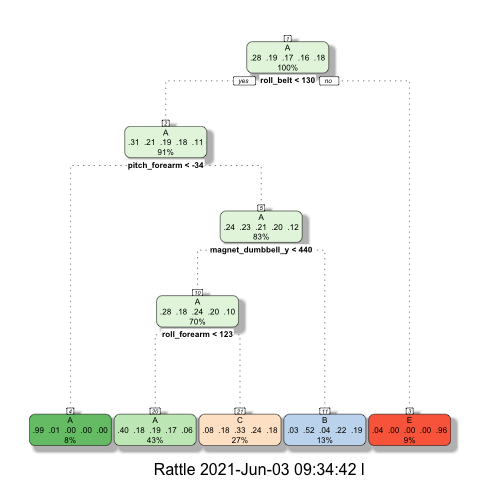

## Peer-graded Assignment: Practical Machine Learning Course Project

**Objective**
The goal of this project is to predict the manner in which they did the exercise. This is the "classe" variable in the training set. We may use any of the other variables to predict with. We should create a report describing how you built your model, how we used cross validation, what we think the expected out of sample error is, and why we made the choices you did. We will also use our prediction model to predict 20 different test cases. 

### 1. Data Processing
#### 1a. Load the data, library and perform some basic exploratory data analyses. 

```r
#setwd("/Users/l/Documents/Google_Drive/Workplace-JP/Workspace/R/datasciencecoursera/8PracticalMachineLearning")

## Load libraries
library(caret); library(dplyr)
training_url <-"https://d396qusza40orc.cloudfront.net/predmachlearn/pml-training.csv"
testing_url <- "https://d396qusza40orc.cloudfront.net/predmachlearn/pml-testing.csv"

# Treat all NA, #DIV/0!, "" as missing value
training = read.csv(training_url, na.strings=c("NA","#DIV/0!",""))
validation = read.csv(testing_url, na.strings=c("NA","#DIV/0!",""))
rm(training_url, testing_url)

# check training data size
dim(training)
```

```
## [1] 19622   160
```

```r
# Check any missing value in training dataset
any(is.na(training))
```

```
## [1] TRUE
```

```r
# Check the dimension after we removed observed rows if missing data exists
dim(training[complete.cases(training),])
```

```
## [1]   0 160
```

```r
review1 <- colSums(is.na(training))
```
We found that there was missing data in the training dataset. However, if we removed observed rows if any missing data exists, it would remove all observed data.

So, we also reviewed if there existed any unnecessary variables (columns) in the dataset. 

For the detailed summary, please refer to Appendix A.


#### 1b. Cross Validation
Now we splitted training data into 60% training and 40% test sets.

```r
set.seed(1234)
inTrain <- createDataPartition(y=training$classe,
                              p=0.6, list=FALSE)
training <- training[inTrain,] # split dataset
testing <- training[-inTrain,]
```

#### 1c. Data cleaning
We removed unnecessary variables and all columns which only had missing values from our testing dataset. 

Besides, we also thought that some variables are unrelated. We also removed them from the dataset. 


```r
# Prepcoressing function, which can be applied later
preprocessing <- function(df) {
    df %>% 
    # Clean data: filter columns with missing data only
    select_if(function(x) !any(is.na(x))) %>%
    # Clean data: Remove unrelated variables (columns)
    subset(select=-c(X, user_name, raw_timestamp_part_1, 
                              raw_timestamp_part_2, cvtd_timestamp,
                              cvtd_timestamp, new_window, num_window))
}

# Apply the prepcoressing to testing 
training <- preprocessing(training)
```
We could see that there was no more missing values, and it did not affect the number of observed data. 

The structure of the processed data are shown in the appendix B.


### 2. Data exploration
table(training$classe)

```r
# identify variables with no variability 
nearZeroVar(training,saveMetrics=TRUE)
```

```
##                      freqRatio percentUnique zeroVar   nzv
## roll_belt             1.101904     6.7781062   FALSE FALSE
## pitch_belt            1.036082     9.3772296   FALSE FALSE
## yaw_belt              1.058480     9.9734991   FALSE FALSE
## total_accel_belt      1.063160     0.1477933   FALSE FALSE
## gyros_belt_x          1.058651     0.7134849   FALSE FALSE
## gyros_belt_y          1.144000     0.3516461   FALSE FALSE
## gyros_belt_z          1.066214     0.8612782   FALSE FALSE
## accel_belt_x          1.055412     0.8357966   FALSE FALSE
## accel_belt_y          1.113725     0.7287738   FALSE FALSE
## accel_belt_z          1.078767     1.5237998   FALSE FALSE
## magnet_belt_x         1.090141     1.6664968   FALSE FALSE
## magnet_belt_y         1.099688     1.5187035   FALSE FALSE
## magnet_belt_z         1.006369     2.3290184   FALSE FALSE
## roll_arm             52.338462    13.5256345   FALSE FALSE
## pitch_arm            87.256410    15.7323412   FALSE FALSE
## yaw_arm              33.029126    14.6570176   FALSE FALSE
## total_accel_arm       1.024526     0.3363572   FALSE FALSE
## gyros_arm_x           1.015504     3.2769341   FALSE FALSE
## gyros_arm_y           1.454369     1.9162165   FALSE FALSE
## gyros_arm_z           1.110687     1.2638875   FALSE FALSE
## accel_arm_x           1.017341     3.9598410   FALSE FALSE
## accel_arm_y           1.140187     2.7367241   FALSE FALSE
## accel_arm_z           1.128000     4.0362858   FALSE FALSE
## magnet_arm_x          1.000000     6.8239731   FALSE FALSE
## magnet_arm_y          1.056818     4.4439914   FALSE FALSE
## magnet_arm_z          1.036364     6.4468454   FALSE FALSE
## roll_dumbbell         1.022388    84.2065029   FALSE FALSE
## pitch_dumbbell        2.277372    81.7449801   FALSE FALSE
## yaw_dumbbell          1.132231    83.4828254   FALSE FALSE
## total_accel_dumbbell  1.072634     0.2191418   FALSE FALSE
## gyros_dumbbell_x      1.003268     1.2282132   FALSE FALSE
## gyros_dumbbell_y      1.264957     1.4167771   FALSE FALSE
## gyros_dumbbell_z      1.060100     1.0498420   FALSE FALSE
## accel_dumbbell_x      1.018018     2.1659362   FALSE FALSE
## accel_dumbbell_y      1.053061     2.3748853   FALSE FALSE
## accel_dumbbell_z      1.133333     2.0894914   FALSE FALSE
## magnet_dumbbell_x     1.098266     5.7486495   FALSE FALSE
## magnet_dumbbell_y     1.197740     4.3012945   FALSE FALSE
## magnet_dumbbell_z     1.020833     3.4451126   FALSE FALSE
## roll_forearm         11.589286    11.0895933   FALSE FALSE
## pitch_forearm        65.983051    14.8557741   FALSE FALSE
## yaw_forearm          15.322835    10.1467740   FALSE FALSE
## total_accel_forearm   1.128928     0.3567424   FALSE FALSE
## gyros_forearm_x       1.059273     1.5187035   FALSE FALSE
## gyros_forearm_y       1.036554     3.7763735   FALSE FALSE
## gyros_forearm_z       1.122917     1.5645704   FALSE FALSE
## accel_forearm_x       1.126437     4.0464784   FALSE FALSE
## accel_forearm_y       1.059406     5.1116094   FALSE FALSE
## accel_forearm_z       1.006250     2.9558659   FALSE FALSE
## magnet_forearm_x      1.012346     7.7667924   FALSE FALSE
## magnet_forearm_y      1.246914     9.5403119   FALSE FALSE
## magnet_forearm_z      1.000000     8.5771073   FALSE FALSE
## classe                1.469581     0.0254816   FALSE FALSE
```
All data are with variability now, and therefore we are good to continue our model fit.


### 3. Model fit
We applied decision tree, and random forest algorithms to the data set for prediction.


```r
# Decision Tree
modFit_dt <- train(classe ~ .,data=training, method="rpart")
library(rattle)
fancyRpartPlot(modFit_dt$finalModel)
```

<!-- -->

```r
# Random forest
modFit_rf <- train(classe ~ .,data=training, method="rf")
```


### 4. Evaluation

```r
# Apply the same prepcoressing to testing dataset
testing <- preprocessing(testing)

# Predict testing dataset by decision tree
pred_dt <- predict(modFit_dt,testing)
confusionMatrix(factor(testing$classe),pred_dt)
```

```
## Confusion Matrix and Statistics
## 
##           Reference
## Prediction    A    B    C    D    E
##          A 1206   14  104    0   15
##          B  353  330  234    0    0
##          C  374   19  424    0    0
##          D  326  130  309    0    0
##          E  123  113  231    0  399
## 
## Overall Statistics
##                                           
##                Accuracy : 0.5015          
##                  95% CI : (0.4871, 0.5159)
##     No Information Rate : 0.5064          
##     P-Value [Acc > NIR] : 0.7534          
##                                           
##                   Kappa : 0.3496          
##                                           
##  Mcnemar's Test P-Value : NA              
## 
## Statistics by Class:
## 
##                      Class: A Class: B Class: C Class: D Class: E
## Sensitivity            0.5063  0.54455  0.32565       NA  0.96377
## Specificity            0.9427  0.85676  0.88448   0.8374  0.89114
## Pos Pred Value         0.9007  0.35987  0.51897       NA  0.46074
## Neg Pred Value         0.6505  0.92712  0.77412       NA  0.99609
## Prevalence             0.5064  0.12883  0.27679   0.0000  0.08801
## Detection Rate         0.2564  0.07015  0.09014   0.0000  0.08482
## Detection Prevalence   0.2847  0.19494  0.17368   0.1626  0.18410
## Balanced Accuracy      0.7245  0.70066  0.60507       NA  0.92746
```

```r
# Predict testing dataset by random forest
pred_rf <- predict(modFit_rf,testing)
confusionMatrix(factor(testing$classe),pred_rf)
```

```
## Confusion Matrix and Statistics
## 
##           Reference
## Prediction    A    B    C    D    E
##          A 1339    0    0    0    0
##          B    0  917    0    0    0
##          C    0    0  817    0    0
##          D    0    0    0  765    0
##          E    0    0    0    0  866
## 
## Overall Statistics
##                                      
##                Accuracy : 1          
##                  95% CI : (0.9992, 1)
##     No Information Rate : 0.2847     
##     P-Value [Acc > NIR] : < 2.2e-16  
##                                      
##                   Kappa : 1          
##                                      
##  Mcnemar's Test P-Value : NA         
## 
## Statistics by Class:
## 
##                      Class: A Class: B Class: C Class: D Class: E
## Sensitivity            1.0000   1.0000   1.0000   1.0000   1.0000
## Specificity            1.0000   1.0000   1.0000   1.0000   1.0000
## Pos Pred Value         1.0000   1.0000   1.0000   1.0000   1.0000
## Neg Pred Value         1.0000   1.0000   1.0000   1.0000   1.0000
## Prevalence             0.2847   0.1949   0.1737   0.1626   0.1841
## Detection Rate         0.2847   0.1949   0.1737   0.1626   0.1841
## Detection Prevalence   0.2847   0.1949   0.1737   0.1626   0.1841
## Balanced Accuracy      1.0000   1.0000   1.0000   1.0000   1.0000
```

We can see that the random forest algorithm has the highest accuracy, and therefore we applied it to our validation dataset.

### 5. Validation

Finally we apply the model by random forest to the validation dataset for validation.

```r
# Apply the same prepcoressing to validation dataset
validation <- preprocessing(validation)
# Apply model to validation dataset
pred3 <- predict(modFit_rf,validation)
pred3
```

```
##  [1] B A B A A E D B A A B C B A E E A B B B
## Levels: A B C D E
```

### Appendix A: The number of missing data of each column in the training dataset 

```r
# Review the number missing data in each column (viables)
review1
```

```
##                        X                user_name     raw_timestamp_part_1 
##                        0                        0                        0 
##     raw_timestamp_part_2           cvtd_timestamp               new_window 
##                        0                        0                        0 
##               num_window                roll_belt               pitch_belt 
##                        0                        0                        0 
##                 yaw_belt         total_accel_belt       kurtosis_roll_belt 
##                        0                        0                    19226 
##      kurtosis_picth_belt        kurtosis_yaw_belt       skewness_roll_belt 
##                    19248                    19622                    19225 
##     skewness_roll_belt.1        skewness_yaw_belt            max_roll_belt 
##                    19248                    19622                    19216 
##           max_picth_belt             max_yaw_belt            min_roll_belt 
##                    19216                    19226                    19216 
##           min_pitch_belt             min_yaw_belt      amplitude_roll_belt 
##                    19216                    19226                    19216 
##     amplitude_pitch_belt       amplitude_yaw_belt     var_total_accel_belt 
##                    19216                    19226                    19216 
##            avg_roll_belt         stddev_roll_belt            var_roll_belt 
##                    19216                    19216                    19216 
##           avg_pitch_belt        stddev_pitch_belt           var_pitch_belt 
##                    19216                    19216                    19216 
##             avg_yaw_belt          stddev_yaw_belt             var_yaw_belt 
##                    19216                    19216                    19216 
##             gyros_belt_x             gyros_belt_y             gyros_belt_z 
##                        0                        0                        0 
##             accel_belt_x             accel_belt_y             accel_belt_z 
##                        0                        0                        0 
##            magnet_belt_x            magnet_belt_y            magnet_belt_z 
##                        0                        0                        0 
##                 roll_arm                pitch_arm                  yaw_arm 
##                        0                        0                        0 
##          total_accel_arm            var_accel_arm             avg_roll_arm 
##                        0                    19216                    19216 
##          stddev_roll_arm             var_roll_arm            avg_pitch_arm 
##                    19216                    19216                    19216 
##         stddev_pitch_arm            var_pitch_arm              avg_yaw_arm 
##                    19216                    19216                    19216 
##           stddev_yaw_arm              var_yaw_arm              gyros_arm_x 
##                    19216                    19216                        0 
##              gyros_arm_y              gyros_arm_z              accel_arm_x 
##                        0                        0                        0 
##              accel_arm_y              accel_arm_z             magnet_arm_x 
##                        0                        0                        0 
##             magnet_arm_y             magnet_arm_z        kurtosis_roll_arm 
##                        0                        0                    19294 
##       kurtosis_picth_arm         kurtosis_yaw_arm        skewness_roll_arm 
##                    19296                    19227                    19293 
##       skewness_pitch_arm         skewness_yaw_arm             max_roll_arm 
##                    19296                    19227                    19216 
##            max_picth_arm              max_yaw_arm             min_roll_arm 
##                    19216                    19216                    19216 
##            min_pitch_arm              min_yaw_arm       amplitude_roll_arm 
##                    19216                    19216                    19216 
##      amplitude_pitch_arm        amplitude_yaw_arm            roll_dumbbell 
##                    19216                    19216                        0 
##           pitch_dumbbell             yaw_dumbbell   kurtosis_roll_dumbbell 
##                        0                        0                    19221 
##  kurtosis_picth_dumbbell    kurtosis_yaw_dumbbell   skewness_roll_dumbbell 
##                    19218                    19622                    19220 
##  skewness_pitch_dumbbell    skewness_yaw_dumbbell        max_roll_dumbbell 
##                    19217                    19622                    19216 
##       max_picth_dumbbell         max_yaw_dumbbell        min_roll_dumbbell 
##                    19216                    19221                    19216 
##       min_pitch_dumbbell         min_yaw_dumbbell  amplitude_roll_dumbbell 
##                    19216                    19221                    19216 
## amplitude_pitch_dumbbell   amplitude_yaw_dumbbell     total_accel_dumbbell 
##                    19216                    19221                        0 
##       var_accel_dumbbell        avg_roll_dumbbell     stddev_roll_dumbbell 
##                    19216                    19216                    19216 
##        var_roll_dumbbell       avg_pitch_dumbbell    stddev_pitch_dumbbell 
##                    19216                    19216                    19216 
##       var_pitch_dumbbell         avg_yaw_dumbbell      stddev_yaw_dumbbell 
##                    19216                    19216                    19216 
##         var_yaw_dumbbell         gyros_dumbbell_x         gyros_dumbbell_y 
##                    19216                        0                        0 
##         gyros_dumbbell_z         accel_dumbbell_x         accel_dumbbell_y 
##                        0                        0                        0 
##         accel_dumbbell_z        magnet_dumbbell_x        magnet_dumbbell_y 
##                        0                        0                        0 
##        magnet_dumbbell_z             roll_forearm            pitch_forearm 
##                        0                        0                        0 
##              yaw_forearm    kurtosis_roll_forearm   kurtosis_picth_forearm 
##                        0                    19300                    19301 
##     kurtosis_yaw_forearm    skewness_roll_forearm   skewness_pitch_forearm 
##                    19622                    19299                    19301 
##     skewness_yaw_forearm         max_roll_forearm        max_picth_forearm 
##                    19622                    19216                    19216 
##          max_yaw_forearm         min_roll_forearm        min_pitch_forearm 
##                    19300                    19216                    19216 
##          min_yaw_forearm   amplitude_roll_forearm  amplitude_pitch_forearm 
##                    19300                    19216                    19216 
##    amplitude_yaw_forearm      total_accel_forearm        var_accel_forearm 
##                    19300                        0                    19216 
##         avg_roll_forearm      stddev_roll_forearm         var_roll_forearm 
##                    19216                    19216                    19216 
##        avg_pitch_forearm     stddev_pitch_forearm        var_pitch_forearm 
##                    19216                    19216                    19216 
##          avg_yaw_forearm       stddev_yaw_forearm          var_yaw_forearm 
##                    19216                    19216                    19216 
##          gyros_forearm_x          gyros_forearm_y          gyros_forearm_z 
##                        0                        0                        0 
##          accel_forearm_x          accel_forearm_y          accel_forearm_z 
##                        0                        0                        0 
##         magnet_forearm_x         magnet_forearm_y         magnet_forearm_z 
##                        0                        0                        0 
##                   classe 
##                        0
```


### Appendix B: the training dataset structure after missing values are removed


```r
str(training)
```

```
## 'data.frame':	11776 obs. of  53 variables:
##  $ roll_belt           : num  1.42 1.48 1.48 1.42 1.43 1.45 1.45 1.42 1.42 1.45 ...
##  $ pitch_belt          : num  8.07 8.05 8.07 8.09 8.16 8.17 8.18 8.2 8.21 8.2 ...
##  $ yaw_belt            : num  -94.4 -94.4 -94.4 -94.4 -94.4 -94.4 -94.4 -94.4 -94.4 -94.4 ...
##  $ total_accel_belt    : int  3 3 3 3 3 3 3 3 3 3 ...
##  $ gyros_belt_x        : num  0 0.02 0.02 0.02 0.02 0.03 0.03 0.02 0.02 0 ...
##  $ gyros_belt_y        : num  0 0 0.02 0 0 0 0 0 0 0 ...
##  $ gyros_belt_z        : num  -0.02 -0.03 -0.02 -0.02 -0.02 0 -0.02 0 -0.02 0 ...
##  $ accel_belt_x        : int  -20 -22 -21 -22 -20 -21 -21 -22 -22 -21 ...
##  $ accel_belt_y        : int  5 3 2 3 2 4 2 4 4 2 ...
##  $ accel_belt_z        : int  23 21 24 21 24 22 23 21 21 22 ...
##  $ magnet_belt_x       : int  -2 -6 -6 -4 1 -3 -5 -3 -8 -1 ...
##  $ magnet_belt_y       : int  600 604 600 599 602 609 596 606 598 597 ...
##  $ magnet_belt_z       : int  -305 -310 -302 -311 -312 -308 -317 -309 -310 -310 ...
##  $ roll_arm            : num  -128 -128 -128 -128 -128 -128 -128 -128 -128 -129 ...
##  $ pitch_arm           : num  22.5 22.1 22.1 21.9 21.7 21.6 21.5 21.4 21.4 21.4 ...
##  $ yaw_arm             : num  -161 -161 -161 -161 -161 -161 -161 -161 -161 -161 ...
##  $ total_accel_arm     : int  34 34 34 34 34 34 34 34 34 34 ...
##  $ gyros_arm_x         : num  0.02 0.02 0 0 0.02 0.02 0.02 0.02 0.02 0.02 ...
##  $ gyros_arm_y         : num  -0.02 -0.03 -0.03 -0.03 -0.03 -0.03 -0.03 -0.02 0 0 ...
##  $ gyros_arm_z         : num  -0.02 0.02 0 0 -0.02 -0.02 0 -0.02 -0.03 -0.03 ...
##  $ accel_arm_x         : int  -289 -289 -289 -289 -288 -288 -290 -287 -288 -289 ...
##  $ accel_arm_y         : int  110 111 111 111 109 110 110 111 111 111 ...
##  $ accel_arm_z         : int  -126 -123 -123 -125 -122 -124 -123 -124 -124 -124 ...
##  $ magnet_arm_x        : int  -368 -372 -374 -373 -369 -376 -366 -372 -371 -374 ...
##  $ magnet_arm_y        : int  344 344 337 336 341 334 339 338 331 342 ...
##  $ magnet_arm_z        : int  513 512 506 509 518 516 509 509 523 510 ...
##  $ roll_dumbbell       : num  12.9 13.4 13.4 13.1 13.2 ...
##  $ pitch_dumbbell      : num  -70.3 -70.4 -70.4 -70.2 -70.4 ...
##  $ yaw_dumbbell        : num  -85.1 -84.9 -84.9 -85.1 -84.9 ...
##  $ total_accel_dumbbell: int  37 37 37 37 37 37 37 37 37 37 ...
##  $ gyros_dumbbell_x    : num  0 0 0 0 0 0 0 0 0.02 0 ...
##  $ gyros_dumbbell_y    : num  -0.02 -0.02 -0.02 -0.02 -0.02 -0.02 -0.02 -0.02 -0.02 -0.02 ...
##  $ gyros_dumbbell_z    : num  0 -0.02 0 0 0 0 0 -0.02 -0.02 0 ...
##  $ accel_dumbbell_x    : int  -232 -232 -233 -232 -232 -235 -233 -234 -234 -234 ...
##  $ accel_dumbbell_y    : int  46 48 48 47 47 48 47 48 48 47 ...
##  $ accel_dumbbell_z    : int  -270 -269 -270 -270 -269 -270 -269 -269 -268 -270 ...
##  $ magnet_dumbbell_x   : int  -561 -552 -554 -551 -549 -558 -564 -552 -554 -554 ...
##  $ magnet_dumbbell_y   : int  298 303 292 295 292 291 299 302 295 294 ...
##  $ magnet_dumbbell_z   : num  -63 -60 -68 -70 -65 -69 -64 -69 -68 -63 ...
##  $ roll_forearm        : num  28.3 28.1 28 27.9 27.7 27.7 27.6 27.2 27.2 27.2 ...
##  $ pitch_forearm       : num  -63.9 -63.9 -63.9 -63.9 -63.8 -63.8 -63.8 -63.9 -63.9 -63.9 ...
##  $ yaw_forearm         : num  -152 -152 -152 -152 -152 -152 -152 -151 -151 -151 ...
##  $ total_accel_forearm : int  36 36 36 36 36 36 36 36 36 36 ...
##  $ gyros_forearm_x     : num  0.03 0.02 0.02 0.02 0.03 0.02 0.02 0 0 0 ...
##  $ gyros_forearm_y     : num  -0.02 -0.02 0 0 0 0 -0.02 0 -0.02 -0.02 ...
##  $ gyros_forearm_z     : num  0 0 -0.02 -0.02 -0.02 -0.02 -0.02 -0.03 -0.03 -0.02 ...
##  $ accel_forearm_x     : int  196 189 189 195 193 190 193 193 193 192 ...
##  $ accel_forearm_y     : int  204 206 206 205 204 205 205 205 202 201 ...
##  $ accel_forearm_z     : int  -213 -214 -214 -215 -214 -215 -214 -215 -214 -214 ...
##  $ magnet_forearm_x    : int  -18 -16 -17 -18 -16 -22 -17 -15 -14 -16 ...
##  $ magnet_forearm_y    : num  658 658 655 659 653 656 657 655 659 656 ...
##  $ magnet_forearm_z    : num  469 469 473 470 476 473 465 472 478 472 ...
##  $ classe              : chr  "A" "A" "A" "A" ...
```


