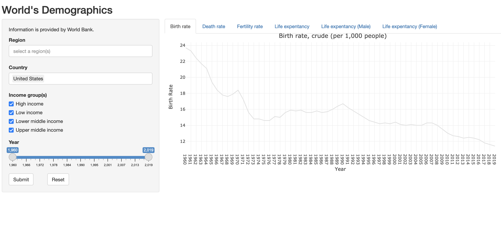

## Objective

This is a peer assessed assignment in the Cousera Developing Data Products by Johns Hopkins University). This aimed to create a Shiny application and deploy it on Rstudio's servers. 

[https://cwl286.shinyapps.io/PA3_shiny/](https://cwl286.shinyapps.io/PA3_shiny/)

This Shiny application was trying to visualize world's demographics data from the [World Bank](https://www.worldbank.org/en/home). It visualized 5 dataset, which were collected on 04/06/2021. It was created by Shiny and Plotly library in R language to provide basic interactive features.

## Features:
1. Input widget: sliderbar, checkbox, selectizeInput, action buttons.
2. Operation on the ui input in server.
    -   User can filter countries by Region, or Income groups, or both. 
    -   User can limit the years of data to display.
    -   User can compare data among countries. 
    -   Our server will filter the relevant data of the corresponding countries based on the input by users.
3. Some reactive output displayed as a result of server calculations
    -   Thanks to the Plotly library, users can interact with the charts by zooming, burshing data, and comparing data on hover.
    

## Dataset
- [Birth rate, crude (per 1,000 people)](https://data.worldbank.org/indicator/SP.DYN.CBRT.IN)
- [Death rate, crude (per 1,000 people)](https://data.worldbank.org/indicator/SP.DYN.CDRT.IN)
- [Fertility rate, total (births per woman)](https://data.worldbank.org/indicator/SP.DYN.TFRT.IN)
- [Life expectancy at birth, total (years)](Life expectancy at birth, total (years))
- [Life expectancy at birth, male (years)](https://data.worldbank.org/indicator/SP.DYN.LE00.MA.IN)
- [Life expectancy at birth, female(years)](https://data.worldbank.org/indicator/SP.DYN.LE00.FE.IN)

## Regions classified in data:
By default, countries all regions are shown.

1. "East Asia & Pacific"       
2. "Europe & Central Asia"      
3. "Latin America & Caribbean" 
4. "Middle East & North Africa" 
5. "North America"           
6. "South Asia"              
7. "Sub-Saharan Africa"     

## Income Groups classified in data:
By default, all income groups are checked.

1. "High income"       
2. "Low income"        
3. "Lower middle income"
4.  "Upper middle income"

## URL

[https://cwl286.shinyapps.io/PA3_shiny/](https://cwl286.shinyapps.io/PA3_shiny/)

